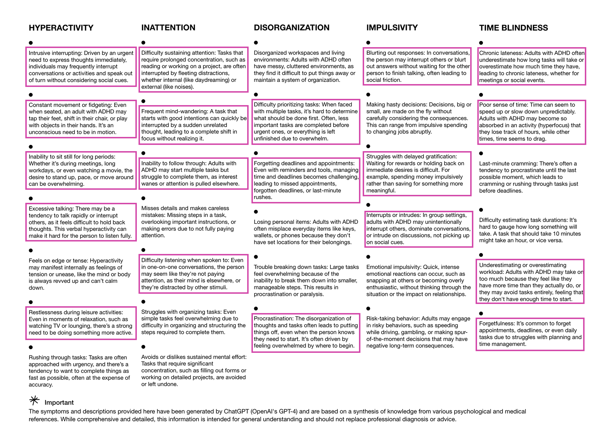

import { IntroParagraph, BookmarkCard, Callout } from '@components/mdx';

<IntroParagraph>My friend Vicki's "mate have you considered maybe youse got ADHD" was the first time I remember this topic coming up. That was six years back and I promptly forgot about it. Then two years ago – while ADHD was all the rage on TikTok – my friend Janina had a period of revelation about herself and made me do a bunch of tests. Turns out I probably have Adult ADHD.</IntroParagraph>

I'm writing this because I read a couple of posts this week which got me thinking about ADHD again, and because I've been knee-deep in AI-related things for the last month. The article below is a response to DHH's [rant](https://web.archive.org/web/20241121071802/https://world.hey.com/dhh/cold-reading-an-adhd-affliction-44163793) about ADHD, which I remember skimming last year. I only just found Schneems' response, which had me in stitches more than once...

<BookmarkCard url="https://www.schneems.com/2024/11/21/my-red-hot-adhd-programming-affliction/" />

He makes a lot of good points, but two bits cracked me up **in relation to myself**...

> My biggest behavioral issue was that I snuck books into class and read them under my desk. If your mental picture of someone with ADHD is an out-of-control “little monster,” then this seems like the opposite. I got through college with a degree, taught myself Ruby on Rails

I also snuck books into school to read under the desk. One teacher gave me detention for it. Others brought me _really interesting_ books from home (in one case a giant stack of New Scientist magazines), and occasionally let me get away with reading _over_ the desk instead of doing whatever I was supposed to be doing. And like Schneems, I also got through university with a degree and taught myself Ruby on Rails.

> One day, I was having an argument with my wife. It was about how I never planned dates. It got heated. She had to go to a meeting, and I planned to return to the conversation “Hey, how about we grab lunch after your meeting to talk it over.” I realized that I needed to meet the basic expectations of planning events and trying to compensate for them by taking action then and there. The suggestion might seem trite or pandering, but she thought it was good and agreed.
>
> An hour later, she walked into my office (garage), and I literally couldn’t remember why she was there. Or rather, I was in the middle of another task, and when she walked in, I had to rack my brain to quickly retrieve the info that would provide context to her: “I’m here.” It took a split second too long, and she noticed. Turns out that I don’t “have a good memory.” What I have is the ability to recall extremely detailed information about a situation, given that I’m primed with the context.

I laughed out loud at this for like five minutes. In the two years since my friend Janina made me do those tests, we've laughed a lot at how differently this stuff affects each of us. The venn diagram of our symptoms barely overlaps. What Schneems describes here is not a thing for her at all, but it **very much is for me**. Janina and I share a house, so she's seen (and been frustrated by) many versions of this over the years. See also my ex-girlfriends. And collegues. And friends. Every single person I sent that quote to laughed – especially at the last two sentences.

Those last sentences are a beautifully concise version of something I've always struggled to articulate about myself: _"What I have is the ability to recall extremely detailed information about a situation, given that I’m primed with the context."_

You and me both, Schneems. You and me both.

---

Entirely unrelated, I stumbled upon this wonderfully creative site:

<BookmarkCard url="https://www.adhdexperience.com/" />

Once I'd stopped puzzling over how on earth this was built on Wix, I read the list of symptoms. It's been two years since I read a list of ADHD symptoms and I properly chuckled at how many apply to me. I've circled those which I **definitely** experience (and I'm sure my friends would recognise) below.

<Callout>Over the last 20 years I've developed some **extremely good** mechanisms for dealing with many of these symptoms (without which I'd have circled *everything* bar four). I also have fairly good mechanisms for many of those I circled, but not yet to the extent they don't affect me.</Callout>

## Me and ADHD

When ADHD was all over TikTok, loads of friends were prodding me about getting a formal diagnosis. I didn't seek one because knowing whether I _Have ADHD_ or not wasn't **useful to me**, and still isn't.

Most people I know – when faced with mountains of evidence that _you very obviously have ADHD_ – reacted with some version of "OMG this explains soooo much, this is really helpful to know". And for most of them it's been **really** fucking helpful.

My own reaction was one of mild interest. Because while _"you very obviously have ADHD"_ was news to me, **not one of the symptoms was** news. I've always held the view that these "symptoms" were just kinda _how my brain is_. Sure, they make me super-shit at a bunch of things, but they also make weirdly great at other things. Whether I like it or not, they're how my brain is. And always has been.

This muted reaction is partly because I've been an accidental stoic from a young age – I've always thought it insane to try to control the uncontrollable. Things are how they are and unless we can **actually** change them it's better to embrace reality and look for what we _can_ change. I can no more control the symptoms I circled above than I can my emotions. But I can control how I **respond** to them.

I realised years ago that my brain was a bit weird. I also learned that any attempt to fundamentally change it was utterly exhausting, felt turbo-shit, and – most importantly – **didn't work at all**. And if I couldn't change how my brain worked, the only sensible response was to happily accept reality, and focus on useful things I **could change**.

Which is why I read _Getting Things Done_ as a weed-smoking seventeen-year-old: I had some vague notion that I couldn't rely on my brain to stay organised. All my mates thought this was very weird. And when – like most folks who read it – I failed to stick to the "GTD Way" for more than a minute, I took the bits that **actually helped me** and left the rest behind. And I've kinda been doing that ever since.

The result is: I'm self-employed, work remotely for multiple clients and intentionally avoid anything requiring a fixed 9-5 or Mon-Fri schedule. I write **everything** down immediately, lest it's gone when my mental context changes 10 seconds later. Every time-based thing goes straight in my calendar, which is always with me. I own an Apple Watch specifically to poke me when I have meetings. I've internalised a bunch of habits which keep my physical space tidy without any concious mental effort. I have hard rules to avoid impulse purchases and hasty big decisions (fundamentally: "always sleep on it"). _And I could go on and on..._

The point is: I've been finding out how to work _well_ with my own brain for decades. Far from being exhausting, the kinda stuff above is **liberating** when I get it right, because it **feels easy for once**. Figuring this stuff out, however, is often _not_ easy. The hard work is always the **figuring out**, not the sustained doing. Because if sustaining a thing feels hard, I haven't figured out the hard bit of it yet.

Whether you have ADHD or not, finding ways to work **with** your brain rather than _against_ it will never be a bad thing. And after working heavily with AI for the last few months, I have some embryonic thoughts which I'll expand on some other time.

## Embryonic Thoughts on AI & ADHD

In no particular order, some embryonic thoughts on AI, me, and possibly ADHD...

### 1️⃣ A Focussed Context Window (for me, not the LLM)

When most folks get a WhatsApp message asking if they're free on such-and-such date they'll open their calendar app and either reply with an alternative date or add an event to their calendar, before closing it and carrying on with whatever they were doing before.

When I get a message, 50% likeley to do exactly this. But in the other 50% I'll catch sight of some unrelated meeting or event next week and my brain will instantly switch context to thinking about that. Worst case, this means I forget to deal with the message which caused me to open my calendar in the first place. Best case it takes 15 minutes to refocus my brain on whatever I was doing before.

And this applies to **loads of shit**. It's why I check email at designated times and why none of my tech sends me notifications This problem is easily solvable by deliberatly doing _One Thing At A Time_ in an isolated context. Right now I'm writing this post in a super-zen minimalist editor precisely so I don't get distracted.

But that's not how most knowledge work works. Most work constantly requires **context and information** from places other than where we're curently working – calendar, meeting notes, slack, notion, the web, etc etc etc etc.

So the real challenge for me here is creating an environment where I always have the **full context I need for what I'm doing right now but nothing more**.

While I can kinda do this manually it takes way more energy than it does for most folks, so I'm particularly excited about the potential for AI tools to help with this. Which is kinda amusing because – like me – LLMs also operate best when their context window contains _exactly_ the right stuff.

### 2️⃣ Meetings Etc

Meeting recording and transcription tools are a big deal. For most of my life I've waged an internal battle between losing myself in the experience of a good meeting and ensuring something useful comes out of it after. Whether I'm stream-of-consciousness jabbering while excitedly hand-waving or listening rapt while others do so, I'm concious that creating & guiding **effective** conversation – and **capturing the useful bits of it** – requires skilled facilitation. I often end up in that role, requiring a decision on whether I want to do it well **or** fully participate in the conversation. Because I absolutely cannot do justice to both at the same time.

AI cannot **ever** replace skilled human facilitators. But in the (many) situations where my de facto facilitation role is just preventing unhelpful tangents and ensuring we remember the important bits after... AI **can totally take the latter away from me during the meeting itself**.

Paired with [vaguely sensible meeting practices](https://betterat.work/tool/meetings), AI tools like [Notion's meeting recorder](https://www.notion.com/en-gb/product/ai-meeting-notes) have really helped me to stay present and focussed during calls.

### 3️⃣ Faster Side Quests

I'm certain there's a subreddit dedicated to the partners of ADHDish people sharing funny-but-exasperated stories about this afternoon's progression from _quickly cleaning the garage_ to _driving forty miles for a custom-machined nozzle for the tool that oils the leaf blower_ while the contents of the garage remains 50% organised and labelled in excruciating detail and 50% **definitely not going back in the garage before nighfall**.

I'm like this, and I fucking love it. I love that custom-machined nozzle and its metaphorical brothers. I could legitimately argue that my whole career has been a series of semi-random side-quests stacked on top of each other.

I'm lucky that given enough time I'm pretty good at working back up the chain of side-quests until eventually **the garage ends up clean**. But that often takes a bit too long, and I run out of time, and the stuff on the drive gets nicked or rained on otherwise ruined. **If only today was longer and I had a floodlight etc**.

LLMs won't help me with my garage, but they can make a lot of computer-based side-quests **waaaaaay faster**. More importantly, they significantly reduce the time between me embarking on a side-quest and realising either A) it's more than a side-quest and I should treat it as such or B) it's not worth persuing. I'm talking weeks to hours in some cases.

TL;DR: LLMs have allowed me to follow side-on-side-on-side-quests and come back up the _callback chain_ in a reasonable timeframe way more than I could before. Which is both fun and useful.

### 4️⃣ Context Switching When Bored

I get bored way to easily. But I also hyperfocus easily. I'm lucky enough that I've worked out how to blend those things into something which makes me good at learning things and doing things.

A large part of that is my ability to maintain focus on things in a macro sense over periods of time. But the one thing I **cannot fucking do** is maintain focus in a micro-sense when it's gone. In the course of writing this article I've walked downstairs six times to smoke a cigarette and twice to make a cup of tea. I've folded five T-Shirts, weighed myself and noted the result in my journal and resisted countless urges to open a web browser.

None of those things took more than 5 minutes and none distracted my macro-brain from this article. But without them I'd have been impotently raging at my keyboard.

Because while I need that **focused context window** in a macro-sense, I need regular mini-distractions in the micro sense.

Surprisingly, I've found that doing **at most two things at once** with agentic AI tools ticks this box. I legit smoke fewer cigarettes when working on two unrelated tasks using AI agents. When I need a break from hard thinking about Thing A, I set an agent off doing something useful on it and context switch to checking in on what AI has done on Thing B. Prodding Thing B's AI towards the next thing is just enough of a break to bring my brain back to Thing A. 🔄.

This only seems to work if Things A & B are not the same complexity. AI coding agents (in Aug 2025) don't have sufficiently nuanced mental models to make non-trivial decisons about software engineering – nuanced mental models is my job as the human overseer. But if I'm doing that for Thing A, I need Thing B to need the same _nuanced mental models_ I'd give to smoking a cigarette or making a cuppa.

When this works, context switching between two tasks **improves my ability to focus on both**. Which is new to me (despite many attempts to kid myself otherwise in the past).

## Wrapping up...

Writing this has been weirdly cathartic because it's the first time I've properly ordered _any_ thoughts about this stuff. But also because whether we're talking about AI or our own brains my parting message is the same...

**This is what it is, and pretending otherwise is foolish. Our job is to work out how to use it in a way that's positive for both ourselves and the wider world**.

I don't think AI will ever be better at 👆 than humans. Solong as we give it the time of day.
