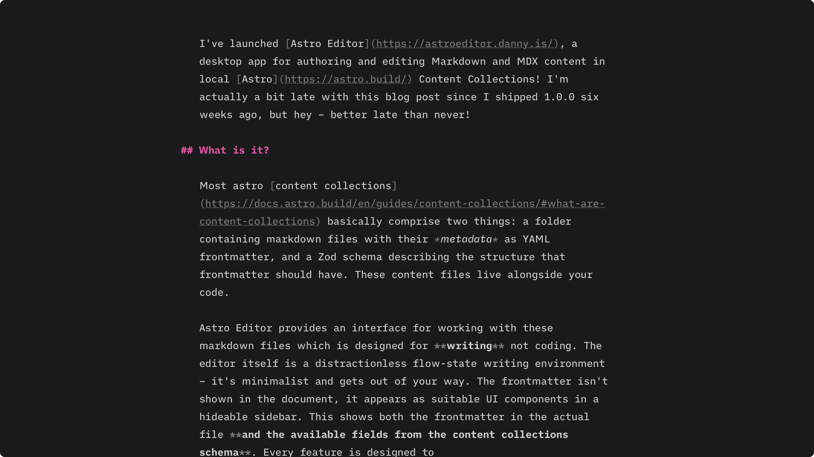

import { Embed } from '@components/mdx';

I've launched [Astro Editor](https://astroeditor.danny.is/), a desktop app for authoring and editing Markdown and MDX content in local [Astro](https://astro.build/) Content Collections! I'm actually a bit late with this blog post since I shipped 1.0.0 six weeks ago, but hey – better late than never!

## What is it?

Most Astro [content collections](https://docs.astro.build/en/guides/content-collections/#what-are-content-collections) basically comprise two things: a folder containing markdown files with their *metadata* as YAML frontmatter, and a Zod schema describing the structure that frontmatter should have. These content files live alongside your code.

Astro Editor provides an interface for working with these markdown files which is designed for **writing** not coding. The editor itself is a distractionless flow-state writing environment – it's minimalist and gets out of your way. The frontmatter isn't shown in the document, it appears as suitable UI components in a hideable sidebar. This shows both the frontmatter in the actual file **and the available fields from the content collections schema**. Here's a screenshot of me writing this article right now.

When I dragged that screenshot into the editor it was automatically copied to the right folder in my project and renamed appropriately before the markdown image tag was inserted. I can check it's the right one by holding <kbd>⌥</kbd> while hovering over the image tag, which shows a little preview. Astro Editor is full of little features like this, all of which are intended to let you focus on **writing words** without getting distracted. You can see the main features on the [website](https://astroeditor.danny.is/) (more in the [userguide](https://github.com/dannysmith/astro-editor/blob/main/docs/user-guide.md)). Here's a full explanation and demo:

<Embed url="https://www.youtube.com/watch?v=SJkXD59gQ5U" />

## Why?

Because I've wanted this myself for ages and the closest I ever got was [Darkmatter](https://getdarkmatter.dev/) – which I paid for and used regularly but never *quite* did what I wanted.

### But *why*?

Most folks who publish content with Astro work in two distinct _modes_. We're in **coder mode** when we're editing Astro components, pages, CSS etc. This is best done in a _coding tool_ like VSCode. We're in **writer mode** when we're writing or editing prose in markdown. Editors designed for coding are not well suited to this - they have too many distractions and lack the kinds of tools which help with writing and editing prose.

Because of this, it's common for people to **write** in tools like [iA Writer](https://ia.net/writer) or [Obsidian](https://obsidian.md/) and then switch to VSCode to add frontmatter, build and publish. The workflow often looks something like this:

1. Create a new draft markdown file & start writing
2. Edit and tweak (maybe over a number of sessions)
3. Add frontmatter for things like description, tags etc
4. Build & run locally to check everything works
5. Push to github and deploy/publish

Steps 1-3 are very much _writer mode_ tasks, while 4 & 5 are definitely _coder mode_ tasks. Astro Editor is only concerned with the former which means things like:

- Code blocks are not syntax highlighted because writing example code should be done in a code editor.
- You can't commit or publish because that's best done in a code editor or terminal.
- You can't preview your writing because that's best done in a browser while running your site on localhost.

And because the goal is **simplicity when in writer mode**, Astro Editor is intentionally opinionated about its UI and limits the user customisation features to _"making it work with your Astro project and no more"_. It's not possible to customise colour schemes, typefaces etc.

## Where we at now?

At time of writing [1.0.5](https://github.com/dannysmith/astro-editor/releases/tag/v1.0.5) is stable for macOS and Windows and the GitHub repo has **328 stars**. While I don't collect analytics, I do get a ping whenever the auto-updater checks for a new version (which only happens automatically on launch). This includes only the currently installed version, the OS (`mac` or `win`) and a random UUID unique to each install. So I know that as of Thursday 8 January 2026:

- There are 276 unique installs, 264 of which are on macOS and 12 on Windows.
- Only 20 installs are pre-1.0.0
- 14 people opened Astro Editor today (probably, including me).

More importantly though... I'm writing in it basically every day. And I **really fucking enjoy it**.

## So what's Next?

Short answer: **Finished Software**. After years working in VC-funded startups which by definition can never be "finished", it's weirdly exciting to look at a 6-month-old Astro Editor and think *"yeah I think it might be finished soon"*. 

I do still have one or two things on the [roadmap](https://github.com/users/dannysmith/projects/5) though...

1. A [complete reworking](https://github.com/dannysmith/astro-editor/issues/82) of how project config is managed, including some new options to control [file naming](https://github.com/dannysmith/astro-editor/issues/87).
2. [Internationalization](https://github.com/dannysmith/astro-editor/issues/69) and basic RTL support.
3. Better [quick search and internal link insertion](https://github.com/dannysmith/astro-editor/issues/10).

And maybe better Linux support someday.

## Like & Subscribe plz

If you have an Astro site, please give Astro Editor a go. It's only got to where it is now thanks to a bunch of folks trying it out and sharing feedback on [GitHub](https://github.com/dannysmith/astro-editor/issues).

And as a free open-source side project, the only marketing it's gonna get is from people who like it saying so on their socials & websites. So tell your mates. Plz 🙏

## Quite The Journey

I didn't mean to build anything proper here. In July '25 I was just starting to *properly* experiment with AI coding beyond Copilot & Cursor autocomplete and was looking for a project to use as a guinea pig. My basic requirements were:

1. **It can't be throwaway** because learning how to hold these new AI tools *properly* meant more than blind vibe coding.
1. **It can't be a toy** for the same reason.
2. **It must be something I'll use daily if it works** because otherwise I'd not have been invested in its quality.
3. **It must have a GUI** because at the time LLMs were turbo-shit at UI design, which made this a key learning goal.
4. Ideally, **it's designed to run locally** because any non-toy web app involves a bunch of third-party services to handle auth and emails and file storage and all the rest. Some of which cost money and all of which require me – the human – to manage them.

So I settled on *iA Writer but how I want it to write my blog*, which ticked all the boxes. And duly dictated some nonsense requirements into a markdown file and had cursor turn it into what I thought would be a good PRD, which became Astro Editor's [first commit](https://github.com/dannysmith/astro-editor/commit/69faa816914e415fba43fc07e363ab6bf2f87923).

As an AI Coding noob the maybe-kinda-working app Cursor built from this felt like magic, but after a few hours going round in circles I actually read the code and realised it was (obviously) dogshit slop. And so began the very interesting process of working out how to do that better, which I'll write about in another article.

Fast forward a few months and I had a completely rewritten Astro Editor with a not-so-insane architecture, which both me and my new friend Claude could reason about well enough to iterate on features quickly and reliably. And on 18 Aug I shipped a feature-complete [0.1.20](https://github.com/dannysmith/astro-editor/releases/tag/v0.1.20) and shared in the Astro Discord! 🎉

Feature complete my arse.

Turns out not everyone has the same Astro setup as me. So I spent September-November dealing with that, which involved a completely different approach to schema reading/parsing, lots of testing on weird and wonderful Astro projects and a smattering of new features.

I [released 1.0.0](https://github.com/dannysmith/astro-editor/releases/tag/v1.0.0) on 22 November 2025.
