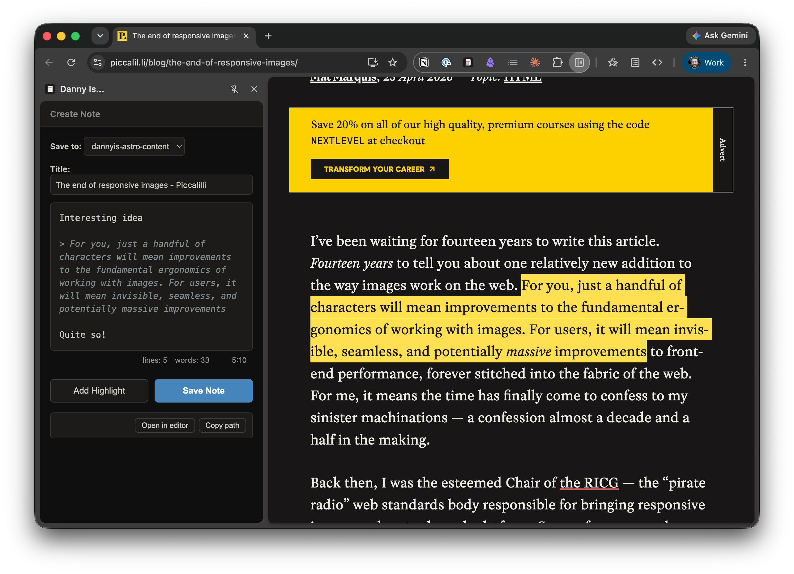

I currently publish two kinds of content on this site: [articles](/writing) and [notes](/notes). I write all my articles in [Astro Editor](https://astroeditor.danny.is/), with in-progress work committed to `main` as drafts and pushed to GitHub regularly. When I'm ready to publish an article I have Claude Code check for spelling errors, flip the draft toggle and – after checking it looks okay on my local dev server – commit and push. Pushes to `main` trigger a GitHub action which rebuilds the static site and redeploys it.

This process works great for articles, especially since I now keep two local copies of this repo: one for working on the site's code (which is often not on `main`) and one for working on content (which is always on `main`).

This also works great for notes [like this one](/notes/less-painful-editing-in-astro/) which are basically mini-articles, but it's not ideal for [ones like this](/notes/2026-06-06-the-end-of-responsive-images/) which are responses to stuff I found online.

When I find something interesting online I want to open Astro Editor, create a new note, paste the URL I found into `sourceURL` and then type my comments... that's way too much faff.

## There's gotta be a chrome extension for that?

I think [this](https://github.com/dannysmith/dannyischromeextension) was actually one of the first things I **fully** vibe-coded. It's a Chrome sidebar extension which grabs the URL and title of the current tab and lets me add some notes. Hitting **save** writes a new draft note to my local copy of this site with appropriate frontmatter and filename.

The textarea supports markdown & keyboard shortcuts, and the **Add Highlight** button grabs the selected text from the page and adds it to the textarea as a blockquote. This works *great* when I wanna comment on multiple quotes from an article.

Notes created this way obviously won't go live until I've removed `draft: true`, committed and pushed. I can live with that – it only takes a few seconds and if I forget, it'll happen when I'm next in the repo.

I use Astro Editor and this Chrome extension on my desktop machine, and both are designed to work with **local files** on it. This works because I'll always have a local copy of my website's repo, and the tooling to quickly commit and push.

This is not so on my iPhone...

## Vibe coding my first personal iOS app

I do not like writing on my phone and am never gonna use it to work on articles or long notes for this site. The closest I'm likely to get is the scrappy thoughts that might someday make it to this site, for which I use [Obsidian](https://obsidian.md/).

The only phone-based thing I wanna do re. this website is quickly create (and sometimes publish) *short* notes about the thing I'm reading. **And damn have I realised I wanna do that a lot.**

I probably do eighty percent of my online reading on my phone and while I have a perfectly good system for clipping stuff into Obsidian, I almost never remember to share it here afterwards.

What I need is something similar to my chrome extension, but on my phone. And since I don't have a local copy of this website on my phone it will need to write directly to GitHub.

So I (mostly) vibe-coded a little iOS app specifically for this...

### How it works

The app ships with a [Share Sheet](https://developer.apple.com/design/human-interface-guidelines/activity-views) extension which lets me save a new draft note from pretty much any app. If there's a URL or title available they'll be passed to the app along with any notes I type into the share sheet. The notes field will be pre-populated with any selected text.

<BasicImage
  src="/src/assets/articles/2026-06-30-ios-notes-sharesheet.png"
  alt="The Share Sheet extension with a notes field and source URL"
  width={300}
/>

Opening this note in the actual app looks like this. The *title*, *sourceURL* and *body* fields have been properly populated and a suitable filename has been generated. We can also see a link preview for the source URL.

<BasicImage
  src="/src/assets/articles/2026-06-30-ios-notes-new-note-from-sharesheet.png"
  alt="A new note in the app with title, sourceURL and body populated, showing a link preview"
  width={300}
/>

The body field supports simple markdown formatting and can be expanded for easier writing.

<BasicImage
  src="/src/assets/articles/2026-06-30-ios-notes-4.png"
  alt="The expanded body field with markdown formatting"
  width={300}
/>

All new notes are created as **Local Drafts** and stored as Swift data on the device. These can be created, edited and deleted in the app.

### Getting notes to GitHub

When the app loads, it fetches all my notes via the GitHub API, parses the relevant frontmatter and stores them in the app. **Published** notes get a green label while **unpublished** drafts get an orange one.

<BasicImage
  src="/src/assets/articles/2026-06-30-ios-notes-app-1.png"
  alt="The notes list with green labels for published notes and orange for drafts"
  width={300}
/>

When I'm done with a local draft I have two options: I can push it to GitHub as a draft or publish it immediately. In both cases the app uses the GitHub API to make a new commit adding the new note to the repo – *publish* just removes `draft: true` from the frontmatter.

I originally planned to leave it at this but I can easily imagine pushing a new note and then spotting an error in it, so it's also possible to edit and delete notes. Published notes can be "unpublished", which makes a new commit adding `draft: true` and unpublished drafts can be published by doing the reverse. Notes can also be permanently deleted via the app, but I can't see myself doing that very often.

<BasicImage
  src="/src/assets/articles/2026-06-30-ios-notes-3.png"
  alt="Options to push, publish, edit or delete a note"
  width={300}
/>

Any note which exists on GitHub and is later edited in the app is marked as having *local changes* and I have the option to either update the note on GitHub with those changes or overwrite the local data with whatever is on GitHub. There's also a tiny bit of cleverness to deal with notes which have been updated on GitHub and ensure the local data is updated on sync.

Here's the code if you wanna have a nose...

<BookmarkCard url="https://github.com/dannysmith/dannyis-notesapp-ios" />

## Building Apps for One

The initial build of this took about two hours, most of which was me getting clear on what I actually wanted and adequately explaining that to Claude Code. I've probably spent another ninety minutes or so glancing over some of the code and iterating with Claude on the visual design.

I'd probably never have bothered building this before AI models got good at coding, but if I had **I would certainly have tried to make it usable for people other than me**.

The biggest reason I was able to get this done so quickly is the number of decisions I didn't need to make because this **only needs to work for me**. All the info about my Astro site is hard-coded, as are the fields for my `notes` schema. I auth with GitHub via a scoped Personal Access Token, not a complex OAuth flow. It's only been tested on an iPhone 15 Pro because that's the only device it'll be used on. The UI is designed to my taste alone. And so on.

But perhaps most exciting for me is that I've just built my first iOS app in under three hours. And while I only hand-wrote about four lines of code, the simplicity inherent in such a tightly-scoped *App for One* means I've **read and understood** most of it. That, plus working in a tight feedback loop with Claude Code has allowed me to learn a lot of new things very quickly here.
