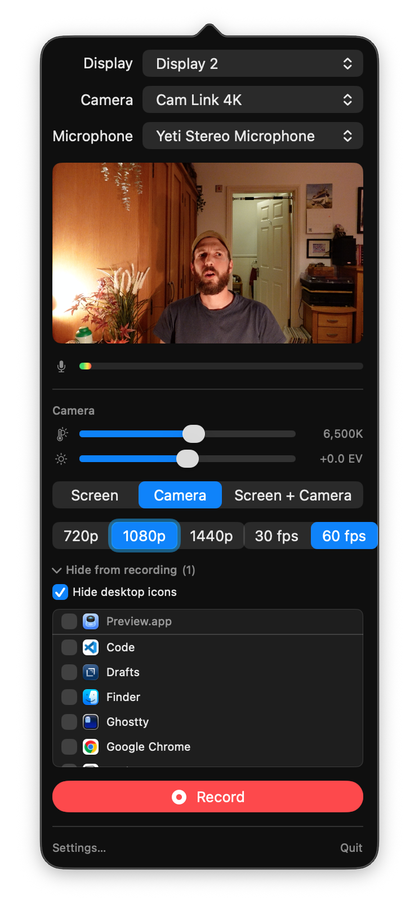
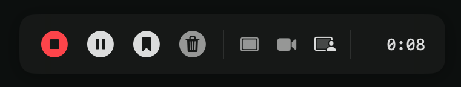

<IntroParagraph>
Over the past couple of months I've been building a personal video-sharing platform to replace  [Loom](https://loom.com/), partly so it works how I've always wanted Loom to work and partly so I have long-term control over my own videos. Its basic functionality is broadly equivalent to Loom minus the stuff I never use, plus some me-specific extras. Building what I'm currently calling *LoomClone* has been mad fun and I've learned a **ton** (this is my first proper native macOS app, among other things).
</IntroParagraph>

Before we dive in, here's what one of these videos looks like embedded on this site...

<LCVid src="https://v.danny.is/lorem-one" showDescription={false} showTitle={false} />

I've been a [huge fan](https://betterat.work/tool/loom) and paying customer of Loom since their very early days and have always had two main use cases:

1. **Quick, short screenshares and talking head videos** where I hit stop and immediately paste the link into Slack, Notion, Asana, WhatsApp or similar. For this kind of video-based async communication to work, it must be **frictionless** for both me and viewers. Loom was the first product which could do this reliably.
2. **Longer, more polished videos** for tutorials, guides, presentations and the like. These often end up embedded in evergreen Notion/Google docs and tend to be widely linked to from all sorts of places. When I say "more polished" I don't mean the *hours-in-final-cut-pro* polish I might put into a marketing video. More like *preparing for an All Hands or training session on Zoom*: I'm gonna prep an outline & some slides, tidy up my desktop, make sure all my demos and other windows are in the right place, maybe do a quick run-through **and then record in one take**. My default approach to this with Loom has always been to line up any slides or apps I need in fullscreen spaces and swipe between them as I record, adding any important talking-head segments by recording separate Looms and then stitching them together in Loom's web editor.

Loom's whole business is built on being brilliant at (1) and while they do (2) kinda-okay I've always had some gripes about their product, my biggest being...

1. **I don't own the canonical URLs for my videos.** I've got hundreds of historical Loom videos, many of which are embedded in documents, wikis, knowledge bases and archived slack channels in organisations I've long-since left. Every one of them points to `loom.com/something`, so while I own my actual videos (I can download them), Loom controls what matters most for content on the web: *the canonical URLs*.
2. **I don't have much control over the viewer experience.** Loom controls how my videos are served to viewers: It's impossible for me to control things like RSS feeds, custom embed players, SEO and text-based endpoints to the degree I want.
3. **The camera feed isn't first class unless I'm in *cam-only* mode.** Most of my longer videos involve cutting between talking-head and screenshare segments. Loom doesn't let you do that with a fullscreen, high-quality camera feed mid-recording. This has always been mega frustrating for me.
4. **Reliability & Recomposability.** Loom recordings rarely fail, but when they do it's invariably a 30-minute single take in which I was *fucking inspired* and will never repeat quite as well after picking my smashed laptop off the floor. If you've been here you **know** how that feels. And it's only *slightly* less frustrating to realise a whole segment which should've been *talking-head* is actually a recording of my empty desktop with a voiceover on top. And there's nothing I can do because the camera feed wasn't even captured.
5. **The mac app is not a mac app.** Loom's macOS app is built on Electron and bundles a custom build of [ffmpeg](https://ffmpeg.org/) alongside the usual Chromium. I get why they do this but as I'm always on Apple Silicon, a proper native mac app is likely to be way more performant for heavy stuff like video capture in all sorts of ways (even before taking advantage of lower-level OS APIs).
6. **All the features I don't want.** Any product with a wide audience will have features I don't want. I'm cool with that even though I can't turn many of them off. But in 2026, any product like Loom will likely have features nobody at all wants because *a)* it can never be finished unless it's been abandoned, and *b)* it's gonna be **stuffed full of nonsense AI features**.

I tried [switching to Cap](/notes/loom-to-cap/) because it's open source and I can use my own domain, but while it isn't terrible it doesn't feel like a platform I wanna bet on long-term. And so we arrive at the thought... **what if I built my own?** 🤔

Which is just what I've been doing...

<Callout type="blue" emoji="📜" title="Core Principles">

Given the massive potential for scope creep here, I started by defining some core principles. These underpin almost all the product decisions I've made along the way.

1. **Instant Shareability**. The moment I stop recording, I need a working URL which I can share immediately. This is what differentiates async video comms tools from other recording and hosting apps.

2. **Never Lose Footage**. The product must guarantee that footage is recoverable. Recording a 20-minute tutorial and losing it thanks to connection or server problems isn't okay. The whole thing should be fault-tolerant by design.

3. **Permanent URLs which I own**. A video URL works forever. If I change a video's slug, the old URL redirects to the new one. Videos embedded in Notion pages, Google Docs, and knowledge bases years from now must still work. Every video lives on `v.danny.is`, a domain I control.

4. **Reliability for Viewers**. When someone clicks a video link, it Just Works regardless of device, location, connection etc. Viewer-facing video delivery must be first-class.

5. **Discoverability & Viewer UX**. I'm a good *web citizen*. The public-facing endpoints serve semantic content which works in a variety of contexts. Public videos are SEO-friendly and are discoverable via RSS feeds, LLM-facing endpoints and the like.

6. **Simplicity**. The whole system is designed with one goal in mind: **allowing me to record, host, and share videos**. Every feature must be in service of doing these things *really well*.  Similarly, the codebase and technology stack should be as simple as possible.

7. **I'm the Only Creator Here**. This product is *only for me*. Nobody else will use the mac app or admin app. Nobody else will record videos. The only parts where other people matter are the public-facing bits where folks find and watch my videos.
</Callout>

## The Four Moving Parts

It's helpful to think about LoomClone as four separate things, each with a distinct purpose and set of user needs. While this isn't quite accurate when it comes to the underlying tech, it's the framing I'll be using in this series of articles.

1. **The macOS recording app**. A native macOS menubar app for recording videos with as little friction as possible. Its only job is helping me get set up for a recording quickly and then streaming it up to the server once I hit record while dealing properly with all the pausing and mode switching that happens during recording.

2. **The backend API**. A web API which receives data from the mac app and handles storage, background post-processing, backup, error recovery and the like. Its job is working with the mac app to get recordings on a server and ready for public consumption in a reliable way.

3. **The admin app**. A web interface for managing, editing and working with my videos, optimised for the workflows I personally care about most. Ideally, I'll rarely use it but when I do, its job is to make whatever I need as easy and painless as possible.

4. **The viewer-facing surface**. Serves videos to viewers in the best way *for them* and handles everything else that has to do with publishing, discoverability etc.

We'll go into detail about *how* these work later but for now it's important to explain *exactly what* they do from a user perspective. So the next half of this article is dedicated to the **recording app** UI and **viewer-facing surface**, finishing with a 4-minute lightning tour of the **admin app** and its features.

## The macOS recording app

The menubar app is deliberately very simple. Clicking it opens a popover like this.

Here's what each control is for...

| Control | Description |
| ------- | ----------- |
| Display | The monitor to use for screen recording |
| Camera | The camera to use |
| Mic | The microphone to use |
| Preview | Shows how the recording will look (based on the *starting mode* selected below) so I can confirm the right sources are selected and are looking good |
| Sound meter | For the selected mic so I can check I have decent audio levels |
| White balance | Adjust the camera white balance. I often want to tweak this depending on the current lighting conditions |
| Brightness | Adjust the camera brightness |
| Starting mode | Choose between screen-only, camera-only and picture-in-picture mode. This only affects the preview above and the mode in which the recording will **start**. I can toggle between these freely while recording. |
| Upload quality | Choose the quality of the uploaded recording ( 720p, 1080p or 1440p) |
| Upload framerate | Choose the framerate of the uploaded recording (30 or 60fps) |

The UI adapts appropriately to the three selected sources: if camera or display is set to "None" the mode toggle is disabled; the camera controls are hidden when no camera is selected; the sound meter is only visible when a mic is selected. The upload quality and framerate toggles also respect the available feeds – a camera delivering 1080p/30fps with no display selected won't show higher options for the upload quality because we'd just end up with an upsampled upload.

Here's what it looks like with *Camera* mode selected and the preview showing the full camera feed. Expanding the *Hide from recording* section allows me to hide stuff from the screen recorder.

| Control | Description |
| ------- | ----------- |
| Desktop icons | When checked, Finder’s desktop icons will be hidden in the screen recording |
| App Windows | Any checked apps will have their windows hidden in the screen recording. Currently running apps are shown alongside the five most-recently selected apps (whether they’re running or not) |

The **Record** button shows a short countdown and begins recording.

### The UI while recording

During recording, a floating toolbar is shown at the bottom of the screen.

From left to right the controls are...

| Control | Description |
| ------- | ----------- |
| Stop | Finishes the recording |
| Pause/Unpause | Pauses the recording. I use this *all the time* during longer recordings while I reorganise windows, switch to different spaces or quickly check my notes |
| Add chapter marker | Adds an anonymous chapter marker. If my recording has multiple chapters to it I can hit this to add markers which can later be named in the web interface |
| Cancel | Cancels the recording and deletes any data already on the server |
| Mode switcher | Switch between screen-only, camera-only and picture-in-picture mode mid-recording |
| Recording length | Shows the length of the recording so far |

When in a camera mode a draggable preview of the camera feed is shown as an overlay while recording. This is circular when in screen-and-camera and rectangular when in camera-only mode.

Neither the camera preview nor toolbar are captured in the actual screen recording, but dragging the camera preview between quadrants of the screen will cause the camera overlay in the final recording to move to that corner of the screen.

Besides the settings window and a few warnings which pop up if something goes wrong while recording, **this is the whole UI of the macOS app**. 

<Callout>
Notice all the things which **aren't** here. Most apps like this include options for recording individual windows or sections of a screen, or controls for adding effects, audio cleanup and the like. I know I don't need any of that myself, so it's not there.
</Callout>

## The viewer-facing surface (a quick tour)

As soon as I'm finished recording a video, it's available on a randomly-generated public URL like `https://v.danny.is/three-random-words/`. Here's what the page for the video at the top of this article looks like.

It shows the title, length and date at the top (plus any public tags – more on that later) with a large video player below. The video player works exactly as you'd expect, including closed captions, thumbnail scrubbing and the like. The description and a simple footer are shown underneath.

While the page is intentionally simple, fully controlling its underlying code means I've been able to ensure these URLs embed properly in Notion and Google docs, have appropriate rich preview data when shared, and – for public videos – are discoverable via appropriate SEO, RSS feeds and the like.

Here's a quick 3-minute run-through of the video player itself, plus a few little easter eggs.

<LCVid src="https://v.danny.is/bumpy-planets-spend" showTitle={false} showDescription={false} showOpenLink={false} />

The only other part of the public surface I should mention is **tag pages**, but first a note on visibility...

<Callout title="Visibility" type="blue" emoji="👀">
A video's *visibility* can be one of three values:
- **Unlisted** is the default. These are publicly available but are not easily *discoverable* unless you know the URL. The vast majority of my videos are of this type.
- **Public** videos are additionally discoverable via things like RSS & JSON feeds, and are indexed by search engines.
- **Private** videos are not available outside the admin interface and have no public URL. These are intended for personal notes and videos I want to keep private until I’m ready to share them.
</Callout>

As we'll see shortly, **tags** mainly exist to help organise my recordings in the admin app. But like videos themselves, tags can be *private*, *unlisted* or *public*. And public tags have their own **tag pages** which serve as public collections (or playlists) which look like this.

We'll dig into some of the more interesting features and subtleties of the public surface in subsequent articles, but for now I wanna give you a quick tour of the admin app for all this.

## The admin app, a lightning tour

I'll do a whole article on the admin web app in due course, but since I've now got a fancy video platform I might as well give you a lightning tour in video form! Here's a four-minute demo...

<LCVid src="https://v.danny.is/shaky-bobcats-talk" showDescription={false} />

## Wrapping up

At the time of writing, LoomClone feels pretty much feature-complete. I've still got a little work to do on audio post-processing & recording performance, but the only new features I'm considering are [auto-expiry](https://github.com/dannysmith/loom-clone/issues/7) and [watermarking](https://github.com/dannysmith/loom-clone/issues/5), both of which are pretty trivial. 

By far the most interesting parts of this project are under-the-hood, but hopefully this introduction to **what** LoomClone does will set the scene for the next few articles about **how** it works.
