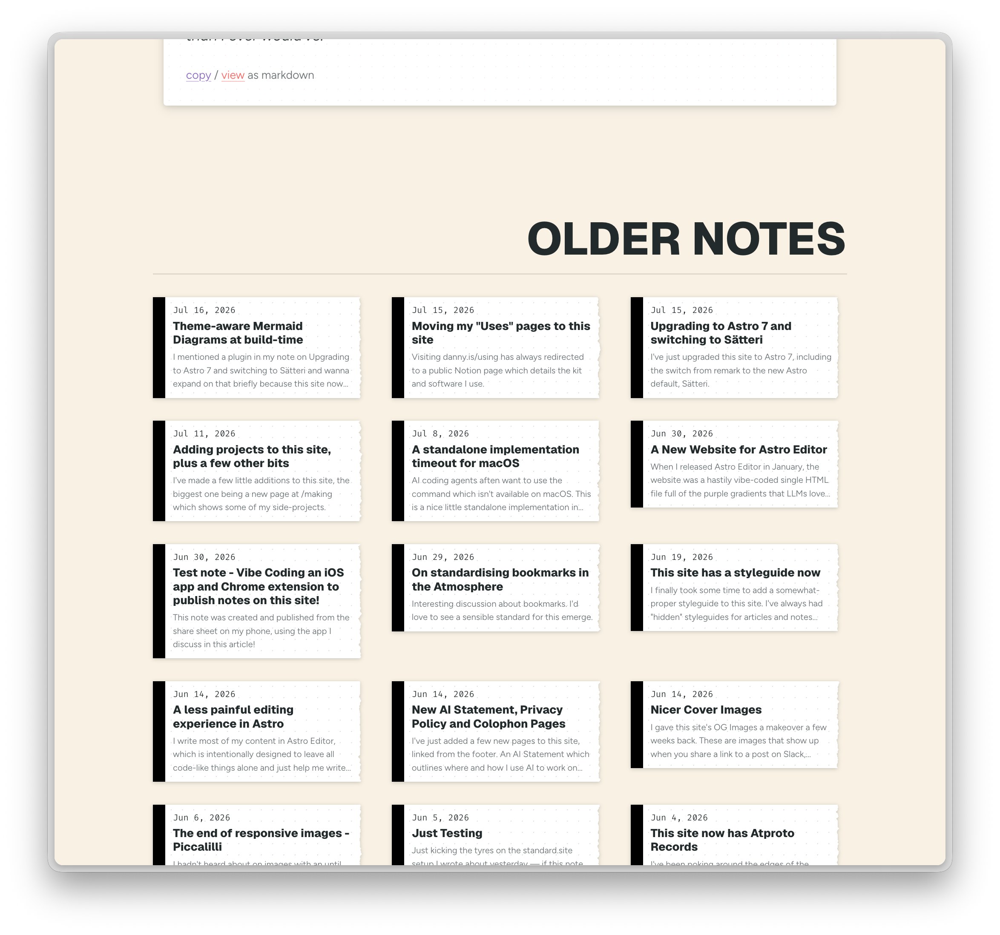

Over the last month or two I've been trying to finally get this site to a place where it feels *finished enough for the moment*. For my personal website this basically equates to **nothing annoys me about it and nothing on the backlog feels like it's hanging over me**.

I've really enjoyed picking away at this because it's been a real mixture of random stuff I'm interested in right now and ideas which I recorded as GH issues **years** ago.

While I've written about some of this, I was having too much fun to stop and cover much, so I can only really point you at the [styleguide](/styleguide), which does a decent job of demonstrating a lot of it. Or the [commit history](https://github.com/dannysmith/dannyis-astro/commits/main/).

<Callout>
The few notes & articles about recent work on this site:

- [Some Work on this Site](/writing/2026-05-28-work-on-this-site)
- [This site now has Atproto Records](/notes/2026-06-04-this-site-on-atproto)
- [Speeding up Astro builds and improving deployment](/writing/speeding-up-astro-builds)
- [Nicer Cover Images](/notes/nicer-cover-images)
- [New AI Statement, Privacy Policy and Colophon Pages](/notes/new-meta-pages)
- [A less painful editing experience in Astro](/notes/less-painful-editing-in-astro)
- [Making this Astro site more Agent-Friendly](/writing/making-this-astro-site-agent-friendly)
- [This site has a styleguide now](/notes/site-styleguide-now)
- [Adding projects to this site, plus a few other bits](/notes/adding-projects-site-plus-few-other-bits)
- [Upgrading to Astro 7 and switching to Sätteri](/notes/upgrading-astro-7-switching-satteri)
- [Moving my "Uses" pages to this site](/notes/moving-uses-pages-site)
- [Theme-aware Mermaid Diagrams at build-time](/notes/theme-aware-mermaid-diagrams-build-time)
- [Showing my Toolbox on this site](/notes/showing-my-toolbox-on-this-site)
</Callout>

Looking back at my task lists and GH issues it's pretty clear I've shied away from two jobs for bloody ages:

1. Putting some *proper* thought into the typefaces and how I use them.
2. Redesigning the homepage ([#25](https://github.com/dannysmith/dannyis-astro/issues/25), Apr '25).

Which is unsurprising because they both require Actual Non-Trivial Taste-Based Decisions About My Own Website. Anyone reading this who's ever had "redesign personal site" on their todo list will know that such decisions are orders of magnitude more difficult than **any** genuinely-weighty decision required at work. 🤷‍♂️

So I'm happy to say that I've just ticked the last one off. The homepage of this site now contains more than a simple list of links.

")

")

I've always had a soft spot for the "skeuomorphic" faux Sellotape, stitched corner banners and ripped paper effects which everyone loved twenty years ago. So while the homepage shows recent articles in the usual *type-as-design* style, I couldn't resist showing notes as little bits of dot-grid paper with a torn right edge – both on the homepage and on the [notes](/notes) index.

Before starting on [#151](https://github.com/dannysmith/dannyis-astro/pull/151) I tried to lay some groundwork by standardising the [various card components](/styleguide/components#article-card) but still ended up tweaking a bunch of stuff while working on the homepage, including the addition of global CSS **view transitions**. The PR description has a decent list of all the little bits which happened by accident.

Aside from "clearing the backlog", it's been lovely having **actual time** in this codebase. That might sound weird considering how simple it is – especially since AI has been writing much of the recent code here – but I don't ever remember having the time and headspace to kinda *settle in* to my own site's code in a kinda intuitive, somehow *fundamental* way[^1].

I still have a ton of fun ideas I wanna play with on this site, but **boy does it feel good** to finally clear the backlog and have nothing I feel I *should* do here. This site was always intended as a playground but it's hard to really enjoy playing when you're avoiding that awkward new roundabout & slide you gotta deal with sometime.

[^1]: I feel like working with AI coding agents has probably made this possible, because for every session I've spent working on this site at least 3/4 of it has been **reading** and **thinking**, not **writing code**. Which is a luxury one rarely gets on a personal website.

