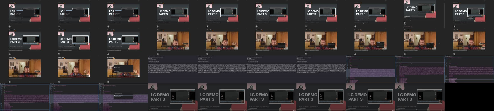
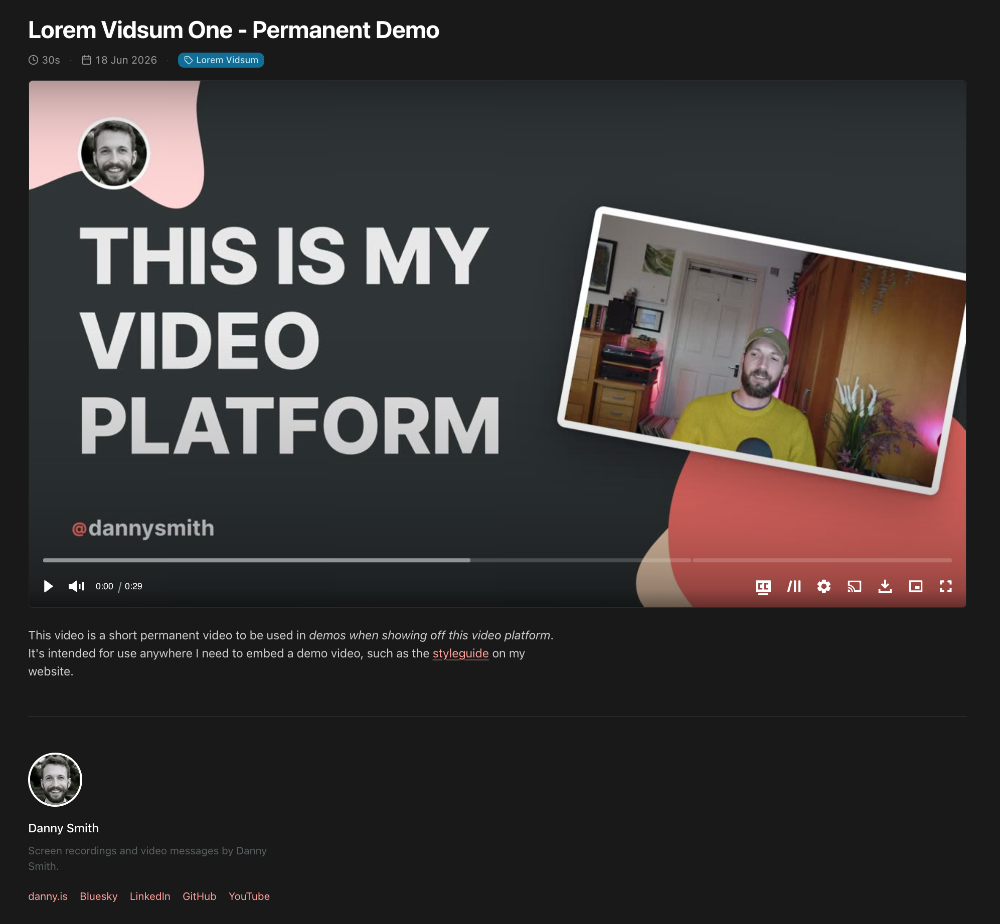

My [introduction](/writing/loomclone-part-1) to *LoomClone* was pretty sparse on technical detail so I'm gonna dive into a bit of that here, specifically how the mac app and backend API work together for the lifecycle of a recording. You should go read the intro if you haven't already or this won't make much sense.

I think the best way to explain this is to walk through the lifecycle of a recording one step at a time.

## 1. Opening the menubar app

When I open the menubar popover we start some lightweight preview sessions for the selected camera and audio devices and start capturing screenshots of the active display to provide a preview for that. We also begin polling for new devices to keep the dropdowns up-to-date and check the server is reachable and the local data directory is writable. All this is intentionally separate from the actual capture sessions and is torn down once the menubar popover is closed. Its only purpose is to confirm to the user that the chosen sources are set up properly and let them choose a few settings.

## 2. Pressing record

The recording toolbar shows a short countdown while in the background:

1. We immediately start capture sessions for the selected devices so they have time to warm up, check the audio source is actually providing samples and spin up the various writer sessions so they’re warm. We also double-check a few other bits about the video and audio streams we're getting.
2. We hit the server to generate a UUID and unique three-word slug for the video. This creates a new recording in the database and seeds a data directory on the server, returning the UUID and slug to the mac app.
3. We use the UUID to create a local data directory and seed it with an `init.mp4` to act as an entrypoint for the local `m4s` segments.

When the countdown finishes we initiate an internal *metronome* to help keep things in sync and begin the **writes** processes.

## 3. During Recording

We use two capture sessions: one for the screen and another for the camera+audio together (or just the audio if there’s no camera feed). These feed an orchestrator which maintains a metronome & recording clock, handles user pausing/unpausing by pausing the clock, and deals with things like frame caching.

There's a ton of fiddly stuff in here to gracefully handle video sources which deliver frames unpredictably. Every video frame and audio sample is timestamped using the *hardware capture time* it arrived with rather than the wall clock, so variable latency between capture and reaching my code is irellevant for timing sync. When camera & mic are both selected they share a single capture session so are inherently aligned to sub-millisecond accuracy. While the metronome ticks along at the target frame rate, it's just a *budget*: on each tick we emit whatever the source has actually delivered. So a camera that can only manage 24fps produces honest 24fps output rather than the horrible corrupted mess I ended up with from my initial metronome implementation.

<Callout title="Aside: Some cameras are lying bastards">
My Sony ZV-1 advertises itself as a 30fps camera but actually only delivers **about** 24. When I told macOS to *hold* 30fps, its capture layer tried to fabricate the missing frames and in doing so corrupted the timestamps on every frame, shifting them several seconds into the past and completely desyncing the audio. The fix was to stop telling the camera how fast to run and just take whatever it gives us. Cameras that can actually sustain their advertised rate (like the built-in FaceTime one) were never affected, which made it a *delightfully* confusing bug to track down.
</Callout>

Anyway....

During recording we continuously write three media files to disk locally, directly from the capture sessions:

- `screen.mov` - The "raw" output of the ProRes screen capture session.
- `camera.mp4` - The "raw" output of the H.264 camera capture session, ignoring any user adjustments to white balance & brightness, including an audio track.
- `audio.m4a` - The “raw” audio from the mic.

These are never sent to the server, but having them locally means I can always pull them into Final Cut Pro if I decide to do some proper editing later, and have a reliable backup if composition fails for some reason. We also keep a timeline of events in memory and continuously write to a few log and diagnostic files.

The video we send to the server is *composited* from the capture streams using the upload resolution and framerate selected by the user before recording. Camera adjustments for white balance & brightness are applied to the camera feed and the camera and screen feeds are downscaled and/or cropped to an appropriate size & aspect ratio for the recording, taking into account the selected stream quality.

<Callout title="User Actions While Recording">
The following user actions affect the composited recording.

- Pressing **pause** in the toolbar temporarily pauses all writers until **unpause** is pressed, along with the metronome.
- Pressing **chapter marker** in the toolbar adds an anonymous marker to the recording timeline which can later be edited in the admin app to create viewer-facing chapter markers. If pressed while paused it's added at the next *unpause* timestamp.
- Switching **mode** in the toolbar causes the composited recording to swap to the relevant feed (screen or camera). In screen & camera mode the camera feed is rendered as a small circular overlay in a corner of the screen.
- Moving the camera preview from one quadrant to another (eg. bottom-right to top-left) moves it to that corner in the composited output (when in screen & camera mode).
</Callout>

As the composited video is generated it's encoded at an appropriate bitrate and written to disk locally as a series of ~4 second `.m4s` segments before being "streamed" to the server via a queue of simple `PUT` requests. Failed `PUT`s are retried indefinitely with an exponential backoff (and we stop bothering entirely while the network is obviously down), but they're all sent via a queue so even a ~10 min connection loss just means the queued segments are sent up on reconnection. These `PUT`s are idempotent on the server.

There are a couple of other resilience details worth a mention. If the Metal compositor hangs or returns a bad frame – which can happen under sustained GPU pressure – we detect it, rebuild the context and carry on. And when the screen content isn't changing for a while (eg. I'm holding on a slide while talking to camera) we emit synthetic *keep-alive* frames so the HLS segments never go empty and break the playlist. We also keep an eye on the capture sources themselves: if the screen, camera or mic stalls or drops out mid-recording a warning pill pops up in the toolbar so I know something's wrong. And if a camera sharing a session with the mic dies we fail over to a separate, always-running mic capture session so the audio keeps recording.

The recording timeline is periodically written to a temporary file on disk to facilitate recovery if anything goes wrong.

## 4. Pressing Stop

When we hit stop, the capture sessions and writer processes are stopped. If the `UploadActor` queue isn’t empty it’s given up to ten seconds to finish uploading before any remaining segments are marked as *failed* locally[^1].

The recording timeline is used to write a local `recording.json` to disk which includes:

- Basic info like UUID, start/end timestamps, duration etc.
- Details of the input sources and raw writers used, including device names, hardware details and the like.
- Details of the writer used for the composited video including the encoder and streaming settings.

It includes a log of timeline events during recording, each of which has:

- `kind` - type of event (eg `segment.uploaded` or `modeChange.CamOnly`).
- `t` - time of event as seconds since metronome `T0`.
- `wallClock` - datetime of event per OS clock as UTC.
- `data` - Other useful stuff as an object. This depends on the kind of event.

While the event log includes the segment upload events, `recording.json` also contains a separate list of the generated segments, including:

- `bytes` - size of the segment
- `durationSeconds` - segment duration
- `emittedAt` - Metronome time the segment was emitted.
- `filename` - Filename on local filesystem (eg `seg_000.m4s`).
- `index` - Order of segments chronologically as emitted by the compositor. We can use this to deal with any ordering issues later.
- `uploaded` - True if any `PUT` for the segment returned OK, false if not.

This data is written to a local `recording.json` and then `POST`ed to `/:uuid/complete` on the server to tell it we're done recording.

We also write a local `diagnostics.json` full of per-tick timing data and — because a lot of camera and encoder gremlins originate deep inside weird bits of macOS — we grab a slice of the macOS system log for the recording and temporarily write it to disk to help with debugging.

<Callout>
Because the HLS segments are written to the server as they arrive, and we generated the slug at the beginning, it's possible to watch the video live at `https://v.danny.is/the-generated-slug` *while it's being recorded*. This isn't really an intentional feature (it's not a livestreaming platform), we do this so that when we hit stop we **already** have a live video on a URL.

At the end of recording the mac app copies the public URL to the clipboard so it can instantly be shared, and it's also possible to quickly edit a recently-finished video's title, slug and visibility in the macos menubar app.
</Callout>

## 5. When recording's finished

When the server receives the `POST` to `/:uuid/complete` it already has all the segments on disk and is serving them as an HLS playlist on the public URL. So the *complete* signal just causes the data in `recording.json` to be written server-side, with some of the key data from it added to the recording's database record. It then kicks off a series of step-by-step post-processing jobs.

### Healing

Healing is the recovery mechanism for HLS segments that didn't make it during live recording. The server knows what segments it has on disk and now it has the client’s segment log from `recording.json` it can compare the two and ask the client to resend any missing or broken segments. The mac app also re-checks on launch: if a recording from the last few days still has segments that never made it up it quietly finishes healing them in the background.

### Restitching

The first and simplest post-processing task is stitching the `m4s` segments into a single `source.mp4` using `ffmpeg`. As soon as we have a valid `source.mp4` available, we serve that to viewers instead of the HLS playlist. We also use `ffprobe` to extract some metadata from the new MP4 and update the database record.

### Audio Enhancement

Next, we clean up the audio by running it through a chain of ffmpeg filters, writing the result back to the audio track of `source.mp4`. I'm still working on getting this right but at the moment the chain involves:

1. A high pass filter to remove really low frequency noise.
2. `arnndn` to denoise speech.
3. `afftdn` to clean up stationary background noise.
4. An `agate` noise gate to silence parts where I'm not speaking.
5. `dynaudnorm` for volume levelling within the regions where I *am* speaking.
6. A final `loudnorm` to produce a normalised volume of about -14 LUFS.

<Callout>
Despite a lot of tuning this is probably a bit aggressive considering most of my recordings happen in a quiet room with a decent mic. I'm currently iterating on this in a separate little project with a load of representative audio samples.
</Callout>

We also generate a `peaks.json` describing the audio levels which is used in the video editor to render a nice waveform and suggest quiet areas to trim or cut.

### Thumbnail candidates

Multiple frames are extracted and scored by luminance variance, with the “best” written to disk as `thumbnail.jpg` and used as the video's poster image. The other candidates are also saved to disk on the server so I can choose a new one in the admin app.

### Generating video variants

We use `source.mp4` to generate downsized variants so we can serve them to viewers who want lower resolution versions. If our source is 1080p we just generate a `720p.mp4` version. If it’s 1440p we’ll create both `720p.mp4` and `1080p.mp4` derivatives. And so on.

### Generating storyboard images

For videos longer than 60 seconds we generate a `storyboard.jpg` and `storyboard.vtt` so the player can use them to show previews when scrubbing the timeline. Longer videos are sampled less frequently than shorter ones so they don't get too enormous.



We also generate a second, more granular storyboard image and VTT for use in the admin app's video editor.

### Suggested edits

We look at the `peaks.json` and if there are any obviously quiet areas we write a `suggested-edits.json` which is picked up by the video editor and used to suggest trims and cuts when it's first opened. This is deleted when any actual edits are made, and automatically cleaned up after a few days if not.

## Transcription & Subtitles

While the post-processing above is done server-side, doing any **AI stuff** on the server would mean paying for tokens on an external service or beefing up the server enough to run models on it. Since I have a pretty powerful laptop it makes more sense to do this locally instead. So the macOS app includes WhisperKit for transcription and makes use of Apple's built-in foundation models for generating suggested titles and the like.

When a video completes, the macOS app kicks off a task to transcribe the local `audio.m4a` using WhisperKit. It uses this and the timing data from `recording.json` to produce two things:

1. A `words.json` containing each word and its start & end timestamp.
2. A `captions.srt` containing timestamped subtitles.

Both are stored locally on disk and also sent to the server along with the plain transcription text. The plain transcription is written to the database and `captions.srt` is used to provide subtitles in the video players. We only use `words.json` in the video editor, but it's good to keep around as a definitive version of the transcript.

### Suggested title and description

If transcription completes successfully, the first ~500 words are fed to Apple's local Foundation Model along with a system prompt asking for a suggested title and some data from `recording.json`. The suggestion is checked against some simple *is-this-insane?* rules and then sent to the server where it's used to update the video’s title in the database (unless it's already been updated by me first).

A similar process is used to generate a suggested description and, if chapter markers exist, suggested titles for each of them.

This is far from perfect, but it's better than nothing at all.

## So where do we end up?

On the server-side, the whole post-processing pipeline is managed by a kind of *step registry* which ensure each step happens in the right order and allows me to manually retrigger the process from various points if I need to. When everything's finished the admin panel will show a checklist like this.


And we’ll end up with the following in our database record...

| Field            | Description                                                                       | Example Value                          |
| ---------------- | --------------------------------------------------------------------------------- | -------------------------------------- |
| id               | UUID, primary key.                                                                | `a1b2c3d4-e5f6-7890-abcd-ef1234567890` |
| slug             | Current URL slug. Unique. Old slugs live in `slug_redirects` for 301s.            | `how-to-use-the-new-dashboard`         |
| status           | `recording`, `healing`, `processing`, `ready`, `reprocessing`, `processing_failed`, `incomplete` or `deleting`. | `ready`                                |
| visibility       | `public`, `unlisted` or `private`.                                                | `unlisted`                             |
| title            | Display title. Null until set by the user or the AI suggestion step.              | `How to Use the New Dashboard`         |
| description      | Public-facing description. Null until set.                                        | `null`                                 |
| notes            | Private notes — admin-only, never exposed publicly.                               | `null`                                 |
| duration_seconds | Cached at completion so list views don't need to sum segment durations.           | `187.4`                                |
| width            | Pixel width of `source.mp4`, from ffprobe.                                        | `2560`                                 |
| height           | Pixel height of `source.mp4`, from ffprobe.                                       | `1440`                                 |
| aspect_ratio     | Width / height, cached for layout work.                                           | `1.778`                                |
| file_bytes       | Size of `source.mp4` in bytes.                                                    | `48291840`                             |
| camera_name      | Camera device name captured from `recording.json`.                                | `FaceTime HD Camera`                   |
| microphone_name  | Mic device name captured from `recording.json`.                                   | `MacBook Pro Microphone`               |
| recording_health | Summary of any recording issues (dropped frames, failed segments). Null if clean. | `null`                                 |
| source           | `recorded` (from the macOS app) or `uploaded` (via the admin web upload).         | `recorded`                             |
| created_at       | Row creation timestamp (ISO-8601).                                                | `2026-04-30T14:22:03.841Z`             |
| updated_at       | Last update timestamp (ISO-8601).                                                 | `2026-04-30T14:29:17.205Z`             |
| completed_at     | Set the first time the video reaches `ready`; never overwritten afterwards.        | `2026-04-30T14:25:44.012Z`             |
| trashed_at       | Set when the video is moved to the trash bin; null otherwise.                     | `null`                                 |
| last_edited_at   | Set when edits are committed via the video editor; null if never edited.          | `null`                                 |

The `video_transcripts` table will also have a row for the video with the plain text transcript and word count.

#### On Disk

Our server's storage volume will have a directory which looks something like this on disk…

```tree
data/a1b2c3d4-e5f6-7890-abcd-ef1234567890/
├── init.mp4                          # HLS initialization segment (codec headers)
├── seg_000.m4s                       # ~4s media segments streamed during recording
├── seg_001.m4s
├── ...
├── seg_046.m4s
├── stream.m3u8                       # HLS playlist referencing init.mp4 + segments
├── recording.json                    # Timeline, events and segment log from the client
├── chapters.json                     # Chapter markers (extracted from recording.json, user-editable)
└── derivatives/
    ├── source.mp4                    # Stitched single-file MP4 with enhanced audio
    ├── 1080p.mp4                     # Downsampled variant (source is 1440p)
    ├── 720p.mp4                      # Downsampled variant
    ├── thumbnail.jpg                 # Auto-selected best frame
    ├── thumbnail-candidates/
    │   ├── auto-01.jpg               # Other candidate frames (cleaned up after 10 days)
    │   ├── auto-02.jpg
    │   └── auto-03.jpg
    ├── captions.srt                  # Subtitles uploaded by the macOS app
    ├── words.json                    # Per-word transcript timings (used by the editor)
    ├── peaks.json                    # Audio waveform peaks for the editor
    ├── suggested-edits.json          # AI-suggested silence/filler cuts for the editor
    ├── storyboard.jpg                # Sprite sheet of preview frames (videos ≥ 60s)
    ├── storyboard.vtt                # Maps time ranges to sprite regions
    ├── editor-storyboard.jpg         # Higher-density sprite sheet for the editor
    └── editor-storyboard.vtt         # Maps time ranges to editor sprite regions
```

Our mac will have a directory in `~/Application Support/LoomClone/recordings/[UUID]` which looks something like this…

```tree
~/Library/Application Support/LoomClone/recordings/a1b2c3d4-e5f6-7890-abcd-ef1234567890/
├── init.mp4                          # HLS initialization segment
├── seg_000.m4s                       # Composited ~4s segments (uploaded to server)
├── seg_001.m4s
├── ...
├── seg_046.m4s
├── screen.mov                        # Raw ProRes screen capture
├── camera.mp4                        # Raw H.264 camera + audio
├── audio.m4a                         # Raw AAC mic audio
├── recording.json                    # Timeline, events and segment log
├── diagnostics.json                  # Recording-time diagnostic snapshot
├── captions.srt                      # Local backup of generated subtitles
├── words.json                        # Local backup of per-word transcript timings
└── .transcribed                      # Marker: transcription complete
```

And when someone visits the public URL for a video they'll see something like this, complete with subtitles, thumbnail, scrubber previews and the option to play lower-resolution derivatives.



There's **a lot** I haven't covered here – I'll hopefully get to that in some more focussed articles in the future. If you're interested in the details of all this [the internal docs on GitHub might be of interest](https://github.com/dannysmith/loom-clone/blob/main/docs/developer/recording-pipeline.md). Just bear in mind much of it was written by an LLM.

[^1]: Because we keep these locally and know they failed, we can retry them later as part of the "healing" process.