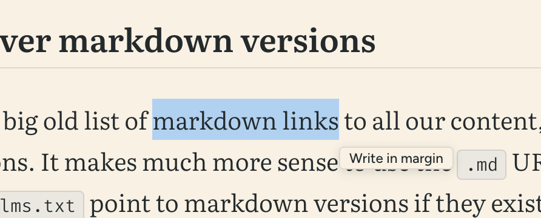
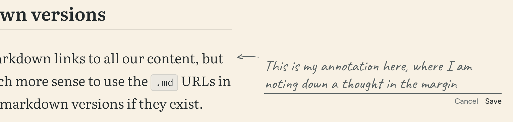
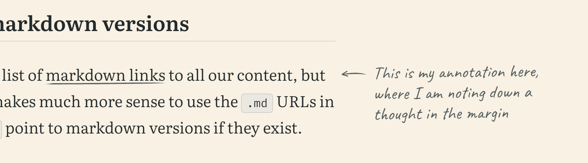
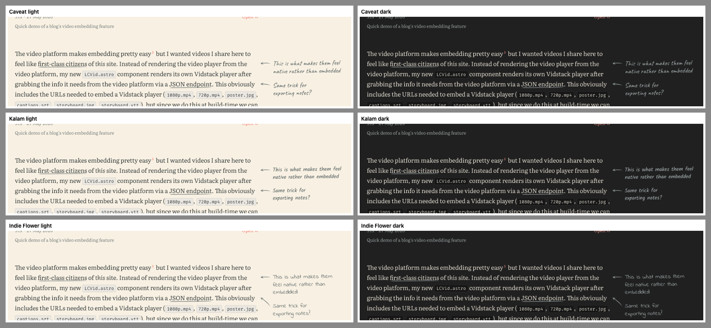

import SGTypeSpecimen from '../../pages/styleguide/_components/SGTypeSpecimen.astro'

Inspired by [this article](https://blog.mastykarz.nl/making-room-for-your-thoughts/) from Waldek Mastykarz, I've recently added the ability for readers to add their own annotations to the side of articles on this website. Selecting some text shows a little *Write in margin* button which opens a form and allows you to write in the margin like this:







The annotations are stored in the reader's browser in local storage and, as on Waldek's site, they also appear in the margin when you print an article to PDF.

The only reason this is an article and not a note is so you can try it out right here. Select some text and give it a go. If you're on a phone there's no margin to write in, so your notes show up underneath the paragraph instead.

## Choosing a typeface

I wanted these notes to look handwritten so they were clearly differentiated from any of **my content**, which meant adding a *fifth* typeface.

Waldek uses [Kalam](https://fonts.google.com/specimen/Kalam), which is small and works well on his site. I tried it alongside [Indie Flower](https://fonts.google.com/specimen/Indie+Flower) and [Caveat](https://fonts.google.com/specimen/Caveat), and threw out a handful of others.



I ended up going with Caveat because I think I'm much more likely to use it in other handwriting-esque contexts in the future than any of the others, plus it's variable.

<SGTypeSpecimen
  family="Caveat"
  url="https://fonts.google.com/specimen/Caveat"
  usageTitle="Margin annotations"
  cssVar="--font-handwriting"
>
  Only used for the notes readers write in the margins of articles.
</SGTypeSpecimen>

Unlike the other typefaces it's not preloaded, and it's also split in two with `unicode-range` so only the basic Latin characters are loaded until someone types an accented character.

## How it works

Each article with annotations gets a `localStorage` key holding a JSON array which is rewritten whenever you add, edit or delete a note. A record looks something like this:

```json
{
  "id": "…",
  "blockIndex": 4,
  "blockId": "p:4:1k2j9x",
  "startOffset": 112,
  "endOffset": 131,
  "quote": "write in the margin",
  "prefix": "a form and allows you to ",
  "suffix": " like this:",
  "note": "Like a printout!",
  "createdAt": "2026-09-18T14:02:11.000Z"
}
```

Storing only the paragraph number and character offsets would break things if I edit a paragraph after folks have added notes, so each record also keeps the quoted text and up to 32 characters either side of it. When the page loads, if the quoted text is still where it was, the note stays put. If it isn't, the script goes looking for the quote elsewhere in the article and uses those surrounding characters to pick the best match.

The underline is an SVG in a data URI, used as a `background-image` on the marked text, and the arrows are generated by JavaScript.

As a general rule, I try to avoid shipping client-side JavaScript on this site, but this feature is obviously impossible without JS. The script is about 700 lines of TypeScript, which comes in at about 5KB minified & gzipped, and is loaded as a deferred module on article pages only. The button & editor HTML are both generated at build time.

This is the kind of feature I might end up removing down the line just for the sake of reducing complexity, but I enjoy the fact that I can play with features like this because this is my personal site.
