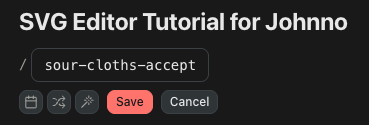
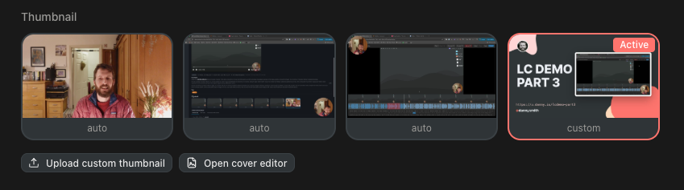
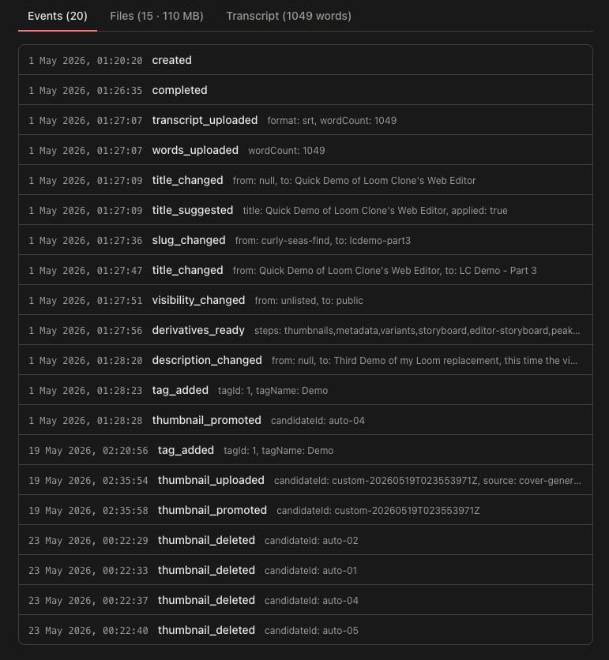
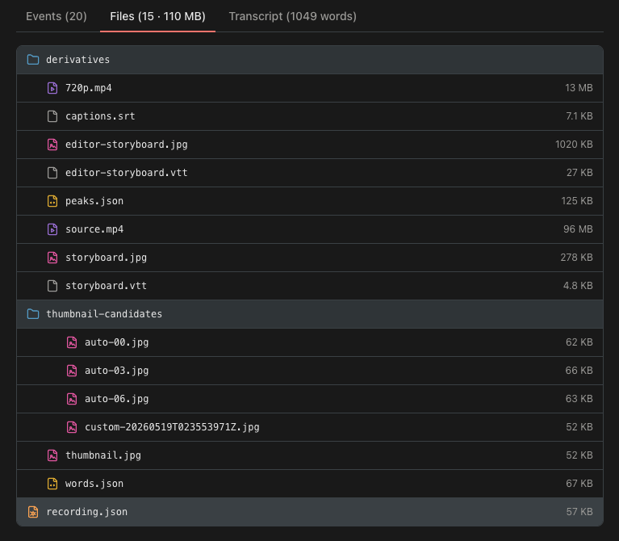
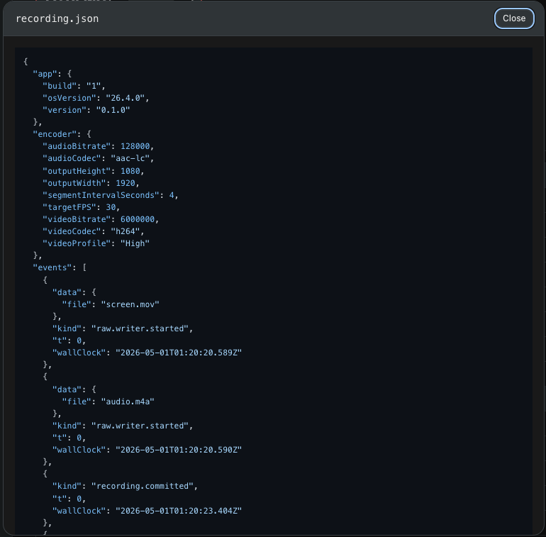

Intro

## The Overvirw Page

The admin interface lives at http://v.danny.is/admin and is a web interface for managing my videos. The dashboard has grid and table views with controls for sorting and filtering videos. Searching will show all videos whose title, description, slug or transcript match.

[VIDEO Dashboard demo]

*Trashing* a video moves it to the **trash bin**, disables its public endpoints and removes it from any public feeds. Trashed videos can be restored or permanently deleted from the trash bin.

[IMAGE Trash bin]

## Uploading videos

I can also upload an `mp4` video directly via the web interface, and the server will run as much of the post-processing pipeline as it can.

[IMAGE Upload screen]

## The Video Page

[VIDEO Video Page Walkthrough]

The admin video page shows the title, slug and visibility, all of which can be easily edited. When changing the slug we have some helpers to save me a few keystrokes:



1. **Prepend today's date**. This just saves me a few keystrokes when changing a slug to something like `2026-05-23-weekly-sales-update`.
2. **Append a long random string**. Default slugs are generated as three random words, but for some unlisted videos I want the URL to be harder to guess than that. This appends a random 64-character string so we end up with a much more obscure slug like `sour-cloths-accept-4togo5adx3ftk74ykt9yvy8n2hqh55o9nfrjpkwt73moj72ex3bjql8ixrsv8ns6`.
3. **Generate from title**. This replaces the text with a slugified version of the video's title.

<Callout>
This is a great example of the kind of *tiny* features which are only useful because they're built specifically for my needs. The last one strips non-ASCII charicters, lowercases and splits by word. It then removes filler words (the, a, and, of, to, is, for, with etc) and generates a hyphenated slug which is always under 50 characters and is always made up of full words from the title. I specifically wanted it to work this way because this is exactly what I'd do manually when slugifying long titles for a URL.
</Callout>

Below this is a row of quick action buttons: **Open** & **Copy Public URL** are self-explaniroty, while **Copy URL at current time** will include a timestamp (eg. `?t=1m12s`) so the player will start from there. **Copy Embed HTML** copies a snipped like this:

```html
<div style="position: relative; padding-bottom: 56.25%; height: 0;">
  <iframe src="https://v.danny.is/my-slug/embed" frameborder="0" allowfullscreen allow="autoplay; fullscreen; picture-in-picture" loading="lazy" title="SVG Editor Tutorial for Johnno" style="position: absolute; top: 0; left: 0; width: 100%; height: 100%;"></iframe>
</div>
```

**Edit Video** opens the [editor](#the-video-editor) while **Download**, **Duplicate** and **Trash** should be self-explanatory.

The status and other metadata is shown underneath the player along with editable fields for the public **description**, **tags** and **private notes** only visible to me. The description and notes fields support basic markdown formatting.

[Screenshot 2026-05-23 at 01.17.10.png](../../assets/articles/2026-05-23-screenshot-2026-05-23-at-0117.10.png)

The **Thumbails** section allows us to choose a cover image from the available *candidates*. We can add to the auto-generated candidates by uploading an image or saving one from the  [thumbnail editor](#the-thumbnail-editor). We can also delete candidates.



The final section has tabs showing the **Event Log**, **Files** and **Transcript**. The transcript tab is self-explanatory but the other two are interesting because they exist to help me be my own "technical support guy".

The **Events** tab shows a chronological log of the major events which affected the video.



The **Files** tab shows the entire contents of the video's data directory on the server as a file tree with filesizes. Having this available inside the admin interface means I rarely need to SSH into the server to look at the actual files on disk, especially as any JSON files can also be viewed here.






## The video Editor


I didn't originally plan to include any sort of video editor because most of my "editing" is done while I'm recording by pausing and unpausing. But after recording a few real videos I realised that I do sometimes need two features here: cutting out mistakes and trimming a few seconds from the start and end of some videos.

The editor loads the video in a fairly standard interface showing the preview, timeline and audio waveform with the usualy ability to play, pause and scrub with keyboard shortcuts. It also shows the transcript with the current word highlighted, and clicking a word will move the cursor to the correct place in the timeline.

I can quickly trim the start and end of a video, and add *cuts* to the timeline at any point. A cut has both a start and an end timestamp and effectively removes that part from the video. Trims and cuts are saved to disk as an `edits.json` file which just specifies their `type`, `startTime` and `endTime`.

Pressing  **commit** generates a new MP4 without the cut/trimmed bits, updates the transcript & video metadata (lenght etc), and generates new derivitives where needed. The editor always shows the original MP4 & transcript and the edits from `edits.json` so we can always regenerate the original by removing the edits and comitting that.

Any recordings with obvious silent periods will have a `suggested-edits.json` generated as part of the post-processing. These suggested trims and cuts are shown on the timeline and can be quickly accepted or rejected the first time we edit a video.

Finally, we can add named chapter markers and – if any were added during recording – name and adjust those too.

[VIDEO Video Editor Demo]

## The thumbnail editor


For less ephemeral videos I often want to add a cover image based on a template I designed in Figma ages ago. 

- Avatar, me, copyright notice
- Title (resizing)
- URL
- Image (unframed, framed, video overlay)
- QR Code
- Exporting

[VIDEO Cover Editor Demo]

## Managing tags
