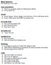

import { Callout } from '@components/mdx';

<Callout emoji="📜">
This was originally posted on [thescri.be](http://thescri.be/2007/05/08/print-kgtd-to-index-cards/) on 8 May 2007 and was imported here from the [Internet Archive](https://web.archive.org/web/20080521124353/http://thescri.be/2007/05/08/print-kgtd-to-index-cards/) on 18 December 2025.
</Callout>

Along with a whole bunch of other GTD guys, I use [kinkless GTD](http://www.kinkless.com/) to keep track of all my next actions. Along with everyone else I'm excited about the release of [OmniFocus](http://www.omnigroup.com/applications/omnifocus/), which will print to index cards. Until its release, however, I need the ability to print my NA's to my hPDA as [Kinkless](http://www.kinkless.com/) or OOP doesn't provide this functionality.

A few weeks ago I started syncing kGTD with iCal and using iCal to work from. I now use kGTD to organize my NAs and iCal to tick them off. This saves having OmniOutliner open the whole time and stops the temptation to re-shuffle my projects every five minutes.

After a bit of research I whipped up a script that formats NA's from iCal in TextEdit and then saves it as an HTML file for printing. Safari will then print the nicely formatted list to 3×5 index cards, providing your printer supports it.

**Download:** [Print kGTD to Index Cards script](http://thescri.be/wp-content/uploads/2007/06/kgtd-print.scpt)

Make sure that you change the user_name to your login name and change show_help_at_start to false if you don't want to be reminded about Safari's printing options when you run the script.

In hindsight it would have made sense to simply format the file as HTML and write it directly to a text file, I may still rewrite the script.

If you like the script or have any problems with it, leave a comment or link to me.
