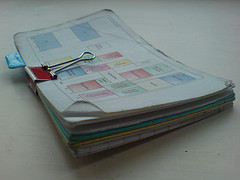

import { Callout } from '@components/mdx';

<Callout emoji="📜">
This was originally posted on [thescri.be](http://thescri.be/2007/05/09/the-hipster-pda/) on 9 May 2007 and was imported here from the [Internet Archive](https://web.archive.org/web/20080521124353/http://thescri.be/2007/05/09/the-hipster-pda/) on 18 December 2025.
</Callout>

Following my post on [printing kGTD actions to index cards](/notes/2007-05-08-print-kgtd-to-index-cards) I thought it would be a good idea to write a brief post about my favorite organizational tool – the humble stack of index cards or [Hipster PDA](http://www.43folders.com/2004/09/03/introducing-the-hipster-pda/).

Popularized by Merlin Mann of [43folders](http://43folders.com/), the hPDA was used by my mother back in the early 70's when she worked as an estate agent. It comprises a stack of about 20 index cards clipped together with a binder clip. I started using it about a year ago as a type of notebook/organizer and I've tried a [whole](http://radio.weblogs.com/0114670/categories/hipsterPda/2005/06/14.html) [bunch](http://www.douglasjohnston.net/weblog/archives/2005/06/11/diyp2_hipsterpda/) [of snazzy](http://gurno.com/dru/?q=node/30) printed cards since then. While a number of these cards were useful, I've come to realize that most of them can simply be drawn out on a plain card in less time that it takes to print one, and with more flexibility. So why bother?

My current hPDA comprises:

- **A Printout of my weekly fixed timetable** showing my University lectures, regular air cadet events and a few other fixed appointments. I made the timetable in OmniGraffle and printed it onto a blank index card.
- **A food shopping list** containing foods I often need to buy and the ingredients for my four of five staple meals. I use this as a sort of reminder if I'm in a shop – running through the list reminds me if I'm out of anything on it.
- **[My Next Actions list](/notes/2007-05-08-print-kgtd-to-index-cards)** printed from kGTD.
- **A simple separator** with a blue "E" tab poking out the side. This separates the blank cards from the others and has my phone number, national insurance number and RAF service number written on it.
- **Ten large post-it notes** stuck to the back of the separator.
- **A handful of business cards** along with a few more in my wallet.
- **Three of four red index cards** for writing really important things on. Any red cards get my attention as soon as I get home, all the others go into my inbox.
- **About fifteen poor quality Tesco index cards** for everything else.

This whole lot is held together with a shiny red binder clip and lives in my back left pocket most of the time. When I get home I throw all the cards with notes and scribbles into my inbox, and action any red ones. To sum up, here are some of the pros and cons of the hipster:

**Pros**

- I *always* have my next actions list on me.
- I never need to write on scraps of paper or napkins.
- I can always give written information to someone.
- Everything is clipped together in one pocket, it's hard to lose.
- It never crashes.

**Cons**

- It's very difficult to back up the hand-written stuff in it.
- It gets wet very very easily.
