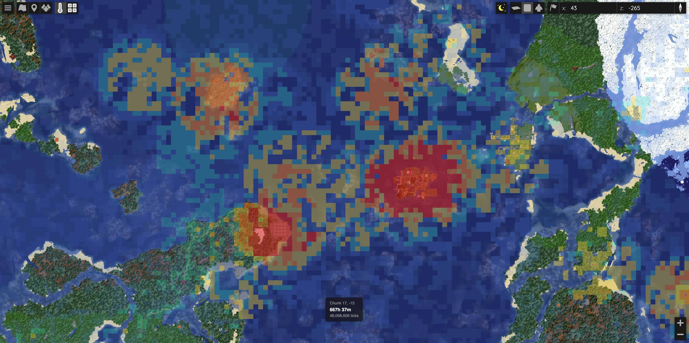
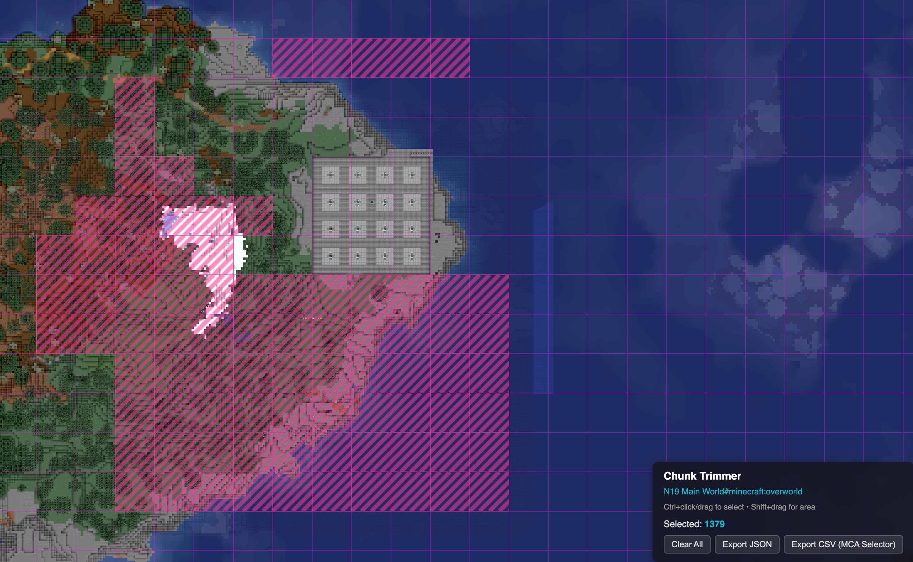
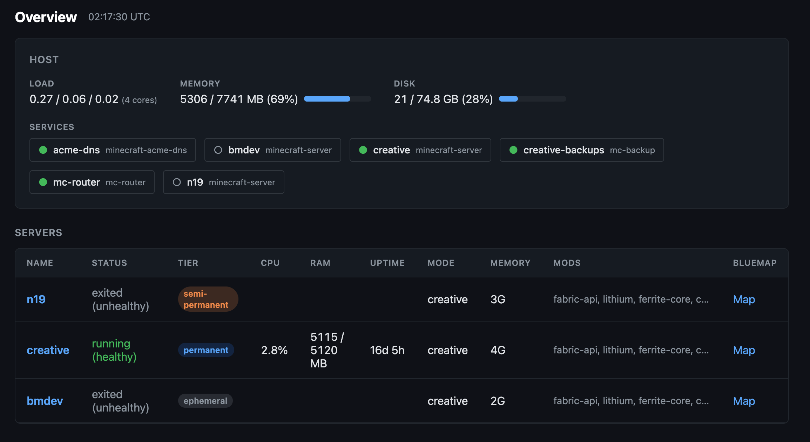
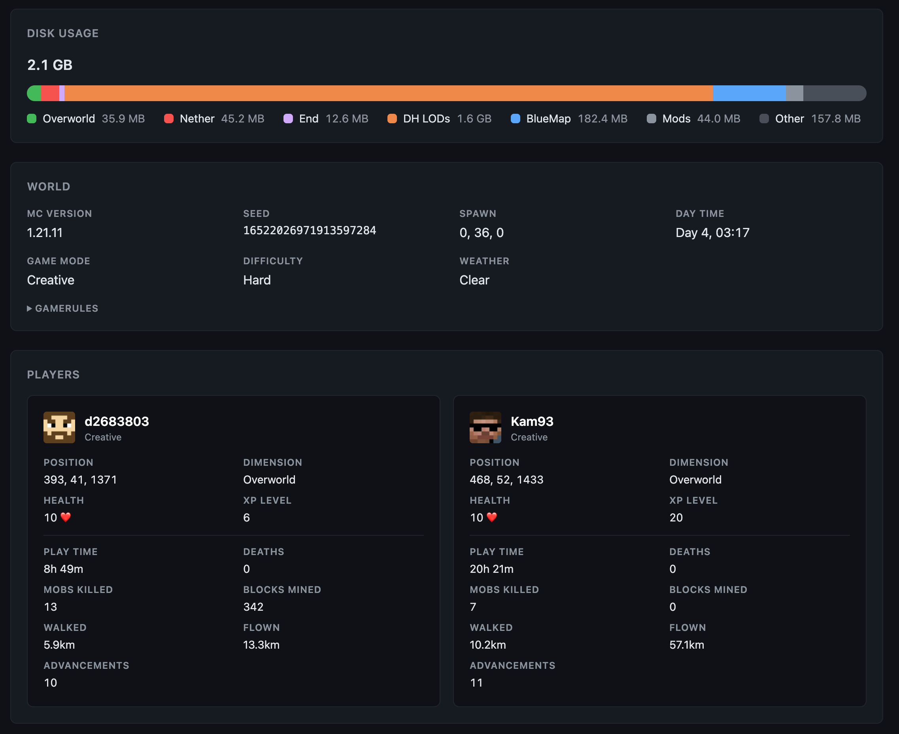

For the last few years I've shared a survival minecraft world with my friend Cam. It's hosted on [WiseHosting](https://panel.wisehosting.com/) and apart from a bunch of performance mods, the only non-vanilla stuff running on it are [Distant Horizons](https://gitlab.com/distant-horizons-team/distant-horizons) and [Bluemap](https://bluemap.bluecolored.de/).

While I could save some money by running my own server, I don't really want to. I play minecraft to get away from my day-to-day, and I also don't want to be responsible if something goes wrong and ~3 years of building in our world suddenly disappears. Hence I outsource to WiseHosting and avoid messing with the default installation too much.

But last month I found myself wanting three things which didn't exist:

1. A Bluemap plugin which shows [Chunkbase-style structure markers](https://www.chunkbase.com/apps/seed-map#seed=493527618652710797&platform=java_1_21_6&dimension=overworld&x=112&z=-968&zoom=0.448) on our actual world map.
2. A Bluemap plugin to assist with [chunk trimming](https://wisehosting.com/help/how-to-trim-your-world-with-mcaselector).
3. A cheap way to run a persistent shared creative world with Cam, and also to spin up and manage ephemeral minecraft servers for various reasons.

After a few days vibe coding and learning about the minecraft ecosystem I have all three...

## Bluemap Structures

[mc-bluemap-structures](https://github.com/dannysmith/mc-bluemap-structures) is a Fabric mod and Bluemap plugin which reads your world seed and adds chunkbase-like structure markers to your bluemap maps.


It works by replicating Minecraft's algorithms and creating [BlueMap markers](https://bluemap.bluecolored.de/wiki/customization/Markers.html). You can read about how it works [here](https://github.com/dannysmith/mc-bluemap-structures/blob/main/docs/structure-algorithm.md). It's currently somewhat limited by the fact that the BlueMap web app doesn't handle very large numbers of markers performantly, so if you run it with a very large radius BlueMap will get janky. At some point I'll look into rendering the markers myself as an overlay, which might help.

The process of building this was super interesting – I learned a whole bunch about how Minecraft decides where to generate structures, and also how Chunkbase manages to replicate the algorithms with such accuracy. I was surprised to discover that Chunkbase does this entirely on the client-side with a ~4 MB WebAssembly module compiled from Rust.

The project includes a [command-line tool](https://github.com/dannysmith/mc-bluemap-structures/tree/main/tools/chunkbase-verify) which uses playwright to extract structure positions directly from Chunkbase and save them to a JSON file. I built this as a way to verify my own algorithms against chunkbase, but it could easily be used to create a much simpler Bluemap plugin which simply reads a manually-generated JSON file from Chunkbase and shows markers based on that.

## Bluemap Chunk Trimmer

As a minecraft map grows through player exploration, it becomes necessary to occasionally trim away chunks which have been generated but contain nothing valuable. This helps keep the world size (on disk) in check and also prevents players having to travel further and further afield to experience new features which will only appear in newly-generated chunks.

To do this well, you need a detailed map of your explored world and the ability to visually select chunks for deletion/retention. It's also very helpful to know the `playerInhabitedTime` for each chunk – if it's only a few seconds we can assume that it was only generated because someone flew near it and has probably never been visited. If it's tens of hours we probably don't want to trim it even if nothing's been built, because someone's spent enough time hanging out it'd feel weird if it changed.

Most of the GUI tools for chunk trimming only work on Windows or on local worlds (or both).

[mc-bluemap-chunky-trimming](https://github.com/dannysmith/mc-bluemap-chunky-trimming) is a Bluemap plugin which does two things:

### 1. Heatmap



Reads the `InhabitedTime` NBT data from `.mca` region files and renders a **heatmap** as an overlay in bluemap's 2D *flat* mode. Chunks with less than 1 minute of inhabited time don't appear on the heatmap at all, and the rest are colored according to how long they've been inhabited, with the highest level being 10+ hours.

When the heatmap is on, a little HUD will show the inhabited time of the chunk under the cursor.

### 2. Chunk Selector



With the Chunk Selector toggled on, control-click on a chunk will *select* it (or deselect it). Chunks can also be selected by dragging a box, or by "painting" with the mouse.

Selected chunks can be exported as either JSON or [MCA-Selector](https://github.com/Querz/mcaselector) compatible CSV. I intentionally decided against building the actual chunk deletion.

## mc-infra

While the two plugins above *might* work for other people, [mc-infra](https://github.com/dannysmith/mc-infra) is very much **for me alone**.

It's some fairly simple tooling for managing minecraft servers deployed to a [Hetzner](https://www.hetzner.com/) VPS.

### 1. Manifest System

The main feature is a [manifest system](https://github.com/dannysmith/mc-infra/blob/main/docs/manifest-and-scripts.md) which allows me to specify a bunch of stuff in YAML and use that to generate a suitable docker-compose file for itzg's [docker-minecraft-server](https://github.com/itzg/docker-minecraft-server) and [mc-router](https://github.com/itzg/mc-router), as well as a bunch of other bits and pieces.

Given a `manifest.yml` like this

```yml
mod_groups:
  fabric-base:
    - fabric-api
    - lithium
    - ferrite-core
    - c2me-fabric
    - scalablelux
    - noisiumforked

servers:
  mynewworld:
    type: FABRIC
    version: LATEST
    mode: creative
    tier: permanent
    seed: '493527618652710797'
    mod_groups: [fabric-base]
    modrinth_mods: [bluemap, distanthorizons, simple-voice-chat]
    svc: true
    pregen:
      radius: 1500
    backup:
      interval: 24h
      keep: 3
```

I'll end up with a properly-configured fabric server called `mynewworld` with:

- Suitable memory, disk usage, CPU limits etc for a "permanent"-tier world.
- My standard fabric mods installed, plus Bluemap, DH and Simple voice Chat.
- Proper config and port-forwarding to support Simple Voice Chat.
- The Chunky mod installed and configured properly to pregen chunks to a 1500 radius.
- 24h backups configured via [itzg/docker-mc-backup](https://github.com/itzg/docker-mc-backup).
- Proper configuration so the server is available at `mynewworld.mc.danny.is`.
- Because bluemap is included:
  - Proper configuration & setup of Bluemap
  - Nginx configured to serve bluemap at `map-mynewworld.mc.danny.is`
  
### 2. Control Scripts

A [bunch of executable shell scripts](https://github.com/dannysmith/mc-infra/tree/main/shared/scripts) are available on the `PATH` for managing the minecraft servers. Some of them are just very thin wrappers around docker commands. Others (like [`mc-nether-roof`](https://github.com/dannysmith/mc-infra/blob/main/shared/scripts/mc-nether-roof)) are more complex.

Together, these scripts give me an interface for working with the minecraft servers on the box once I've ssh'd in.

### 3. Setup Scripts & Dev Tooling

The Hetzner box itself is configured with the tooling I want to work on it, including the developer tools I need to work on mods directly on the box. Scripts like [`setup.sh`](https://github.com/dannysmith/mc-infra/blob/main/setup.sh) make it a little easier to recreate this whole thing on a fresh VPS if I ever need to.

### 4. Monitoring Web App

A simple [Hono app](https://github.com/dannysmith/mc-infra/tree/main/dashboard) provides a web interface for checking the status of the running minecraft servers, and includes some nice minecraft-specific stuff.





## Wrapping Up

This whole thing was a super-interesting side-quest, and I learned a bunch of stuff despite most of the code here being written by an LLM. I don't expect I'll maintain these repos beyond keeping them all working for **my own needs**.
