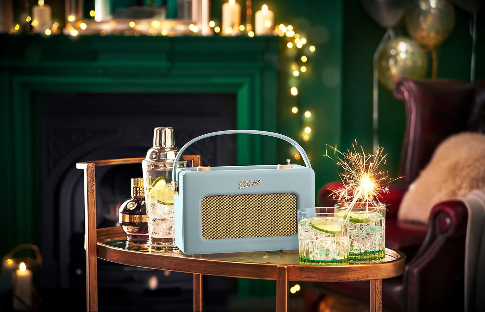
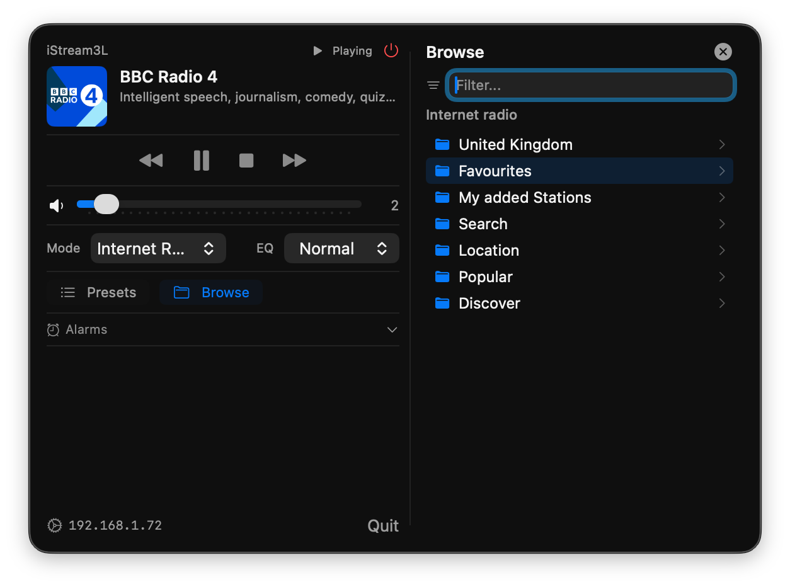

import { BookmarkCard } from '@components/mdx'



I recently bought a [Roberts Revival iStream 3L](https://www.robertsradio.com/en-gb/revival-istream-3#rev-istreamltb) radio having wanted one for some time. It's a **beautiful thing**. I grew up in a house where Radio 4 was on constantly, mostly playing on an old Roberts which my mum carried about the house with her.

While I have Amazon Echos in my kitchen, living room and office/bedroom, I still regularly find myself using my *phone* to listen to podcasts and radio shows because I can take it with me as I potter about the house and garden. I have two problems with this:

1. Phone speakers are *rubbish* and wearing headphones at home is both isolating for me and anyone else I'm sharing a room with.
2. I'm trying to spend more time with my phone tucked away in a drawer and out of mind.

What I really want here is a dedicated portable device which can play the radio without requiring my phone or laptop to even be switched on. I want it to sound warm like Radio 4 should, regardless of the volume. I want it to feel good and make me smile. I basically want **my mum's old Roberts radio**.

But I also want a few modern features – I want it to:

- Play podcasts while my phone is off.
- Have an alarm clock and sleep timer.
- Act as a bluetooth speaker if I need it.
- Recharge itself when plugged in to mains power.

Which is *exactly* what the Revival iStream 3L does. It looks, feels and sounds like a classic Roberts and supports FM & DAB+ radio as you'd expect, plus bluetooth, 3.5mm jack and USB stick inputs. It has an alarm and sleep timer. It runs on mains power or six normal AA batteries, but with the flip of a switch and six 2000mAh NiMH rechargable batteries it becomes rechargable like any other modern device. It is exactly the kind of high-quality, well-thought-out, future-proof product that Roberts built their reputation on decades ago.

And importantly for me, it also supports Internet Radio & Podcasts via [Frontier Smart](https://www.frontiersmart.com/)'s tech with [Airable](https://www.airablenow.com/airable/radio/) providing the online catalog, so I can search & stream online radio stations and podcasts while my phone and laptop are both switched off. It also supports streaming services like Spotify, Deezer & Amazon Music, though they all require another device to search and select songs.

All-in-all it's a cracking piece of kit. And so long as I keep the firmware updated, I expect it to remain so for a lot longer than most modern devices.

## It also runs a webserver!

The useguide recommends using the UNDOK app as an easier interface for configuring & managing the radio, which got me wondering how the two communicated. Turns out the radio exposes a simple HTTP API on your local network called *FSAPI*. Given you know the radio's IP address, you can establish a session and send simple `GET` requests to it which return XML:

```
curl "http://192.168.1.72/fsapi/GET/netRemote.sys.audio.volume?pin=1234"
```

will return

```xml
<fsapiResponse>
  <status>FS_OK</status>
  <value>
    <u8>2</u8>
  </value>
</fsapiResponse>
```

showing that the current volume is `2`.

There are [quite](https://github.com/zhelev/python-afsapi) [a few](https://github.com/MatrixEditor/fsapi-tools) pre-existing libraries for interacting with FSAPI devices, but the interface is small & simple enough that they're not really necessary.

## Building a macOS menubar app

After digging about with `curl` for a while I asked Claude Code to make a SwiftUI macOS menubar app which shows what's playing on the radio and lets me control it from my mac. After a couple of hours' iteration we ended up with this:



<BookmarkCard url="https://github.com/dannysmith/roberts-radio" />

If you have an iStream3L – or possibly any other FS-based radio – you can download a zip containing the menubar app from [here](https://github.com/dannysmith/roberts-radio/releases). It should auto-discover your radio when you first run it.
