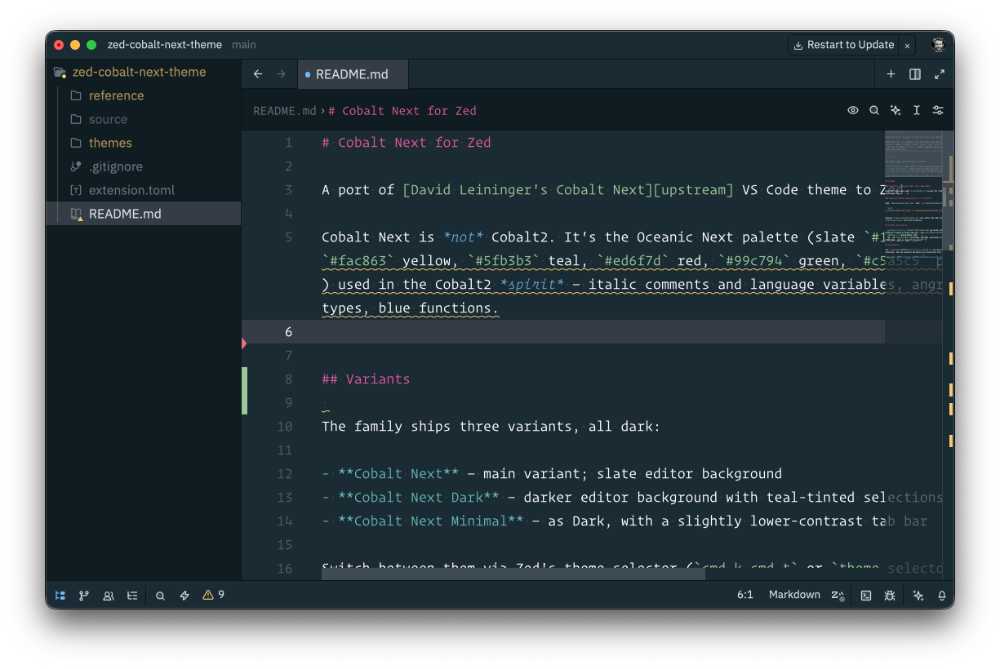

Having [recently switched from Cursor back to VSCode](/notes/switching-back-to-vscode), I figured it was probably worth taking another look at [Zed](https://zed.dev/) – if only so I have a second text editor configured how I like it. Zed comes with a lot of the features I want baked-in and it was pretty trivial to port my VSCode config over. But I was surprised to discover that nobody seems to have ported the [Cobalt Next](https://github.com/davidleininger/cobaltnext-vscode) theme to Zed's theme format.

So I went ahead and did that as best I could...

You can [grab it on GitHub](https://github.com/dannysmith/zed-cobalt-next-theme).
