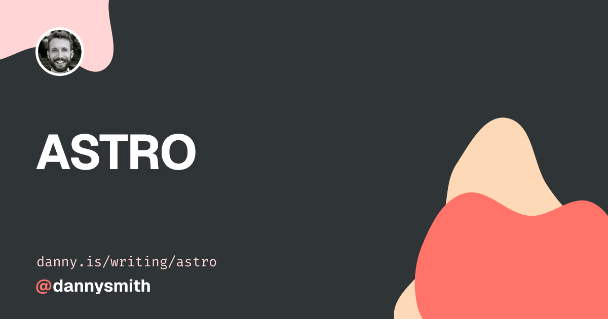
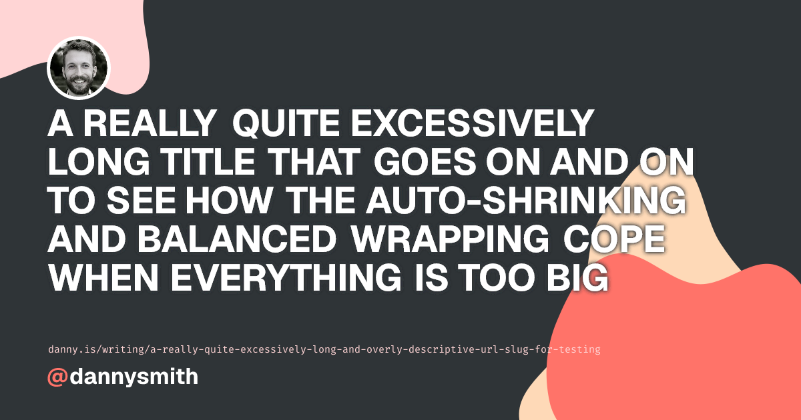
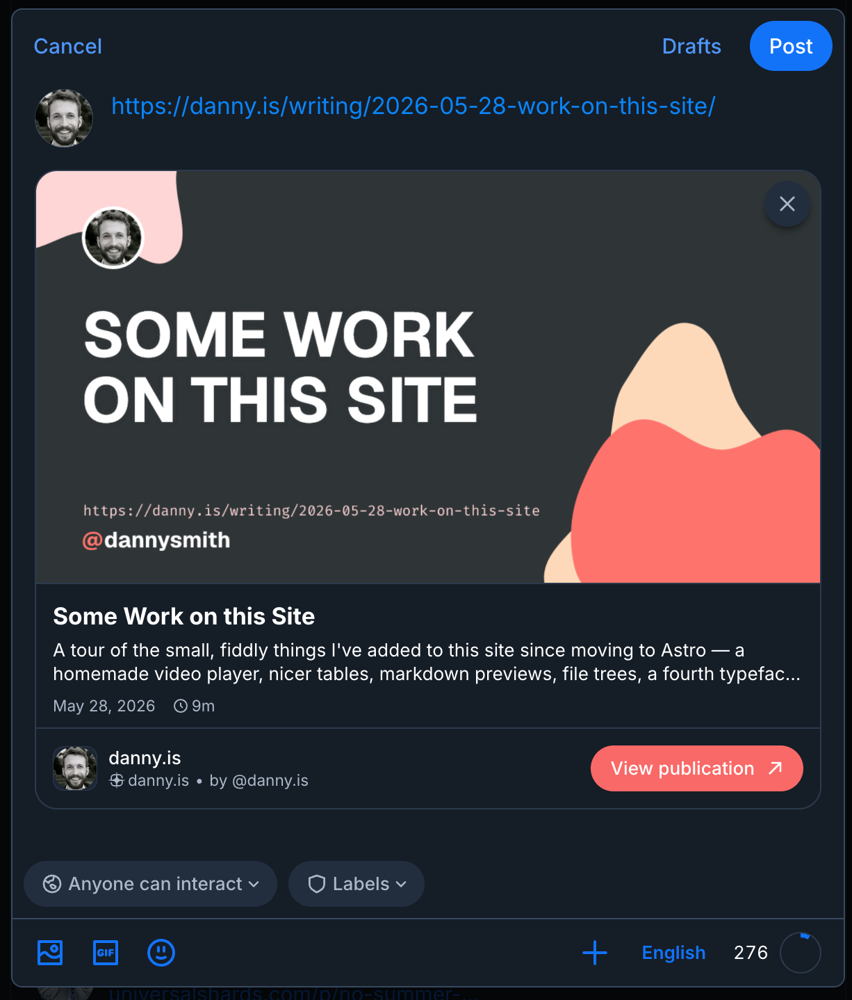

I gave this site's [OG](https://ogp.me/) Images a makeover a few weeks back. These are images that show up when you share a link to a post on Slack, Discord, Bluesky and the like. The old ones were hastily thrown together ages ago and looked pretty rubbish. The new ones include a title, my avatar, the post's URL and my name. Here's an example from a [recent note](https://danny.is/notes/new-meta-pages/)...


They're generated at build time by [`og-image-generator.ts`](https://github.com/dannysmith/dannyis-astro/blob/main/src/utils/og-image-generator.ts) which:

1. Loads the TTF fonts.
2. Turns the [background SVG](https://github.com/dannysmith/dannyis-astro/blob/main/src/assets/og/background.svg) and avatar into data URIs.
3. Calls [`og-templates.ts`](https://github.com/dannysmith/dannyis-astro/blob/main/src/utils/og-templates.ts) which returns an element tree including all the text, structure and styling.
4. Runs [Satori](https://github.com/vercel/satori) to convert the element tree into an SVG.
5. Uses [resvg](https://github.com/yisibl/resvg-js) to convert the SVG into a PNG.

I went with **Tree → SVG → PNG** because of the fonts. Satori converts all the text into vector paths, so by the time the image is rasterised there are no fonts to resolve. This avoids a whole set of font-rendering issues I ran into before when I was hand-writing SVGs and rasterising them directly with [sharp](https://sharp.pixelplumbing.com/).

## Making the title fit

The fiddly bit was the title because it needs to be as big as possible without overflowing, and Satori has no "shrink to fit". It's not perfect, but I ended up with some code which roughly estimates how wide each letter is, tries wrapping the title at the biggest size, and then stepping down until it fits its box:

```ts
function glyphEm(ch: string): number {
  if (ch === ' ') return 0.3;
  if (`.,:;'!|iIlj`.includes(ch)) return 0.3; // skinny
  if ('MWmw@%'.includes(ch)) return 0.92; // wide
  return 0.64; // everything else
}

// Try the biggest size, shrink by 2px until the lines fit.
for (let size = 96; size > 44; size -= 2) {
  if (titleFitsAt(size)) return size;
}
```

It's deliberately rough and Satori still does the actual wrapping. The URL is easier: it's set in a monospace font, so every character is the same width and I can work out the right size directly.

Here's an example of a short title:



And here's a stupidly long title:



And here's the default, which is statically served but can be regenerated based on the same templates with a manual script.


The whole thing is now [cached](/writing/speeding-up-astro-builds/) too, so runs much faster than it used to. This is a tiny little tweak, but I'm pleased with how they look – especially when shared on Bluesky with my [new atproto records](/notes/2026-06-04-this-site-on-atproto)...


