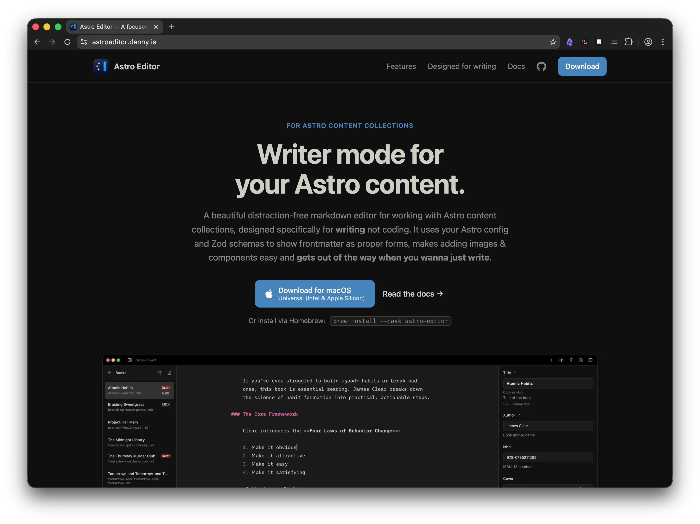
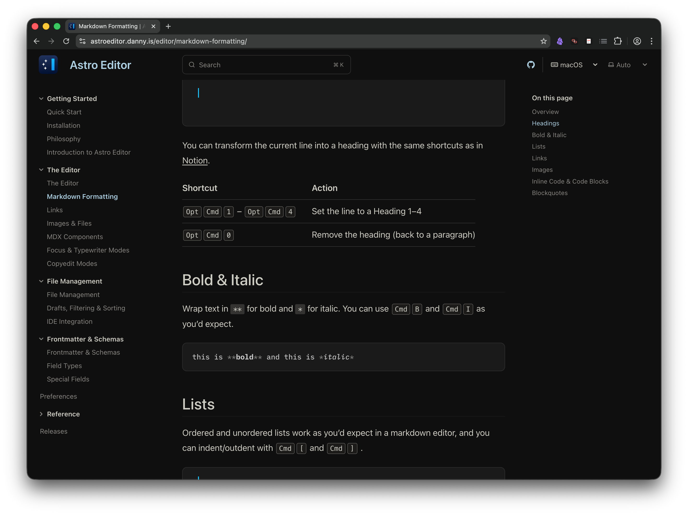

When I [released Astro Editor](../articles/2026-01-08-astro-editor.mdx) in January, the website was a hastily vibe-coded single HTML file full of the purple gradients that LLMs love so much. I've been meaning to re-do it for ages while knowing that a proper job would necessarily involve adding some **actual** documentation for the app too.

Because while Astro Editor isn't an especially complicated app, its minimalist nature means that a lot of its features are hidden behind keyboard shortcuts and command palettes and so on. Moreover, users with unusual Astro setups deserve to have a decent reference for how schemas are read and how overrides are applied and used.

I finally found the time to do this last week, so https://astroeditor.danny.is is now a much better-looking [Starlight](https://starlight.astro.build/) site with a custom index page.

The homepage is simpler and responds properly to light and dark mode switches, and more importantly I think I've done a much better job of demonstrating what the app is and the features that make it unique and useful.

## The new documentation site

By far the biggest piece of work was writing [the documentation pages](https://astroeditor.danny.is/getting-started/) because there were three or four options for how to conceptually structure them which all had their own pros and cons. In the end I settled on this top-level structure.

1. **Getting Started**. The obligatory [Quick Start](https://astroeditor.danny.is/getting-started/) and [Installation](https://astroeditor.danny.is/getting-started/installation/) pages, plus a dedicated [Philosophy](https://astroeditor.danny.is/getting-started/philosophy/) page covering **writer mode** vs **coder mode** and the app's core principles. Arguably the most important page in here is [Introduction to Astro Editor](https://astroeditor.danny.is/getting-started/introduction/), which is an attempt to explain, using examples, why AE exists and the *fundamentals* of how it works.
2. **[The Editor](https://astroeditor.danny.is/editor/overview/)**. Groups all the features for **actually using the editor to write** and puts them before any mention of file management or frontmatter fields, because this stuff is a bit less obvious from simply using the app.
3. **[File Management](https://astroeditor.danny.is/file-management/overview/)**. Groups everything to do with the left sidebar. Right now that's mostly self-explanatory.
4. **[Frontmatter & Schemas](https://astroeditor.danny.is/frontmatter/overview/)**. Everything to do with schemas and the right sidebar, hopefully explained clearly and at the right level.
5. **[Preferences](https://astroeditor.danny.is/preferences/)**. A single page explaining all the preference panes and settings.
6. **Reference**. These aren't really meant to be read top-to-bottom, they're for looking stuff up.
     - [Keyboard shortcuts](https://astroeditor.danny.is/reference/keyboard-shortcuts/)
     - [Commands](https://astroeditor.danny.is/reference/commands/)
     - [Overrides](https://astroeditor.danny.is/reference/overrides/)
     - [URL Scheme](https://astroeditor.danny.is/reference/url-scheme/)
     - [Advanced Stuff](https://astroeditor.danny.is/reference/advanced-preferences/)
     - [How YAML is Handled](https://astroeditor.danny.is/reference/yaml/)
7. **[Releases](https://astroeditor.danny.is/releases/)**. A list of all releases with their release notes. 

## Using AI to write docs

While I used Claude Code extensively to build the homepage, set up Starlight and constantly move, combine and rename pages as I changed my mind, it didn't write many words or decide how to organise things. I tried that with the (much larger) [docs for taskdn](https://tdn.danny.is/getting-started/) and while they're mostly *correct*, they are not fun to read. So my use of AI with these docs was mostly limited to *"Check I'm not missing anything here"* or *"Fix any typos"*.

The major exception here is the documents under *reference*. An agentic coding tool with access to the actual codebase is perfectly suited to writing and maintaining dry, technical docs like a canonical keyboard shortcut or commands reference.

I think AI agents are awesome when used right. But I'm also fed up to the back teeth with reading AI slop, and *used right for documentation* is very different to *used right for coding*.
