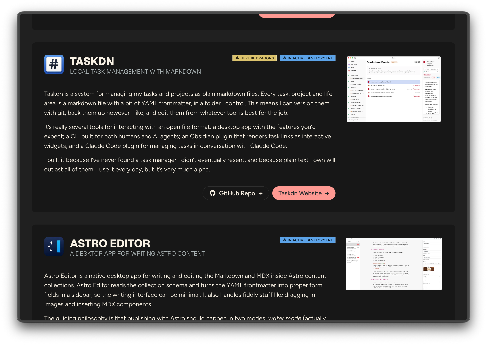
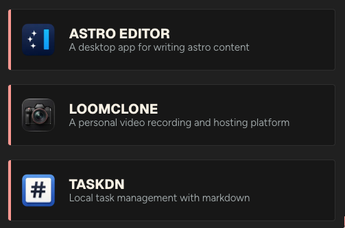
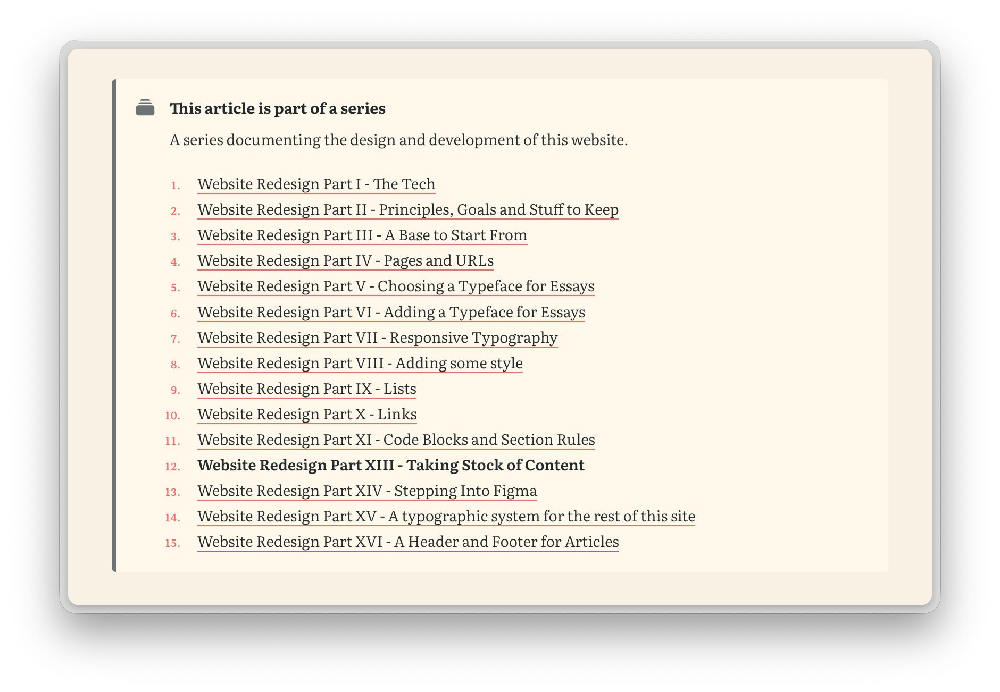

I've made a few little additions to this site, the biggest one being a new page at [/making](/making) which shows some of my side-projects. It's driven by a new `projects` [content collection](https://docs.astro.build/en/guides/content-collections/) whose schema looks like this:

```ts
const projects = defineCollection({
  loader: glob({ pattern: '**/[^_]*.{md,mdx}', base: './src/content/projects' }),
  schema: ({ image }) =>
    z.object({
      title: z.string(),
      byline: z.string().describe('One-sentence description of what it is'),
      stage: z
        .enum(['active-development', 'actively-maintained', 'finished', 'paused', 'archived'])
        .describe('Lifecycle: am I still working on this?'),
      audience: z
        .enum(['public', 'public-with-dragons', 'personal-only'])
        .describe("Who's it for, can others use it?"),
      kind: z.enum(['proper', 'toy', 'experiment']).optional().describe('How seriously to take it'),
      icon: image().optional().describe('Square icon'),
      image: image().optional().describe('Main graphic'),
      website: z.url().optional(),
      github: z.url().optional(),
      featured: z.boolean().default(false),
      startDate: z.coerce.date().optional(),
      draft: z.boolean().default(false),
    }),
});
```

The `/making` page uses a new [**ProjectCard** component](/styleguide/components#project-card) which looks like this:



The component also has a compact variant which only shows the icon, title and byline. I'm not using this anywhere right now but will probably end up using it to show featured or current projects on the homepage.



I decided against creating individual pages for each project because it doesn't feel like they have enough information to warrant it, but I may revisit this in the future.

## Support for article series

I occasionally write articles as a series and wanted an easy way to show that in articles, so I've added a `series` field to the articles schema which [references](https://docs.astro.build/en/guides/content-collections/#defining-collection-references) a new JSON-based *series* content collection.

```json title="series.json"
[
  {
    "id": "loomclone",
    "name": "LoomClone",
    "intro": "A short series on how and why I built my own video recording and hosting platform to replace tools like Loom."
  },
  {
    "id": "website-redesign",
    "name": "Website Redesign",
    "intro": "A series documenting the design and development of this website."
  }
]
```

Now, adding `series: website-redesign` to an article's frontmatter will automatically show a callout at the top of every article in that series like this...



It's only rendered if a series has more than one non-draft article and the links are shown in ascending order of `pubDate`, with the current article being bold.

## A few other bits

I've made a few other little tweaks too...

### Skip to content link

Pressing <kbd>Tab</kbd> on any page shows and focusses a "Skip to content" link pointing to the main content. This is helpful for folks who use keyboard navigation. The `SkipLink.astro` component is included at the top of `MainNavigation.astro` which is loaded on every page.

```html title=SkipLink.astro
<a href="#main" class="skip-link">Skip to content</a>

<style>
  .skip-link {
    position: fixed;
    top: var(--space-s);
    left: var(--space-s);
    z-index: 1001;
    /* ... */

    transform: translateY(calc(-100% - var(--space-s)));

    &:focus {
      transform: translateY(0);
    }
  }
</style>
```

### Back-to-top links

Articles, notes and content pages now include a link at the end which scrolls you back up to the top of the page.

```html title="BackToTopLink.astro"

<a href="#top" class="back-to-top">Back to top <span aria-hidden="true">↑</span></a>
```

### Under the hood

I did a bit of tidying up in the codebase – mostly simplifying or removing config files, but I also [converted](https://github.com/dannysmith/dannyis-astro/commit/679a91afb4515efeaab7572ec6770cc46ea75351) my `check-content` Claude command into an [Agent Skill](https://agentskills.io/) and simplified some of the developer docs.
