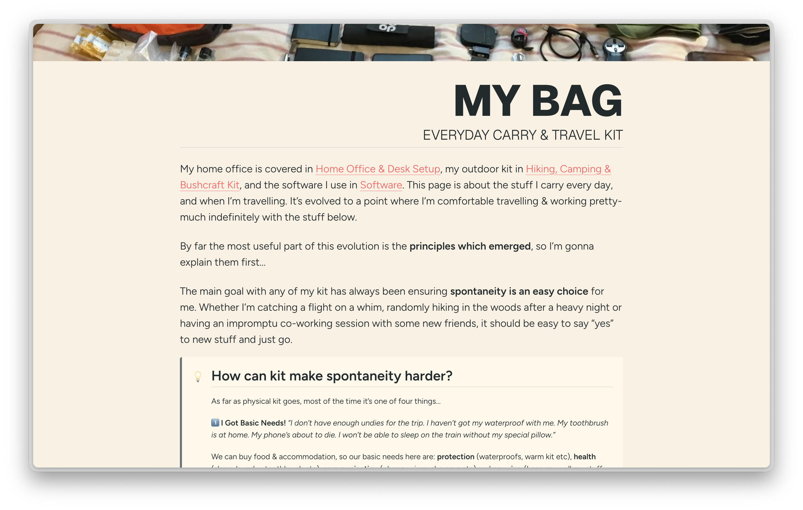

Hitting [danny.is/using](https://danny.is/using) has always redirected to a public Notion page which details the kit and software I use. I've just migrated that content to this site.

- The [Overview](/using) page is just a quick intro and index.
- My "everyday carry" and travel kit is detailed under [My Bag](/using/bag), and includes everything I carry day-to-day and for extended minimal-packing travel.
- The page on my [Home Office & Desk Setup](/using/office) covers my desk setup and all the associated tech.
- [Software](/using/software) is a bit of a work-in-progress as I'm in the process of switching to more local-first tooling where I can, and where cloud SaaS still makes sense, I'm using non-US companies and infrastructure. I'll update this page once I'm properly settled on a new stack.
- Finally, I cover the kit I use when I'm [hiking, camping & bushcrafting](/using/outdoors) for anyone who's interested in outdoorsy stuff.
