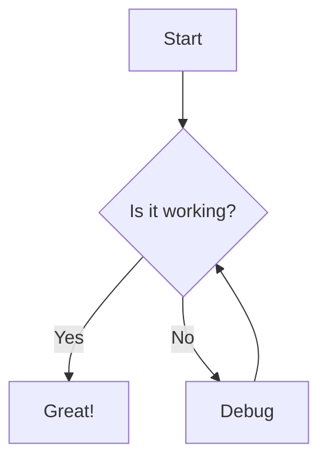

I mentioned a `satteriMermaid` plugin in my note on [Upgrading to Astro 7 and switching to Sätteri](/notes/upgrading-astro-7-switching-satteri) and wanna expand on that briefly because this site now supports themed mermaid diagrams!


[Mermaid](https://mermaid.js.org/) is a way to describe diagrams in plain text and have them rendered nicely. Inside markdown files the mermaid code is usually written inside a fenced code block like this.

````md

````

Which is rendered like this.


In statically-generated sites we've a few options for handling mermaid code: we can render them using a client-side JS library, we can generate raster images at build-time, or we can generate SVGs at build time and embed them in our HTML. **My preference is for the last**, which is easy enough using one of the many mermaid libraries.

I first added support for this ages ago but didn't really give it much thought and only supported one colour scheme.

[Mermaid theme variables](https://mermaid.js.org/config/theming.html#theme-variables) are configured in `mermaid.js` like this:

```js
export const mermaidConfig = {
  theme: 'base',
  themeVariables: {
    primaryColor: '#d9745b',
    primaryTextColor: '#1a1d20',
    primaryBorderColor: '#d9745b',
  }
}
```

Whereas **this site**'s theming relies on global CSS variables which are *already* theme-aware. Anything using `--color-coral` just works when the theme changes because:

```css
--color-coral: light-dark(#fa6863, #ff9890);
```

But we can't use CSS variables in `mermaid.js`, hence the need for that `satteriMermaid` plugin I mentioned. It uses [mermaid-isomorphic](https://github.com/remcohaszing/mermaid-isomorphic) to build the SVGs using the hex colours defined in `mermaid.js` and then rewrites the syntax tree to **replace them with CSS variables**.

The `--mermaid-*` CSS variables are defined in [`_mermaid.css`](https://github.com/dannysmith/dannyis-astro/blob/main/src/styles/_mermaid.css) and map one-to-one onto the colour variables defined in `mermaid.js` except the CSS colours are defined using `light-dark()` like this:

```css
/* ... */
--mermaid-text: var(--color-text);
--mermaid-background: light-dark(var(--color-white), var(--color-background-secondary));
--mermaid-label-background: oklch(from var(--color-background-secondary) l c h / 60%);
--mermaid-coral: var(--color-coral);
--mermaid-purple: var(--color-purple);
--mermaid-green: var(--color-green);
--mermaid-note-background: light-dark(
  oklch(97% 0.04 var(--hue-yellow)),
  oklch(32% 0.05 var(--hue-yellow))
);
/* ... */
```

The end result is that mermaid code blocks in my markdown & MDX files are transformed into inline SVGs in the generated HTML and respond to theme changes because they use theme-aware CSS variables.
