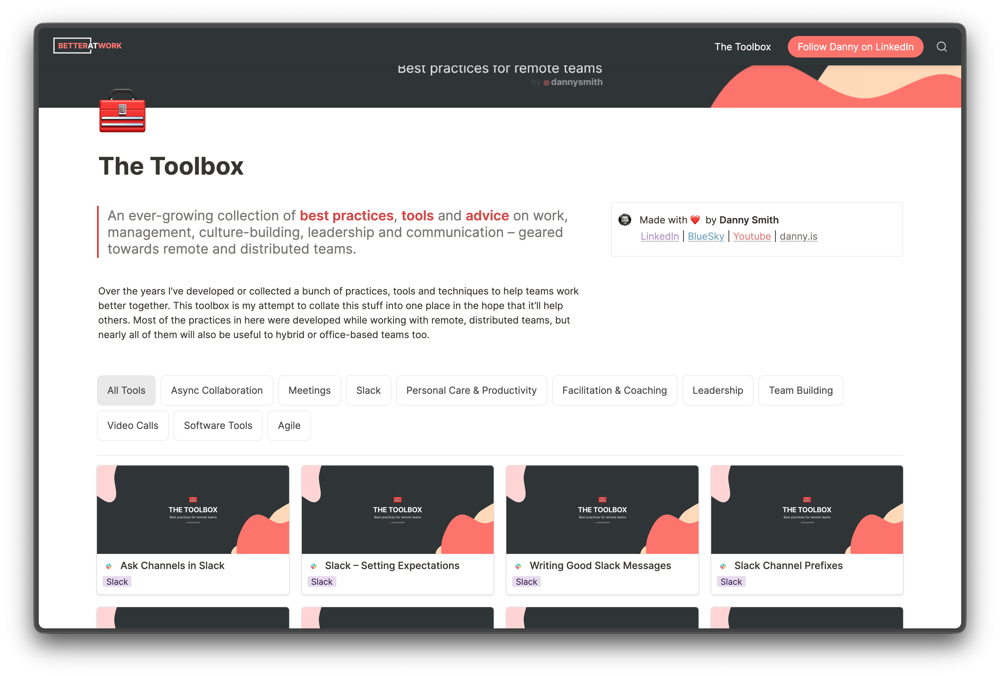
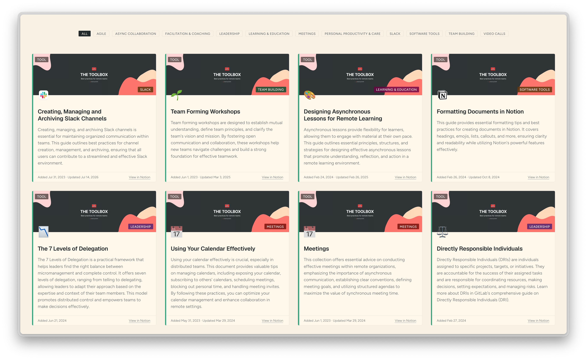

import { ToolCard } from '@components/ui/index';
import toolboxPages from '../toolboxPages.json';

export const exampleToolJson = toolboxPages.find(t => t.id === 'sharing-appreciation');

export const exampleTool = {
  data: {
    ...exampleToolJson,
    created: new Date(exampleToolJson.created),
    lastEdited: new Date(exampleToolJson.lastEdited),
  },
};

One of my ongoing [projects](/making) is **The Toolbox**, a collection of practices, tools and advice on work, management, culture-building, leadership, communication and remote working which I've seen help teams work better together.

The collection lives in a Notion database and I use [Super](https://super.so/) to publish that as part of my consulting business's site at [betterat.work/toolbox](https://betterat.work/toolbox). Here's what it looks like over there...



At some point I'll move my consulting site away from Super, either making it part of *this* site or moving `betterat.work` to its own statically-generated Astro site. I'm still undecided as to whether the toolbox will still be backed by Notion when I do that, but I'll cross that bridge when I get to it.

Until then, it'd be nice if I could **show** the collection of tools here and have them link to the actual tool pages on my work site.

Whereas `/toolbox` used to redirect to my work site, it now renders [a page](/toolbox) like this:



## How does it work?

Aside from the toolbox page itself, there are four parts to this: a new JSON-type content collection, a `ToolCard` component, a script which creates or updates the content collection and a GitHub Action workflow to run the script.

### The content collection

My schema now includes a `toolboxPages` collection loaded from `src/content/toolboxPages.json`. The items in it look like this:

```json
  {
    "id": "sharing-appreciation",
    "title": "Sharing Appreciation",
    "url": "https://betterat.work/tool/sharing-appreciation",
    "notionId": "3a45c848-0747-49d8-9f82-f50f73cef196",
    "notionUrl": "https://dannysmith.notion.site/3a45c848074749d89f82f50f73cef196",
    "emoji": "❤️",
    "coverImage": "[...]",
    "category": "Team Building",
    "summary": "[...]",
    "created": "2024-02-26T20:25:59.822Z",
    "lastEdited": "2024-02-26T21:15:55.181Z",
    "displayOrder": 2
  },
```

The `url` points at the tool's page on *betterat.work* and the `notionId` is a unique UUID for its page in Notion (which can also be used to view the public Notion page at `notionUrl`). Icons for Notion pages can be an emoji (`emoji: <actual emoji>` in the JSON) or an image (`iconUrl: <path to public image file on betterat.work>`). The rest should be self-explanatory.

### The ToolCard component

A new **ToolCard** component requires a `CollectionEntry<'toolboxPages'>` prop and looks like this:

<ResizableContainer>
  <ToolCard tool={exampleTool} />
</ResizableContainer>

An optional `compact` boolean prop produces:

<ResizableContainer>
  <ToolCard tool={exampleTool} compact />
</ResizableContainer>

Both variants should respond well inside containers of any size thanks to modern CSS and container queries.

### The toolbox page

The cards are laid out using CSS grid on the [actual page](/toolbox) and can be filtered by category using the buttons at the top. The filter buttons are actually labelled radio buttons which hide and unhide tool cards with CSS a bit like this.

```css
main:has(#filter-remote-work:checked) .tool-card:not([data-category="Remote Work"]) { display: none; }
```

The only client-side javascript in any of this is ~10 lines which enhance filtered cards by triggering browser **view transitions** when filters are changed.

I still feel a huge sense of wonderment at how easy it is to create robust, responsive components and layouts like this with **so little CSS**! `ToolCard.astro` contains ~170 lines and `toolbox.astro` only ~75, though both obviously lean on global styles.

Modern browsers are awesome. Modern CSS is incredible.

## Populating the content collection

By far the most interesting challenge here was how to populate `toolboxPages.json` with the right information, especially as I don't wanna have to manually trigger a rebuild when I update something in Notion.

I settled on a [simple GH Actions workflow](https://github.com/dannysmith/dannyis-astro/blob/main/.github/workflows/update-toolbox.yml) which executes a script to grab the data, compare it with the current JSON file and commit any changes to `main` (triggering a rebuild & deployment).

<Callout>
This currently runs weekly or whenever I manually trigger it. I should probably look into *also* firing it whenever content in the notion database actually changes via a webhook or something.
</Callout>

The [`get-toolbox-json.ts`](https://github.com/dannysmith/dannyis-astro/blob/31e95233f6ff38bb7bd20a348f6a0ccfffa6d46c/scripts/get-toolbox-json.ts) script has to fetch stuff from two sources:

1. The toolbox index **as rendered by Super.so** at [betterat.work/tool](https://betterat.work/tool/) because the pages it contains are what we're actually gonna link to.
2. The **actual Notion database** because we need some information which isn't passed through to the rendered website by *Super*.

### What we get from Super

Super is a Next.js app, so GET [betterat.work/tool](https://betterat.work/tool/) returns ~370KB of HTML with a bunch of embedded **RSC flight data**, which is basically loads of inline `<script>` elements pushing escaped JSON strings into a global array.

```html
<script>self.__next_f.push([1,"5:[\"$\",\"$L2d\",null,{\"pageReplacement\":\"$undefined\",\"pageId\":\"tool\",\"records\":{\"__version__\":3,\"block\":{\"tool-writing-good-evergreen-documents\":{...
</script>
```

Our `get-toolbox-json` script grabs these chunks via regex, JSON-parses each string and joins them into a big blob of probably-useful data. I think this stuff is React's wire format for hydration because it seems to mostly be refs to JS chunks which Next.js cares about coz hydration stuff? 🤷‍♂️

```
1:"$Sreact.fragment"
2:I[339756,["/_next/static/chunks/ebe94f77d09738d4.js"],"default"]
9:I[897367,["/_next/static/chunks/ebe94f77d09738d4.js"],"ViewportBoundary"]
...
5:["$","$L2d",null,{"pageReplacement":"$undefined","pageId":"tool","records":{...}}]
```

The fifth row here is what caught my eye: it's a serialised React element whose props contain **everything Super's client component needs to render the gallery of tools**. There's no way to `JSON.parse` an object buried in the middle of a stream like this, so the script searches for the literal `{"pageReplacement"` and walks forward counting braces until they balance. *(Yes, I'm aware this is probably brittle as fuck)*

Turns out these props contain a very *Notion-ish* record map with a block for every tool page:

```json
"tool-writing-good-evergreen-documents": {
  "id": "tool-writing-good-evergreen-documents",
  "title": [["Writing Good Evergreen Documents"]],
  "type": "page",
  "icon": "📝",
  "cover": "https://images.spr.so/cdn-cgi/imagedelivery/.../Toolbox_Header/public",
  "uri": "/tool/writing-good-evergreen-documents",
  "blockId": "52beb0d1-b64e-4165-a66a-29d2a69f803f",
  "createdTime": 1708989474574,
  "lastEditedTime": 1708991700189
}
```

I say *Notion-ish* because it's kinda halfway between Notion's internal format and what I'd expect Super to need for rendering a gallery like this as HTML. The blocks are keyed by Super's slugs while titles keep Notion's rich-text format (arrays of `[text, annotations]` segments). Compared with the data available from scraping the server-rendered HTML this is way more useful for our needs. Doubly so because `blockID` is the actual Notion UUID for the toolpage in question.

We also get a few bits that are **only** available from the super-rendered site: 

1. The tool page's cannonical URI on `betterat.work`, plus confirmation it's been properly synced & published by Super.
2. A `coverImage` URL hosted on Super's CDN. Notion's API returns covers as signed S3 URLs which obviously expire quickly. Super's whole job is turning Notion stuff into a *proper* websites, so they serve these kinda static assets the way any *server-of-websites* should... behind a CDN with all the appropriate cacheing and whatnot.
3. Same 👆 for icons which are image URLs not emoji strings.
4. Metadata like *display order*, `collectionId`, `viewId` and `spaceId` which we can use later on.

### What we get from the Notion API

The script also makes a single unauthenticated POST to `https://www.notion.so/api/v3/queryCollection` – an (officially) undocumented endpoint uesd by Notion's own apps. The request includes the collection and view we discovered above, plus a "reducer" asking for up to 1000 rows:

```json
{
  "source": { "type": "collection", "id": "63c2a253-...", "spaceId": "5ba1b849-..." },
  "collectionView": { "id": "da9b9dae-...", "spaceId": "5ba1b849-..." },
  "loader": {
    "type": "reducer",
    "reducers": { "collection_group_results": { "type": "results", "limit": 1000 } },
    "searchQuery": "",
    "userTimeZone": "Europe/London"
  }
}
```

Back comes an ordered list of row UUIDs and a `recordMap` of our *tools*. Here's the one for [Daily Standups](https://betterat.work/tool/daily-standups), heavily trimmed:

```json
{
  "id": "9b659c77-4fd7-407e-b905-04054528be53",
  "properties": {
    "YJEd": [["Agile"]],
    "A@mW": [["Daily stand-ups are essential for team alignment..."]],
    "title": [["Daily Standups"]]
  },
  "created_time": 1690858186374,
  "last_edited_time": 1694004507351
}
```

Notice the property keys are opaque four-character hashes. Decoding `YJEd` to "Category" and `A@mW` to "AI Summary" means using the database's schema, which handily arrives in the same response:

```json
"schema": {
  "YJEd": { "name": "Category", "type": "select", "options": [...] },
  "A@mW": { "name": "AI Summary", "type": "text", "ai_inference": { "prompt": "Write a short one-paragraph introduction..." } }
}
```

<Callout>
The response leaks rather more than I expected: the full AI prompt I use to generate the AI Summary column is right there for anyone to read, along with CRDT edit history and pointers to Notion's internal automation runs on every row. But then again, I'm using an undocumented private API here so 🤷‍♂️.
</Callout>

Between these two requests we've got more than enough data to populate our `toolboxPages.json` collection and render a [toolbox index](/toolbox) there 🥳

---

<em>**PS**. Two years ago this whole approach would've felt scary because it's so obviously mega brittle. Relying on an unofficial undocumented Notion API is bad enough, but at least it's *actually an API*. The way I'm scraping data from Super's Next.js app here feels all sorts of wrong and *obviously unreliable*. Except in the year 2026 I'm cool with that because I know that when this inevitably breaks I can ask a friendly robot to fix it and it'll do so far better than I ever wold've.</em>

---

<em>**PPS**. If you read the **PS** above and didn't instinctively assume all this is fault-tolerant-by-design, non-blocking for working builds, made to fail greacefully with sensible feedback and **excplicitly** bounded (with big *brittle thing which will probs break a bunch in the future and that's okay* vibes)... **you probably shoudn't be using AI to build janky things like this at all**, even on a silly personal website like this one. But also: you absulutely should be building janky things like this with your own fingers if it feels interesting and fun. If that's you HMU on [bluesky](https://bsky.app/profile/danny.is) so I can send some high-fives.</em>
