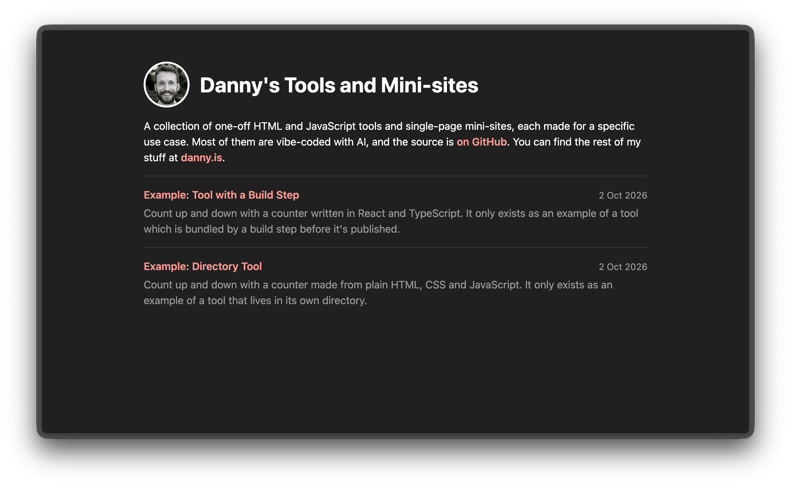

I sometimes find myself vibe coding single-page HTML tools and "microsites" for specific use cases like my little [biggles books site](https://github.com/dannysmith/biggles-books). It feels a bit silly for things like this to all have their own repos and subdomains.

Simon Willison keeps things like this in a single [tools repo](https://github.com/simonw/tools), deployed to [tools.simonwillison.net](https://tools.simonwillison.net). The majority of his tools are single HTML files in the root of the repo, usually accompanied by a `[tool].docs.md` describing the tool.

I've taken a leaf out of his book and created https://tools.danny.is to serve a similar purpose. A simple build script copies the tools into `_site/` which is published on GitHub Pages. A **tool** can be one of three shapes in the repo:

Single HTML files in the repo root are published directly so `my-tool.html` → `https://tools.danny.is/my-tool`. Directories containing an `index.html` are treated similarly and published in full. I expect the vast majority of the stuff in here to be either single files or tiny directories with a couple of HTML files and maybe a CSS file and some images etc.

I also expect that occasionally I'll want to use some more complex tooling so if a directory contains a `package.json` with a `build` script in it we don't just publish the directory as-is. Instead, we run `bun install` and `bun run build` and publish `my-tool/dist/` rather than `my-tool/`.

## The Index Page

The build script generates an index page which looks like this.

For each tool it shows:

- The **title**, taken from the `<title>` tag or the file/directory name if there isn't one.
- A **description**, taken from the `<meta name="description">` tag. A directory tool without one uses the first paragraph of its `README.md` instead.
- The **date** of the first commit that touched the tool. Renaming a tool will obviously reset this.

You can find the GitHub repo [here](https://github.com/dannysmith/dannyis-tools).