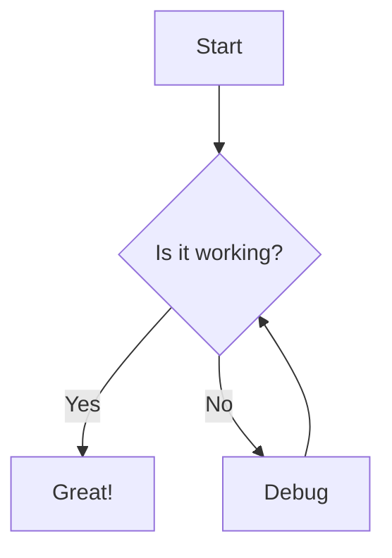
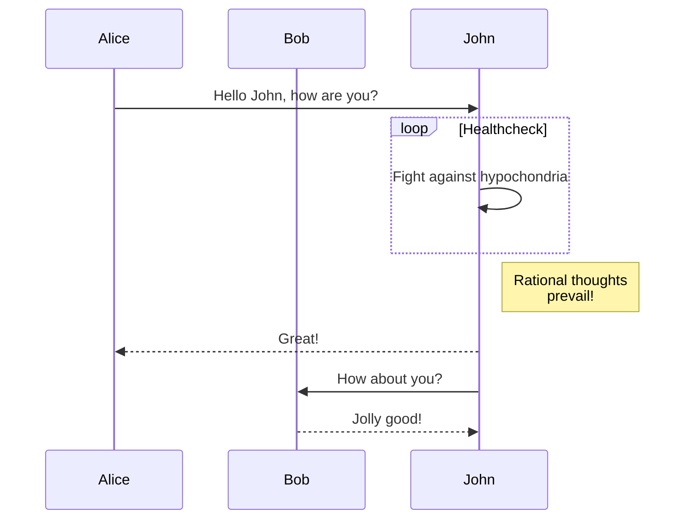
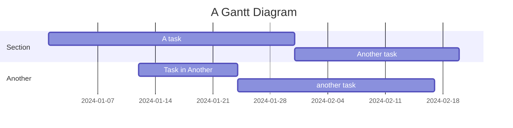
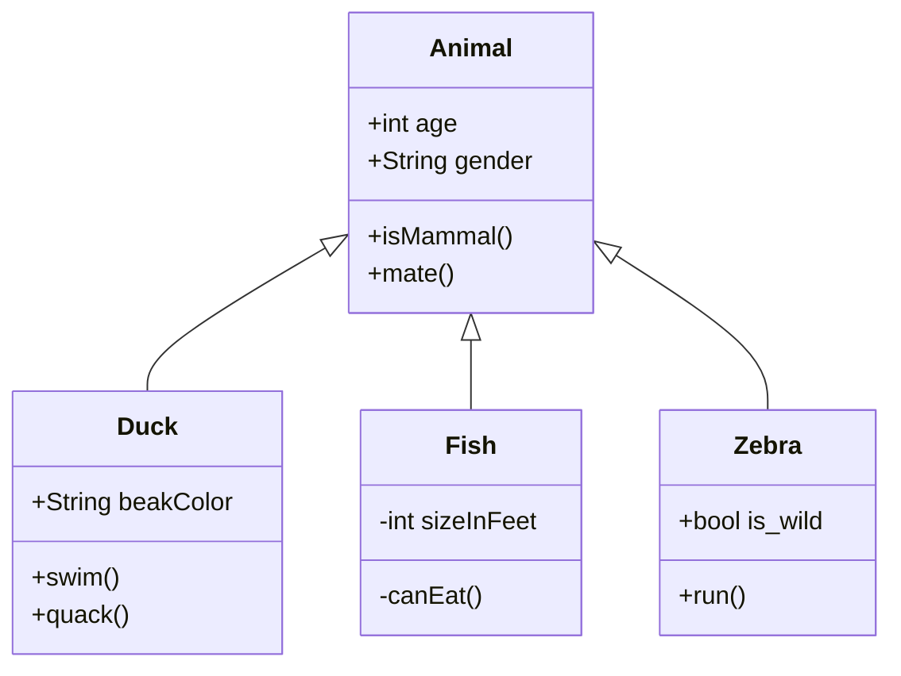

import {
  Accordion,
  BookmarkCard,
  Callout,
  Embed,
  BlockQuoteCitation,
  ButtonLink,
} from '@components/mdx';

This styleguide demonstrates how all key Markdown/MDX features, Astro components, and prose styles render in a Note context. Use it to check typography, component appearance, and real-world content. For a full component reference, see the [main styleguide](/styleguide/).

## Accordion

<Accordion header="Collapsible Note Section">
  Perfect for organizing supplementary information in notes. This accordion contains:

- **Quick facts** that don't need to be immediately visible
- Reference links and resources
- Technical details or implementation notes
- Optional reading materials

Great for keeping notes concise while providing depth when needed.

</Accordion>

<Accordion header="Usage in Notes">
  Use accordions in notes to:
  
  1. Hide lengthy technical details
  2. Organize optional context
  3. Provide expandable examples
  4. Keep the main content focused

```mdx
<Accordion header="Details">Hidden content here...</Accordion>
```

</Accordion>

## URL Cards & Embeds

<BookmarkCard url="https://justinjackson.ca/calm-company" />
<BookmarkCard url="https://dannysmith.notion.site/Meetings-2c4bd8d7ba31427cb1294a008a9df21f" />

<Embed url="https://www.youtube.com/watch?v=dQw4w9WgXcQ" />

## Button Links

<ButtonLink href="https://example.com">Primary Button</ButtonLink>

<ButtonLink href="https://example.com" variant="secondary">
  Secondary Button
</ButtonLink>

## Callout Examples

<Callout emoji="💡" type="blue" title="Information">
  This is a blue callout with an information icon. Perfect for tips and helpful information with
  **bold text** and [links](https://example.com).
</Callout>

<Callout emoji="⚠️" type="yellow" title="Warning">
  This is a yellow warning callout. Use this to highlight important warnings or cautions. It can
  contain: - Bullet points - **Bold text** - `inline code` - [External links](https://example.com)
</Callout>

<Callout emoji="❌" type="red" title="Error">
  This is a red error callout. Use this for error messages or critical information. > It can even
  contain blockquotes with additional context.
</Callout>

<Callout emoji="✅" type="green" title="Success">
  This is a green success callout. Perfect for confirmation messages and positive feedback.
  ```javascript // It can even contain code blocks! const success = true; console.log('Operation
  completed successfully'); ```
</Callout>

<Callout emoji="🔥" type="orange" title="Hot Tip">
  This is an orange callout. Great for highlighting important tips or featured content with _italic
  emphasis_.
</Callout>

<Callout emoji="💭" type="blue">
  This callout has no title, just an icon and content with **markdown formatting** and
  [links](https://example.com).
</Callout>

<Callout emoji="📚" type="blue" title="Comprehensive Example">
  This callout demonstrates all the markdown features that work inside callouts:
  **Text formatting**: We can use **bold**, _italic_, and `inline code`.
  **Lists work great**:
  - Unordered lists
  - With [links](https://example.com)
  - And **formatting**
  **Numbered lists too**:
  1. First item
  2. Second item with `code`
  3. Third item with _emphasis_
  **Blockquotes**:
  > This is a blockquote inside a callout. It maintains proper styling and can include **bold text** and [links](https://example.com).
  **Code blocks**:
  ```javascript
  function example() {
    return "Code blocks work perfectly!";
  }
  ```
  **Links**: Both [external links](https://example.com) and internal references work seamlessly.
</Callout>

## Headings

## Level 2 Heading

### Level 3 Heading

#### Level 4 Heading

##### Level 5 Heading

---

## Blockquotes with Citations

> This is a basic blockquote without citation styling.

<BlockQuoteCitation author="Steve Jobs">
  Design is not just what it looks like and feels like. Design is how it works.
</BlockQuoteCitation>

<BlockQuoteCitation author="Ernest Hemingway" title="A Moveable Feast">
  The best way to find out if you can trust somebody is to trust them.
</BlockQuoteCitation>

<BlockQuoteCitation
  author="Robert Bringhurst"
  title="The Elements of Typographic Style"
  url="https://en.wikipedia.org/wiki/The_Elements_of_Typographic_Style"
>
  Typography is the craft of endowing human language with a durable visual form.
</BlockQuoteCitation>

## Text Styles & Lists

Here's some **bold text**, _italic text_, `inline code`, and a [link](https://example.com).

- Unordered list item
- Another item with **bold**
- _Italic item_
- `Code item`
- [Link item](https://example.com)

1. Ordered list item
2. Another item with **bold**
3. _Italic item_
4. `Code item`
5. [Link item](https://example.com)

> This is a blockquote. It should have a nice left border and italic styling.

```js
// Code block example
const foo = 'bar';
console.log(foo);
```


Here's a paragraph with **bold text**, _italic text_, `code`, and a [link](https://example.com). We can also have:

- Lists with **bold text**
- Lists with _italic text_
- Lists with `code`
- Lists with [links](https://example.com)

> And blockquotes with **bold text**, _italic text_, `code`, and [links](https://example.com).

## Mermaid Diagrams

### Flowchart



### Sequence Diagram



### Gantt Chart



### Class Diagram



## Table Example

| Name  | Role      | Notes           |
| ----- | --------- | --------------- |
| Alice | Designer  | Likes Figma     |
| Bob   | Developer | Typescript fan  |
| Carol | Writer    | Markdown wizard |

---

## Long-Form Content Example

### The Art of Typography

Typography is the art and technique of arranging type to make written language legible, readable, and appealing when displayed. The arrangement of type involves selecting typefaces, point sizes, line lengths, line-spacing (leading), and letter-spacing (tracking), and adjusting the space between pairs of letters (kerning).

The term typography is also applied to the style, arrangement, and appearance of the letters, numbers, and symbols created by the process. Type design is a closely related craft, sometimes considered part of typography; most typographers do not design typefaces, and some type designers do not consider themselves typographers.

---

[Back to Main Styleguide](/styleguide/)
