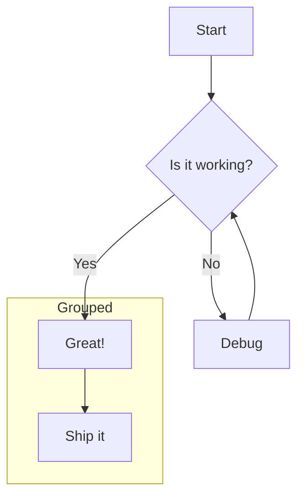
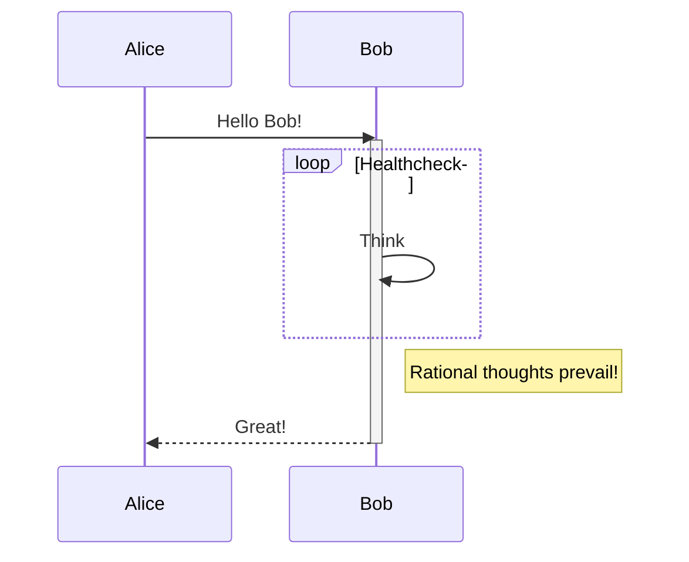
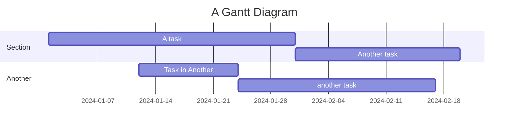
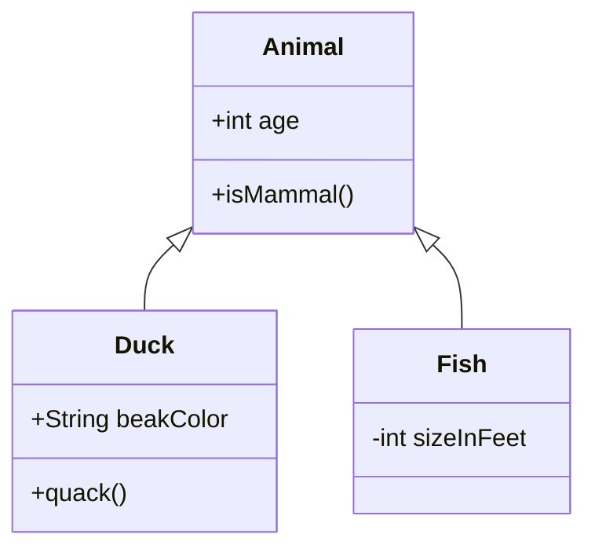
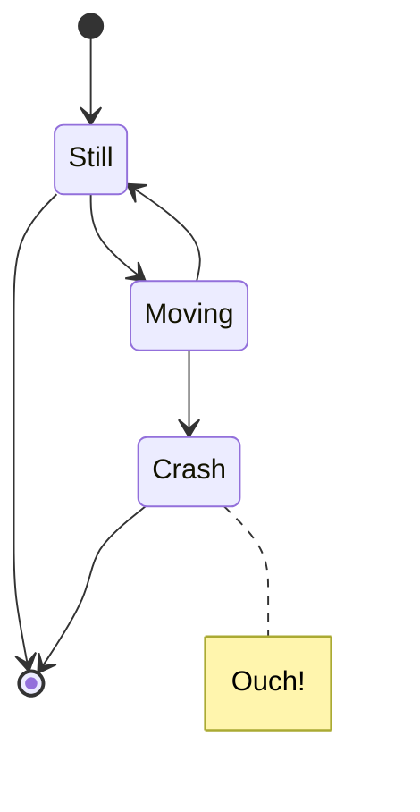
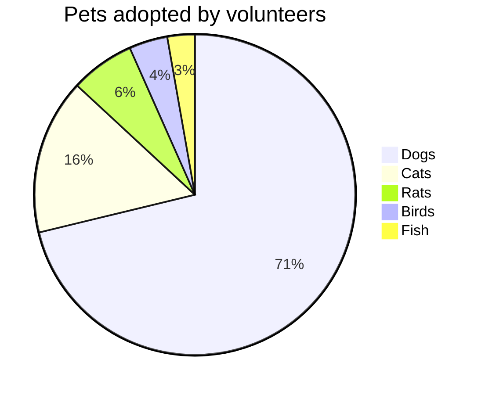

### Flowchart

```mermaid
graph TD
    A[Start] --> B{Is it working?}
    B -->|Yes| C[Great!]
    B -->|No| D[Debug]
    D --> B
    subgraph G[Grouped]
      C --> E[Ship it]
    end
```

### Sequence Diagram

```mermaid
sequenceDiagram
    participant Alice
    participant Bob
    Alice->>Bob: Hello Bob!
    activate Bob
    loop Healthcheck
        Bob->>Bob: Think
    end
    Note right of Bob: Rational thoughts prevail!
    Bob-->>Alice: Great!
    deactivate Bob
```

### Gantt Chart

```mermaid
gantt
    title A Gantt Diagram
    dateFormat YYYY-MM-DD
    section Section
        A task          :a1, 2024-01-01, 30d
        Another task    :after a1, 20d
    section Another
        Task in Another :2024-01-12, 12d
        another task    :24d
```

### Class Diagram

```mermaid
classDiagram
    Animal <|-- Duck
    Animal <|-- Fish
    Animal : +int age
    Animal : +isMammal()
    class Duck{
        +String beakColor
        +quack()
    }
    class Fish{
        -int sizeInFeet
    }
```

### State Diagram

```mermaid
stateDiagram-v2
    [*] --> Still
    Still --> [*]
    Still --> Moving
    Moving --> Still
    Moving --> Crash
    Crash --> [*]
    note right of Crash: Ouch!
```

### Pie Chart

```mermaid
pie title Pets adopted by volunteers
    "Dogs" : 386
    "Cats" : 85
    "Rats" : 35
    "Birds" : 21
    "Fish" : 15
```
