My home office is covered in [Home Office & Desk Setup](/using/office), my outdoor kit in [Hiking, Camping & Bushcraft Kit](/using/outdoors), and the software I use in [Software](/using/software). This page is about the stuff I carry every day, and when I'm travelling. It's evolved to a point where I'm comfortable travelling & working pretty-much indefinitely with the stuff below.

By far the most useful part of this evolution is the **principles which emerged**, so I'm gonna explain them first…

The main goal with any of my kit has always been ensuring **spontaneity is an easy choice** for me. Whether I'm catching a flight on a whim, randomly hiking in the woods after a heavy night or having an impromptu co-working session with some new friends, it should be easy to say "yes" to new stuff and just go.

<Callout emoji="💡" title="How can kit make spontaneity harder?" largeHeading>
As far as physical kit goes, most of the time it's one of four things…

**1️⃣ I Got Basic Needs!** *"I don't have enough undies for the trip. I haven't got my waterproof with me. My toothbrush is at home. My phone's about to die. I won't be able to sleep on the train without my special pillow."*

We can buy food & accommodation, so our basic needs here are: **protection** (waterproofs, warm kit etc), **health** (sleep, laundry, toothbrush etc), **communication** (phone, wires, chargers etc) and **carrying** (I can carry all my stuff about with me).

**2️⃣ I Gotta Work –** *"I need to be at my desk tomorrow. I'm running a workshop and need my second monitor for it. I can't do a whole week's work hunched over a tiny laptop. My work notebook is at home."*

We need the ability to **work as effectively from anywhere** as we can from our home office.

**3️⃣ I've Got Too Much Stuff –** *"I've gotta drop my case at the hotel first. I'll stay with the bags. I can't buy that, it won't fit. I'm worried about leaving my bag here. My pack's too heavy to run for the bus."*

Being **over-encumbered** with a giant suitcase of things I care about is my *worst nightmare*. In a pinch we can buy clothes, toothbrushes, and laptops. But I'm *never* gonna take an impromptu trip if it means binning my favourite coat & cowboy boots. The more we carry, the less freedom of movement we have – both physically and mentally.

**4️⃣ I Gotta Pack First –** *"I'd love to come now but I gotta go pack at my Airbnb first. Gimme half an hour, I'm just laying out all my stuff on the bed. Did I pack my toothbrush or not? Shit I left my charger plugged in by my bed."*

All packing should be as thoughtless as "packing" my jeans with keys & wallet when I go out. It should not require thought. It should never take more than five minutes before you're walking out the door.
</Callout>

## An Additive System…

I've ended up with a system which is **additive**. There's stuff I always have in my pockets. If I'm heading out for the day I **add my bag**. If I'm staying away for a while I **add some extra stuff** to my bag. And if I'm travelling for an extended period I **add a second bag**. Here's how it works…

| When? | What? | Lets me… |
| --- | --- | --- |
| **Near Home** | Clothes, **everyday basics** which I carry in my pockets. | |
| **Out for the Day** | Everything above plus **my bag**. | • Work effectively from anywhere. • Stay away from home for one night (or two at a push). • Go for a swim. |
| **Staying Away** | Everything above plus **some extra stuff in my bag**. | • Stay away from home comfortably for a few weeks, or indefinitely with a bit less comfort. • Be comfortable on flights & trains. |
| **Extended Travel** | Everything above plus **a second bag** and a few extras. | • Travel comfortably indefinitely. |

<Callout emoji="💡" type="blue" title="Some Guiding Principles" largeHeading>
- The everyday basics aren't travel-specific → one laptop, phone & waterproof jacket; the same boxers & T-shirts I wear at home etc.
- Everything else I **add** is explicitly not for home use → two toothbrushes, two keyboards, two chargers, two harmonicas etc. One lives at home and the other is for when I'm out.
- Prefer things with multiple uses → boxers I can also swim in, USB-C everywhere etc.
- Keep it light & small → a reduction in bulk or weight is always worth paying for.
- Buy cheap unless expensive really matters. It'll create less worry.
- Money is easy to carry → it's often easier to buy cheap temporary stuff than cart it around.
</Callout>

## Near Home

This is the stuff I carry about every day, wherever I happen to be.

#### iPhone 16 Pro

I used an [iPhone 16 Pro](https://www.apple.com/uk/iphone-16-pro/).

#### AirPods Pro in Bellroy Pod Jacket Pro

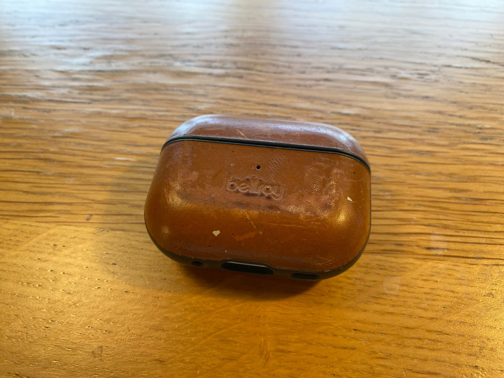

I absolutely love my AirPods Pro – the noise cancelling & sound quality on them is fantastic. I use these for video calls when I'm in noisy environments.

- [AirPods Pro 2](https://www.apple.com/uk/airpods-pro/)
- [Pod Jacket Pro | Smooth Leather Case for Apple AirPods Pro | Bellroy](https://bellroy.com/products/pod-jacket-pro?color=terracotta&material=leather&size=pod_jacket_pro_2nd_generation#slide-0)

#### Apple Watch Series 7 or G10 Military Watch

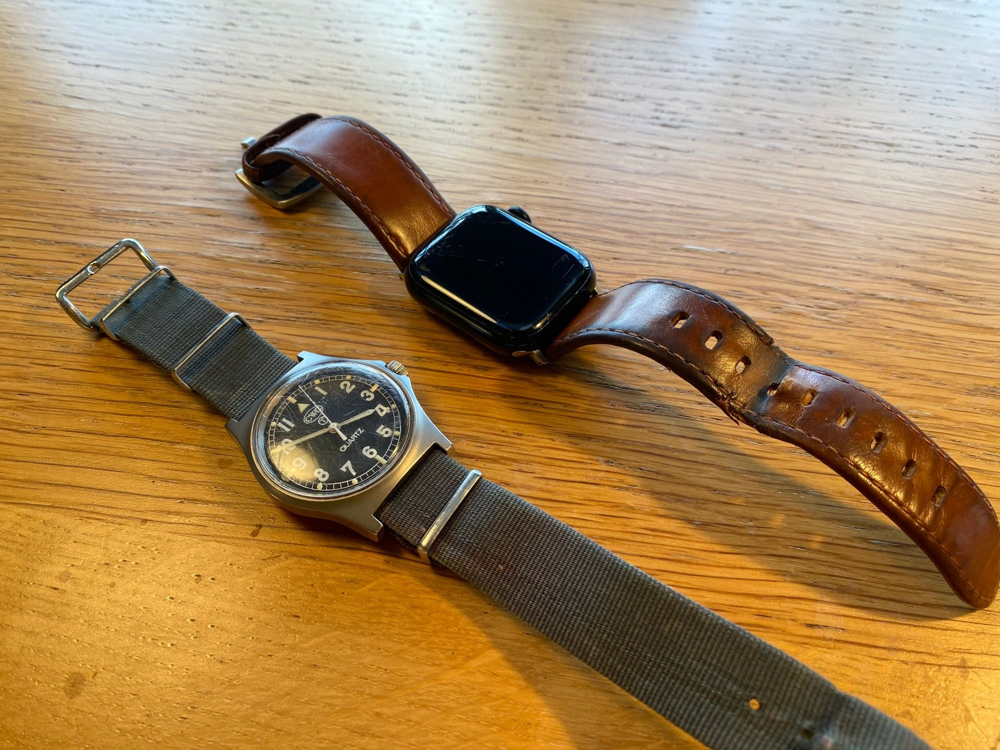

I cycle between an Apple Watch and a G10 depending on my mood. I love the Apple Watch for the health tracking features (especially sleep tracking) and the silent alarm, as well as its ability to hold podcasts and audiobooks when I'm out without my phone.

But I also hate the fact it's *yet another* device, so sometimes wear an old G10 watch. This is an issued item for some British military personnel. Years ago, I managed to convince a storeman to issue me one. It's super tough, easy to read, not bulky and the strap system means it'll never fall off. Not only is it practical, but I think it looks great too. I've got the Army version, which has a hatch to replace the battery and no date display.

- [CWC British Military G10 Quartz Watch](https://www.cwcwatch.com/products/cwc-g10-issue-watch-no-date-with-battery-hatch)
- [Apple Watch](https://www.apple.com/uk/watch/)

#### Hilo 24/7 Blood Pressure Monitor

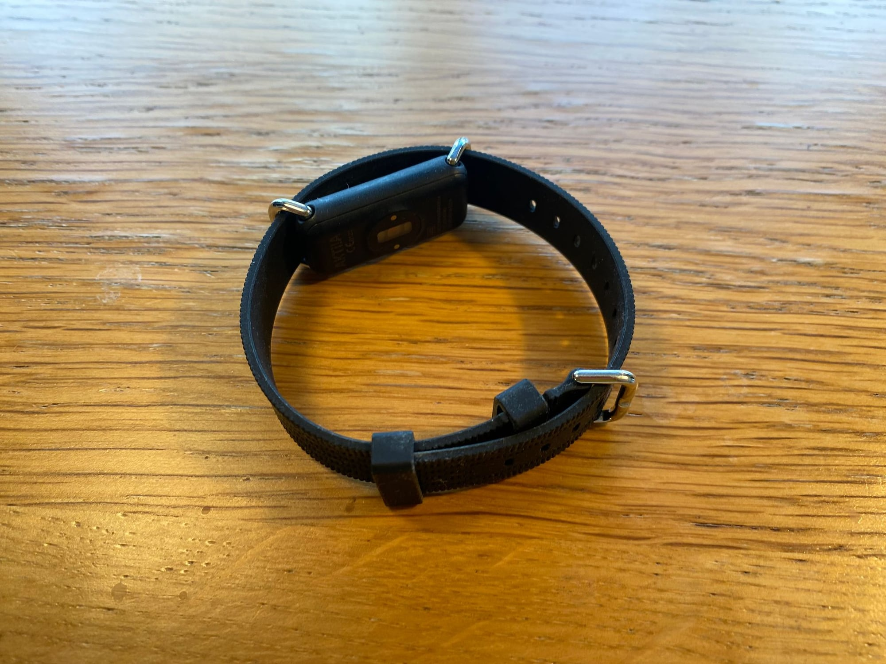

This is a fairly recent addition because I'm trying to lower my blood pressure a little bit at the moment. I wish the Apple Watch had a BP monitor so I didn't need this.

- [Hilo 24/7 Blood Pressure Monitor](https://hilo.com/uk/blood-pressure-monitor/)

#### Bellroy Hide & Seek Wallet, Caramel

<Grid columns={2}>
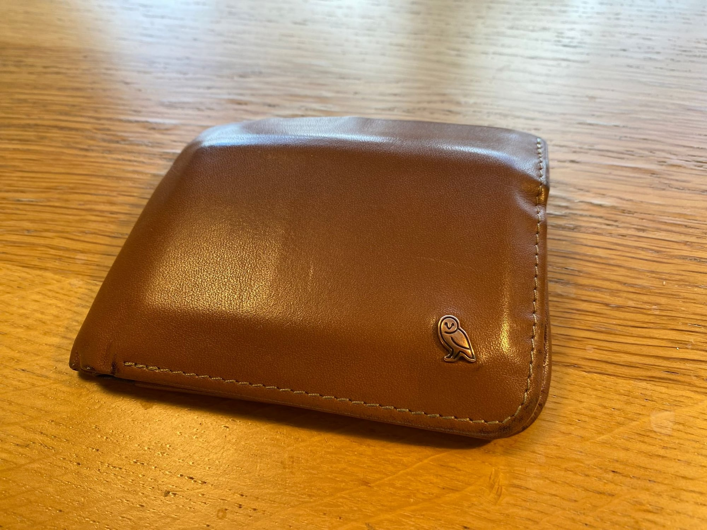

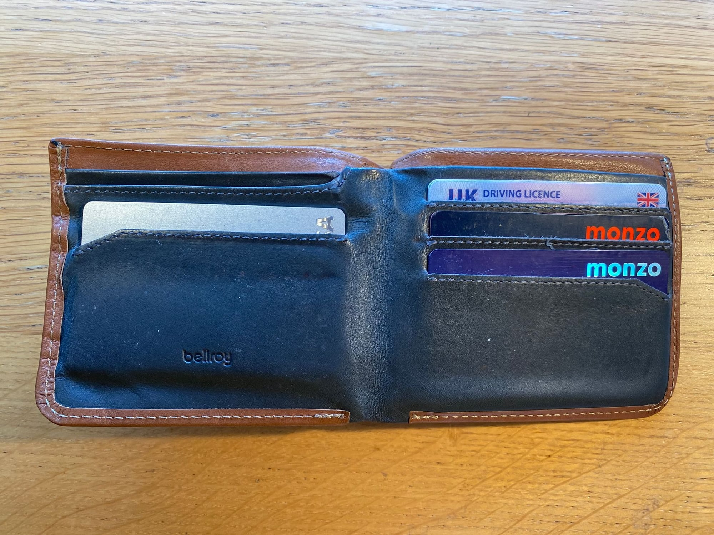
</Grid>

I bought this wallet in about mid-2022 to replace one I'd had for years. The build quality is fantastic and it still feels kinda luxurious after a couple of years use. The four main card slots are enough for the payment cards and IDs I carry and there's another card slot to hold the few membership cards I need. The part for bills has a main section and two "hidden" sections for a bit of backup cash.

- [Hide & Seek: Wallet With Hidden Pocket | Bellroy](https://bellroy.com/products/hide-and-seek-wallet?color=caramel&material=leather_rfid&size=hi#slide-0)

#### Ray-Ban Wayfarer Folding Sunglasses

<Grid columns={2}>
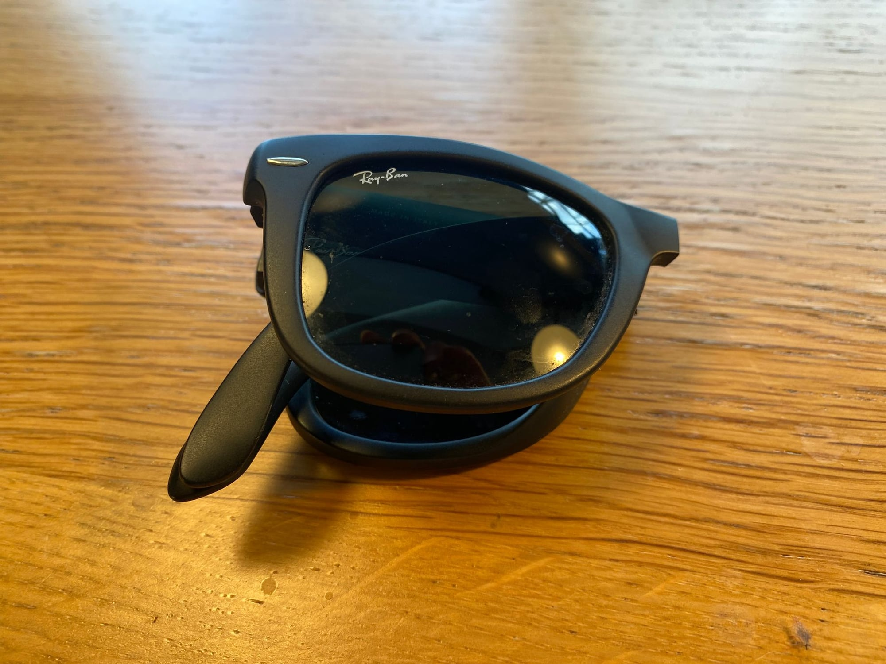

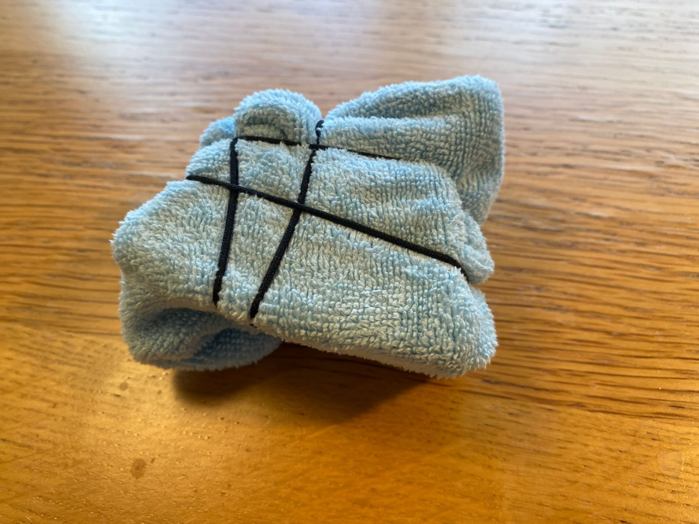
</Grid>

I've worn Ray-Ban Wayfarers for years, but switched to a folding model in about 2019 because they're much easier to keep in my bag when I'm not wearing them. The case they came with is super bulky so I wrap them in a little microfibre cloth and some hairbands when they're in my bag.

#### Keys, Slide, Knife & Lighter

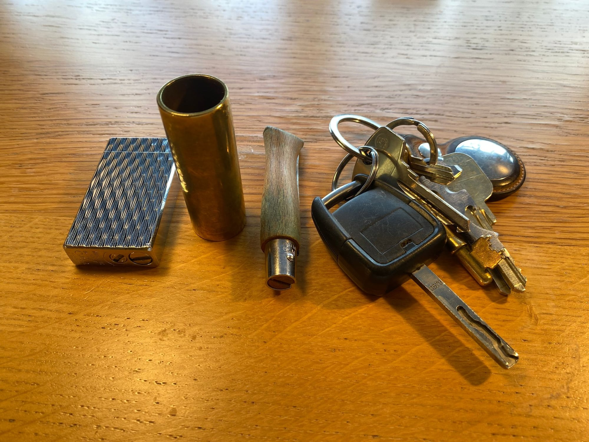

My keys have an Apple AirTag on them in an Apple keyring, and I also have a little utility tool on one of my keys which includes a mini-screwdriver, bottle opener, crap wirecutter etc.

I also carry a beautiful old Colibri lighter from the 60's, a guitar slide and a small Opinel No 5 folding pocket knife which is legal to carry in the UK and fits perfectly inside the guitar slide.

- [AirTag](https://www.apple.com/uk/airtag/)
- [KeyTool](https://www.trueutility.com/products/keytool)
- [N°05 Stainless Steel](https://www.opinel.com/en/pocket-knives/stainless-steel/n5-stainless-steel)

## Out for the Day

If I'm heading out I'll throw my laptop in my bag and head out the door. So long as I've got my bag I should be able to work effectively from anywhere, stay away from home on a whim for one or two nights or hit the gym for a swim.

#### Minaal Daily 2.0 Backpack

<Grid columns={2}>
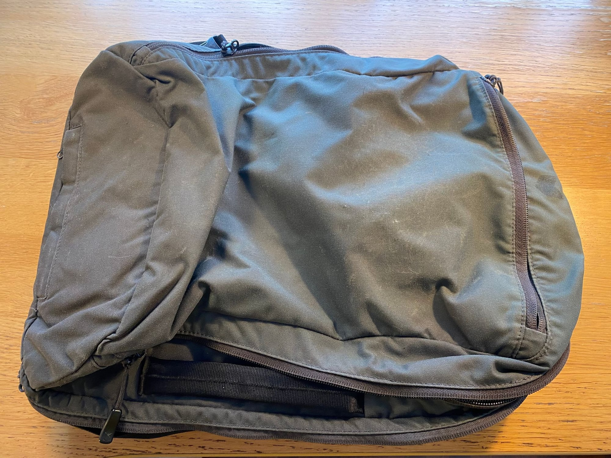

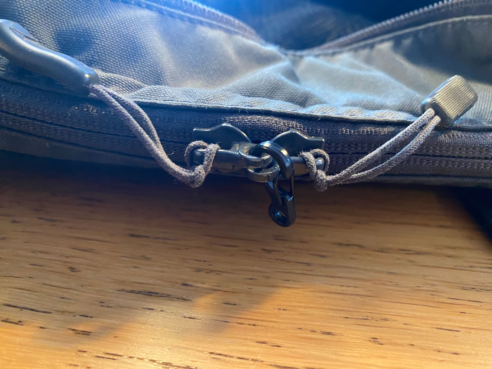
</Grid>

The Minaal Daily is hands-down the best backpack I've ever owned. It's got a whole bunch of features that make it almost perfect for what I want. It was expensive, but totally worth it. There's a good review [here](https://www.youtube.com/watch?v=ZAtsxU6fHls). The zips have some tiny clips so I can "lock" them to prevent pick-pocketing.

- [Daily Bag](https://www.minaal.com/products/daily-bag)

#### Berghaus Stormcloud Waterproof Jacket

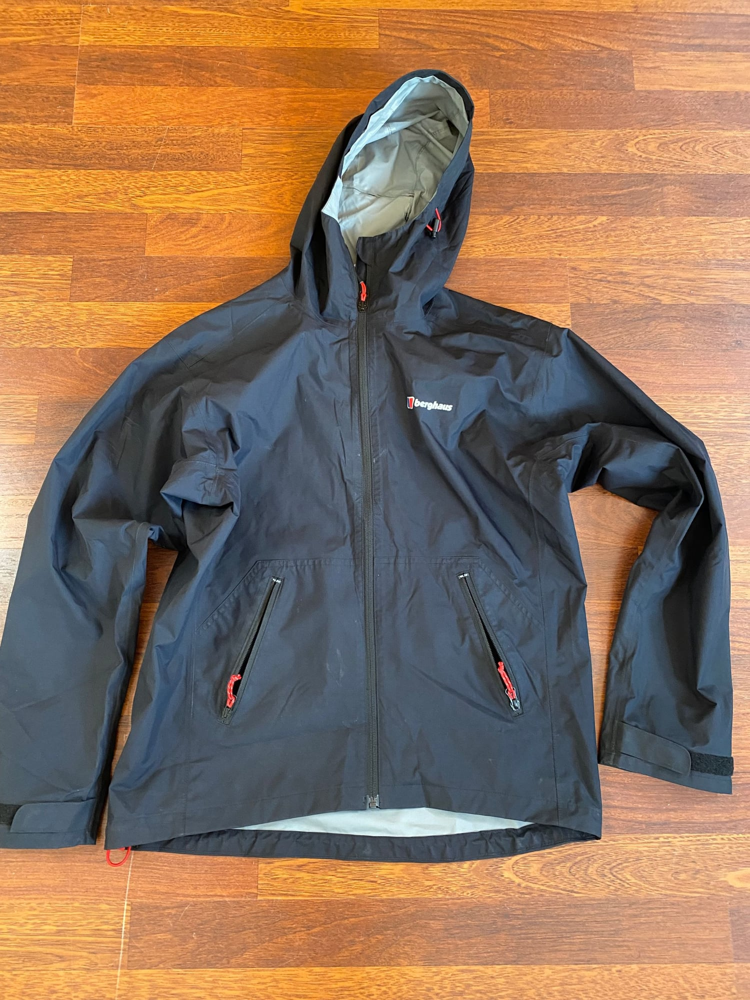

This is the smallest waterproof jacket I could find that doesn't make me look like I'm out for a hike. For years I had an old version of a [Berghaus RG Alpha](https://www.amazon.co.uk/Berghaus-Mens-Alpha-Waterproof-Jacket/dp/B00ELJ18FW), but it didn't roll up well and took up too much room in my bag. This one isn't perfect.. but it's much better.

- [Berghaus Men's Stormcloud Waterproof Jacket | GO Outdoors](https://www.gooutdoors.co.uk/175220/berghaus-men-s-stormcloud-waterproof-jacket-175220)

#### Patagonia Nano Puff Hoody

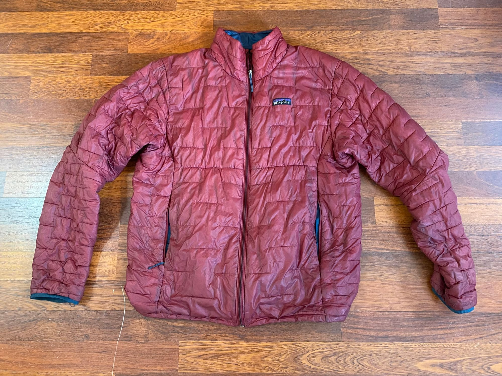

This is super warm for a minimalist synthetic down "warmers" jacket. I went with synthetic down because I had too many nightmares with real down getting wet and being hard to dry. It packs down pretty small and folds into its own pocket for storage, which also makes for a good pillow if needed.

- [Men's Nano Puff® Insulated Hoody | Patagonia UK](https://eu.patagonia.com/gb/en/product/mens-nano-puff-hoody/84222.html?dwvar_84222_color=BURR)

#### Fold-Up Carrier Bag

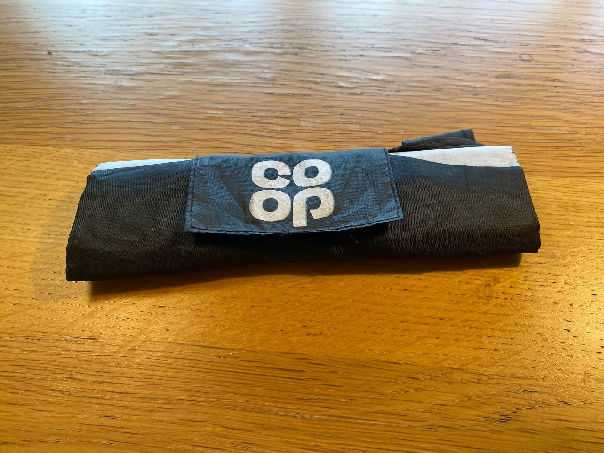

This is great when I need to carry more than fits in my Minaal. It also means I rarely use plastic bags when shopping, which is good for the world. My mum gave it to me ages ago but you can buy them in a bunch of shops/supermarkets.

#### Petzl E Lite Classic Headlamp

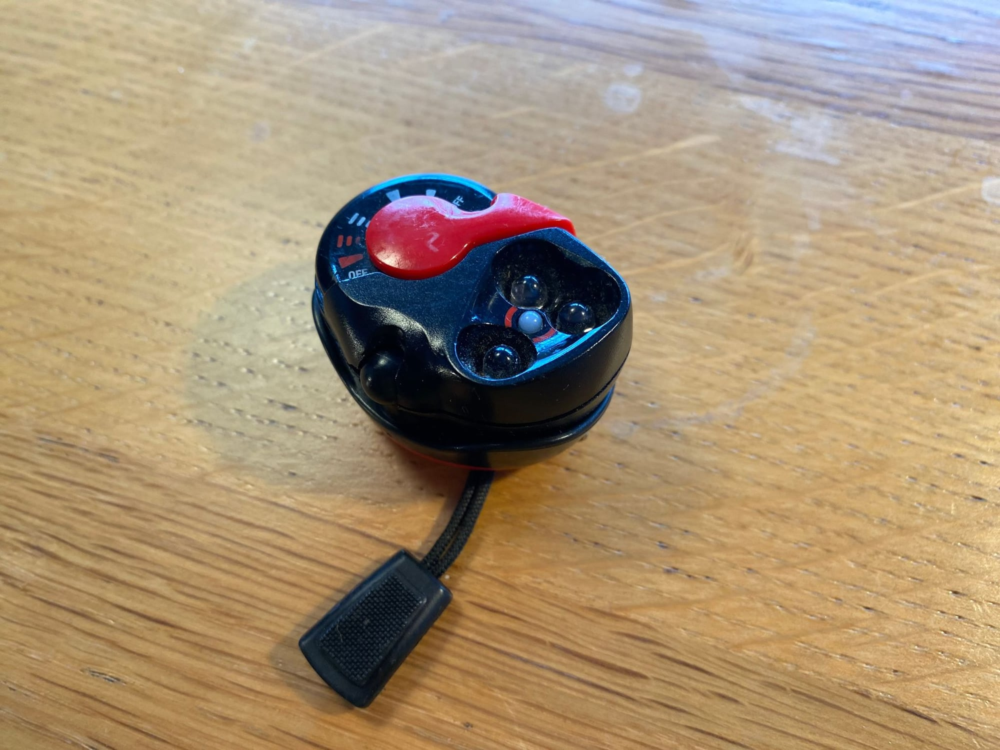

This head-torch is great. It's got settings for white and red light, which can be useful if I'm reading at night and don't want to wake others up. The fact that it's tiny and the headband is retractable means you can attach it to your wrist and use it as a kind of "hand torch". They stopped making this model years ago, which I'm really sad about.

#### Kindle Paperwhite 2025

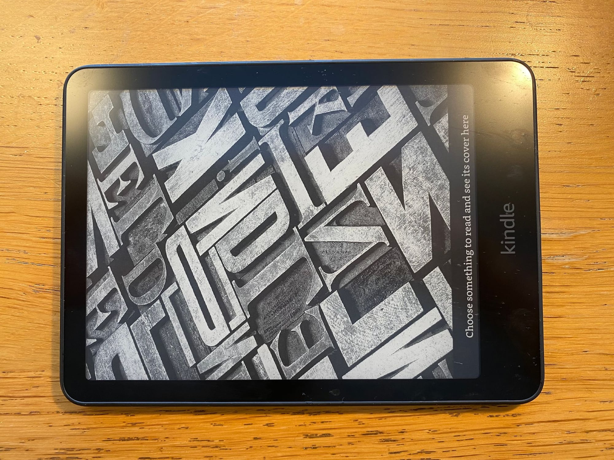

I resisted buying a Kindle for years, but now I have one.. it's **brilliant**. I keep loads of books on it, both for reference and reading. The screen is amazing and has an orange backlight for reading at night, and the fact that it's waterproof means I can read in the bath. Win.

- [Amazon Kindle Paperwhite (16 GB)](https://www.amazon.co.uk/kindle-paperwhite-2024/dp/B0CFPXBJ9Y?th=1)

#### Anker Nano 30W Power Bank with Built-In USB-C Cable

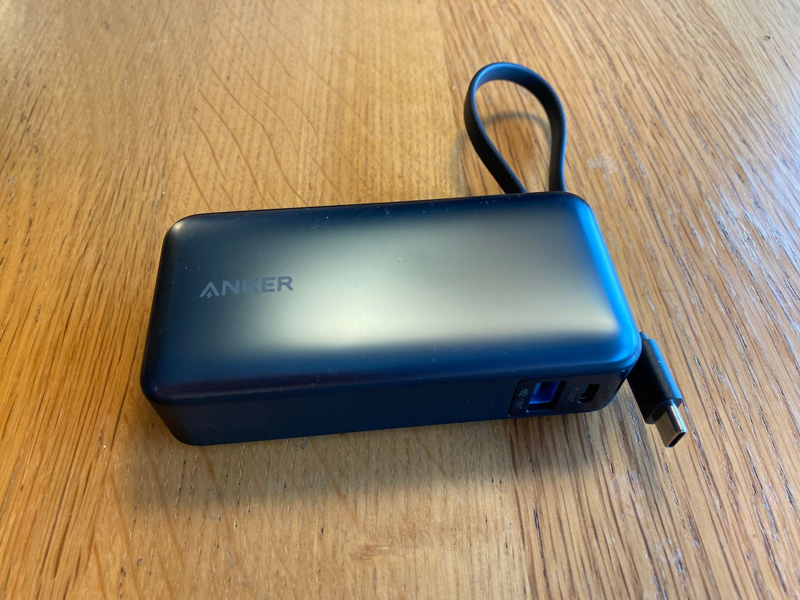

I bought this in early 2025 as a day-to-day alternative to my larger, heavier power bank. I love the fact it has a built-in USB-C cable and is small enough to keep in my pocket. It has fast-charging USB-C and USB-A ports and both the USB-C cable and port can be used to charge the power bank.

- [Anker Nano Power Bank (30W, Built-In USB-C Cable)](https://www.anker.com/uk/products/a1259-built-in-cable-power-bank-10000mah?variant=44575527207076&collections_power-banks=undefined&Sort_by=Recommended)

#### Anker 325 20,000mAh Power Bank

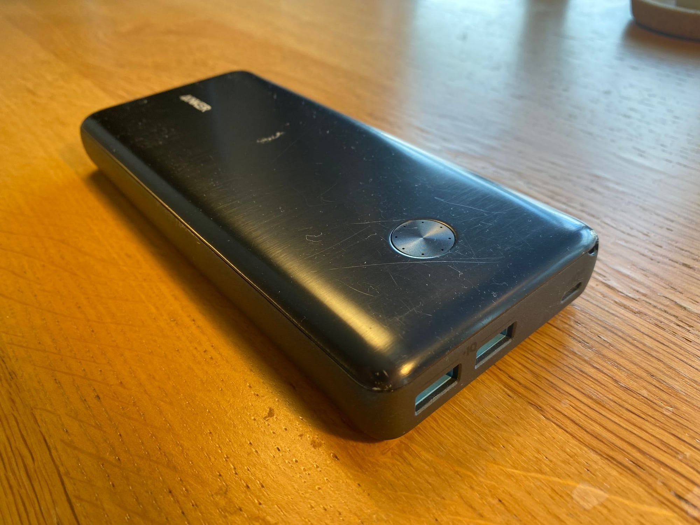

I've had a version of this for years. It takes forever to charge up but can fully charge my MacBook once, and my phone or other devices multiple times. It's a little too heavy to cart around in my pocket but is a reliable backup to the Anker Nano to have in my bag. I wish it had two USB-C ports though.

- [Anker 325 Power Bank (PowerCore 20K)](https://www.anker.com/uk/products/a1268)

#### Pentel TPCP207 Automatic Pencil & Moleskin Notebook

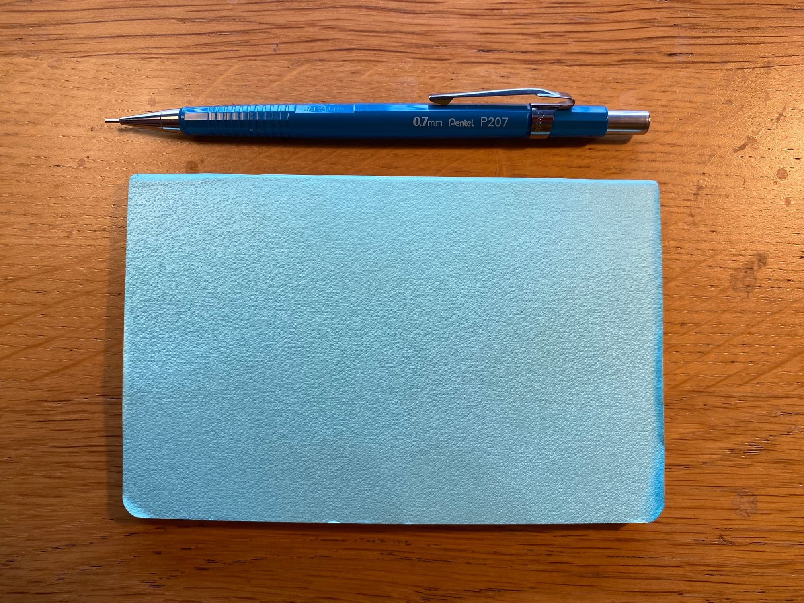

After years looking for a high-quality pen which wasn't expensive, I realised that I much prefer writing with good propelling pencils. The Pentel TCP207's are my current favourite. I use them with a cheap, thin pocket Moleskine for rough notes.

- [Pentel P207 Mechanical Pencil](https://www.pentel.co.uk/product/pentel-p207-0-7mm-mechanical-pencil-single-pack-xp207/)

#### Smart Water Bottle

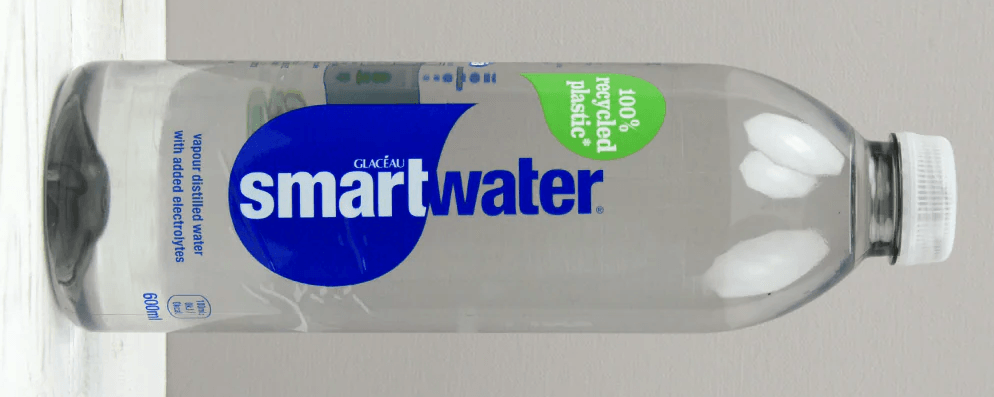

I've tried carrying a large 1-litre metal bottle, but found that it often takes up too much room in my bag. And smaller metal bottles aren't big enough. So while I'd prefer not to use disposable plastic bottles, the ability to throw them out if I need larger or smaller ones is worth it. The SmartWater bottles are much tougher than most others so they last longer when refilling them.

#### Swimming Kit

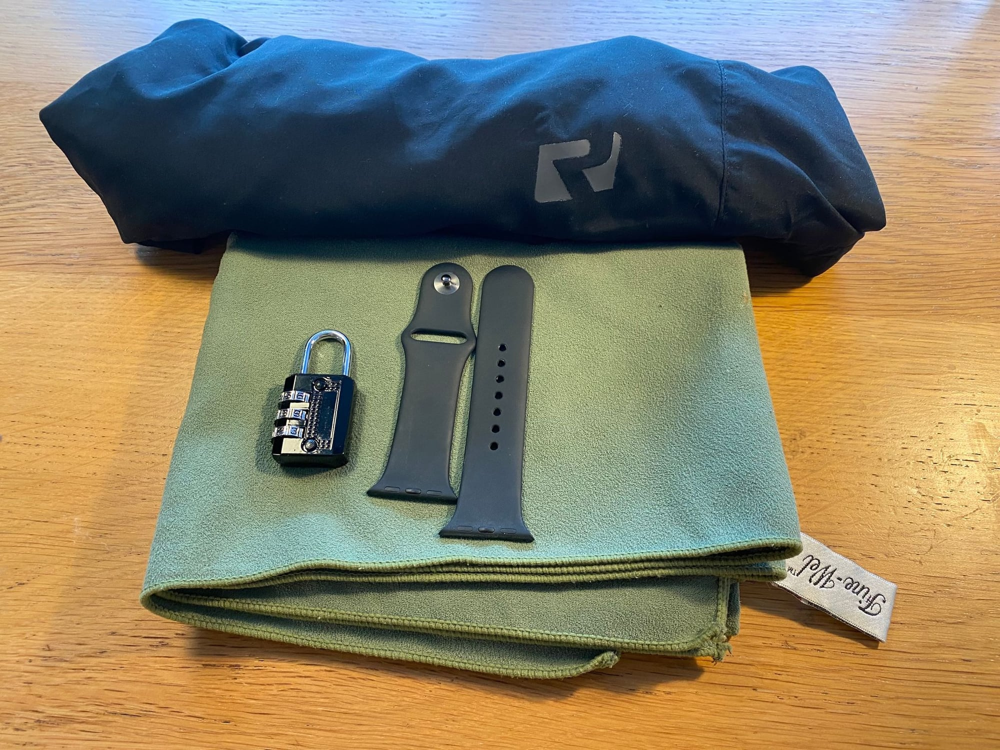

I've been caught out on too many occasions by not having swimming shorts with me, so I keep a cheap pair in my bag along with a waterproof strap for my Apple Watch, a small micro-fibre towel and a small combination padlock for lockers. If I'm staying away without any spare clothes, I can wear the swimming shorts while washing my clothes and still have a towel with me, and the padlock is small enough that it can also be used to secure the zips on my bag to deter casual theft.

### Portable Office

If I'm 💯 certain that I won't need to work, I'll sometimes leave this stuff at home. But if I've got my MacBook with me I'll also have my "portable office". It packs down super small and lets me set up almost anywhere with two monitors, an ergonomic setup and a high-quality webcam for recording videos. My laptop is covered in [Home Office & Desk Setup](/using/office).

<Grid columns={2}>
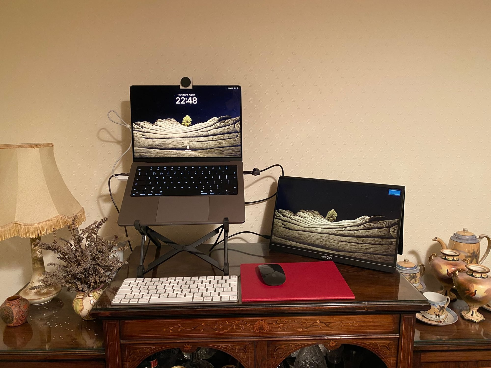

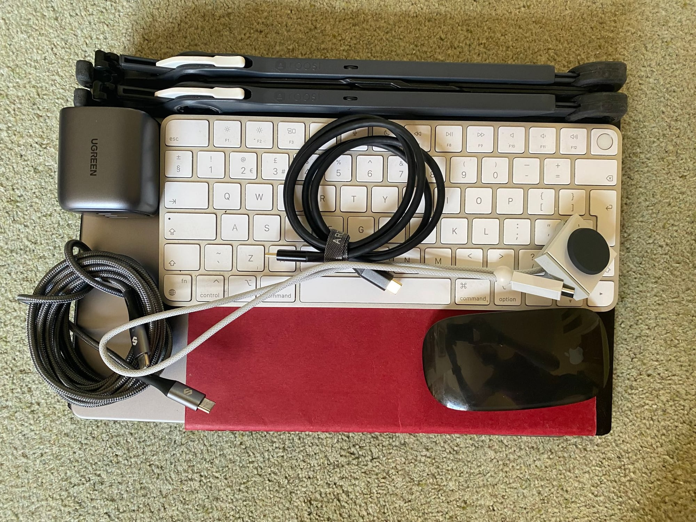
</Grid>

#### Arzopa 15.6" Portable Monitor & Cheap Amazon Stand

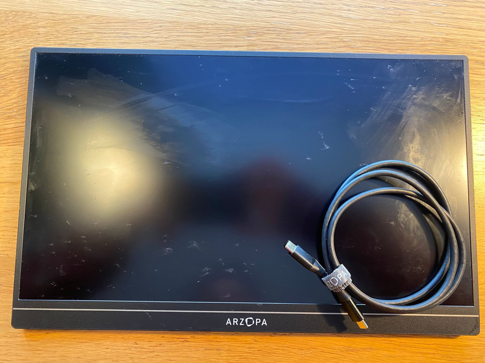

This was recommended to me by a friend and is plenty good enough to use as a second monitor. It comes with a cover/stand which almost doubles the weight, so I've replaced that with a tiny folding iPad stand from Amazon. It connects via USB-C, which also provides power to it.

- [Arzopa A1 Travel Monitor | 15.6" FHD 1080P Display](https://www.arzopa.com/products/a1-15-6-fhd-1080p-portable-monitor)

#### Roost Laptop Stand

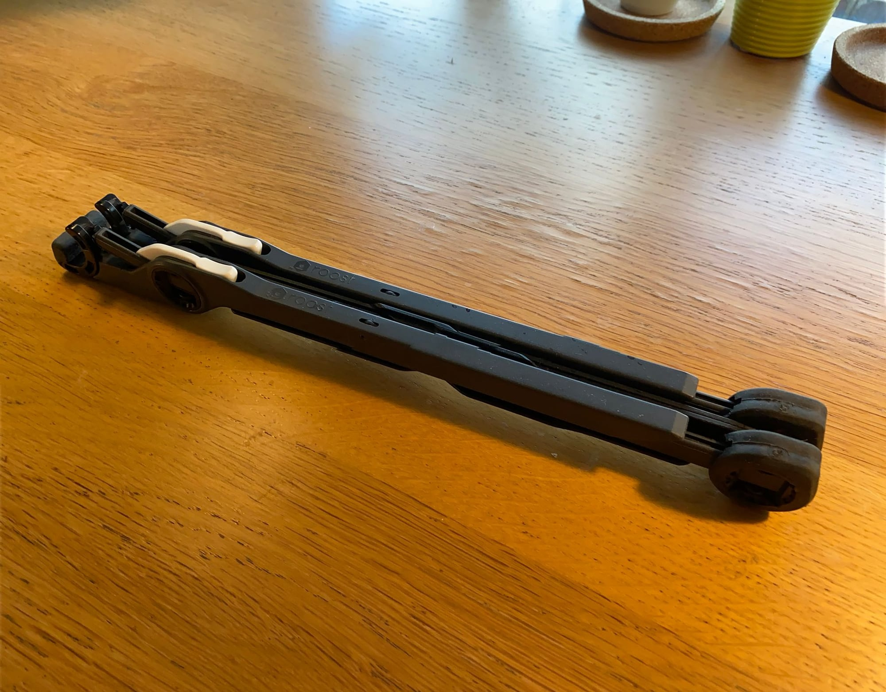

This is a fantastic bit of kit. It folds down super small but is super sturdy when set up. It raises my laptop screen and webcam to eye level.

- [Roost Laptop Stand](https://www.therooststand.com/)

#### Apple Magic Keyboard, Mouse & "mouse mat"

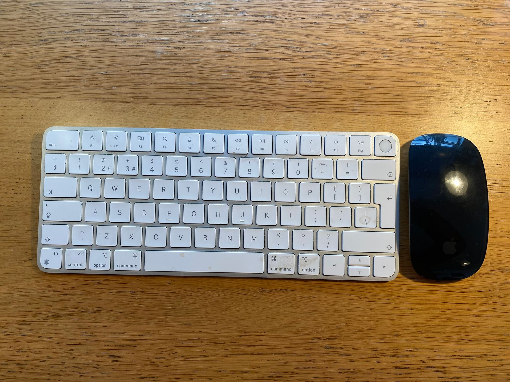

The Roost stand requires an external keyboard and mouse, so I have USB-C versions of the Apple Magic Mouse and Keyboard - exactly the same as I use at home. I use a cheap Moleskine A5 notebook as a mousemat.

#### Opal Tadpole Webcam

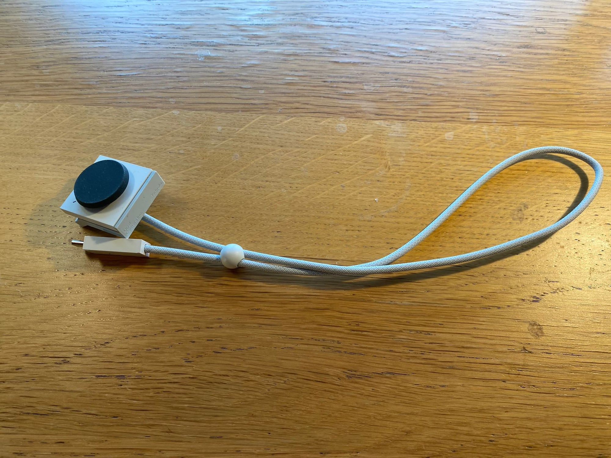

This is probably the best-quality "travel" webcam out there. It's super easy to use, has good depth-of-field for what it is and comes with some great software to control the image it produces.

- [Opal Tadpole — The first portable webcam](https://opalcamera.com/opal-tadpole)

#### Ugreen Nexode 65W GaN Wall Charger 3-Ports

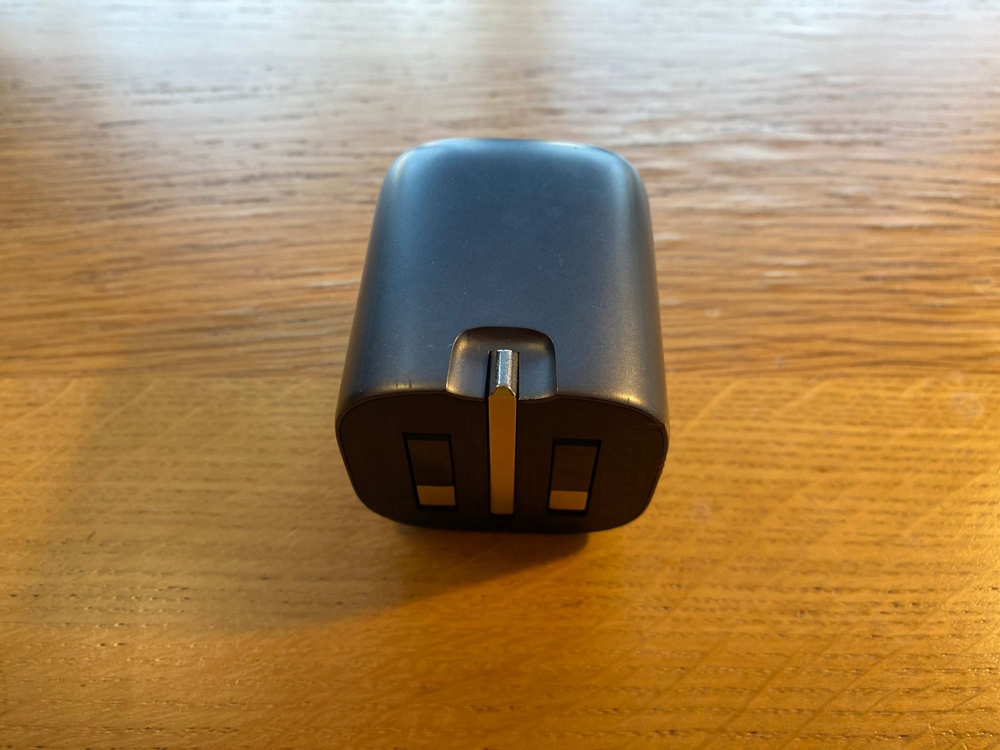

I've had this for ages and it's still the best compact folding UK charger I've found. It can charge my laptop and a second device via USB-C fast charging and has a spare USB-A slot in case I really need it. This is the only wall charger I carry.

- [UGREEN Nexode 65W GaN Wall Charger 3-Ports](https://uk.ugreen.com/products/ugreen-nexode-65w-usb-c-gan-charger-3-ports-wall-charger)

#### Wires & Adaptors

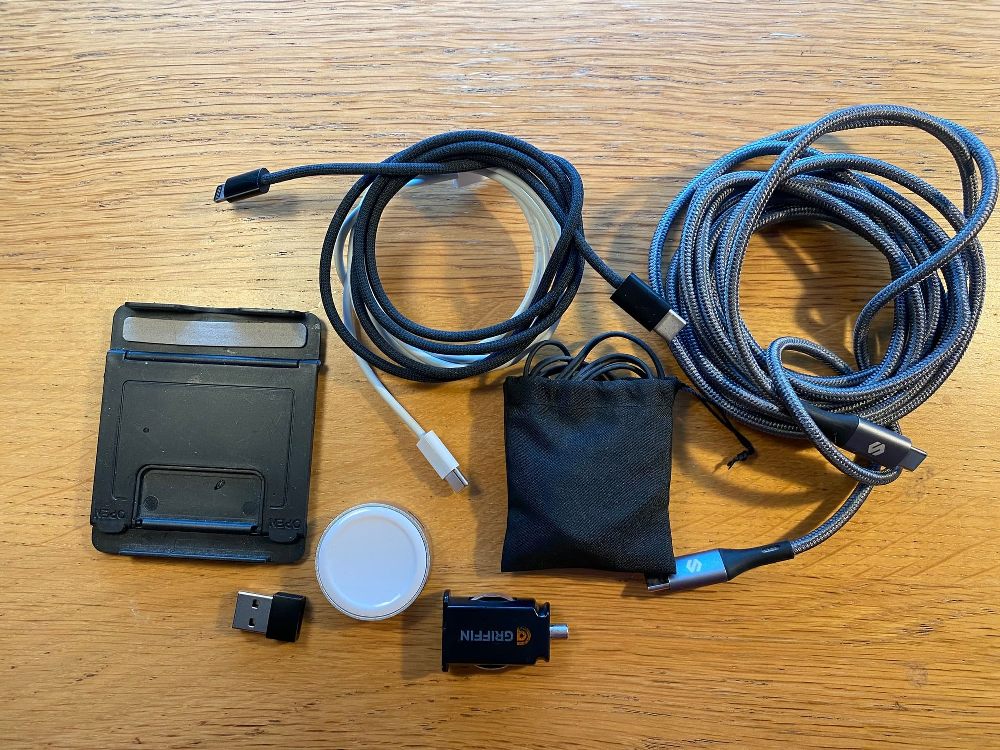

- **Long 3m USB-C cable** – I don't remember what make this is, but I mostly use it to charge my laptop. Having a long cable makes it easier when I need to set up away from a socket.
- **Ruxely Apple Watch Charger** – This has both a Lightning and USB-C input, which is much better than the standard Apple charger which has the wire attached to it.
- **2 x Apple 1m USB-C cables** – For charging other devices.
- **USB-A to USB-C adaptor** – Since I only have USB-C cables on me, it's important to have an adaptor for plugging into USB-A.
- **Griffin USB-A car adaptor** – I rarely use this, but on the one or two occasions where I've found myself in a car without a USB charging port it's been invaluable.
- **HDMI female-female adaptor** – I sometimes find myself needing to wire into an HDMI TV or projector. On *soooo* many occasions I've had two HDMI cables which were too short, so this adaptor lets me join them together to make a longer one.
- **Cheap 3.5mm headphones** – I always think it's a good idea to have some spare cheap 3.5mm headphones with me just in case I lose my AirPods.

## Staying Away

The stuff above is enough for one or two nights away but doesn't exactly make for comfortable travel – not least because I haven't got a change of clothes with me (beyond my swimming shorts)!

If I know I'm going to be away for more than one night, I'll throw in some or all of the stuff below, which I tend to think of as three separate "kits"… **Spare Clothes**, **Sleep Kit** and **Wash Kit**.

### Spare Clothes

#### Spare T-Shirts & Socks

Two each of spare T-shirts, boxers and socks is more than enough for me to stay away for a long time – I just have to hand-wash the day's clothes before I go to bed every night. I roll them as per the video below.

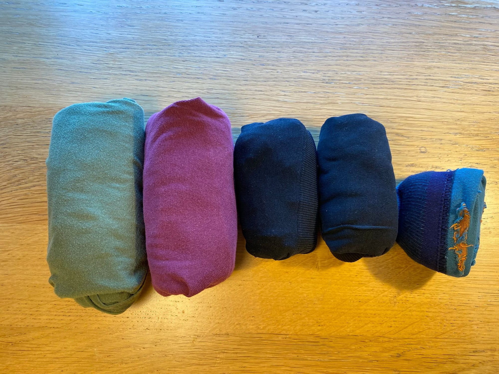

<Embed url="https://youtu.be/Em4lbLf09M0" />

#### Minaal Packing cubes 2.0

<Grid columns={2}>
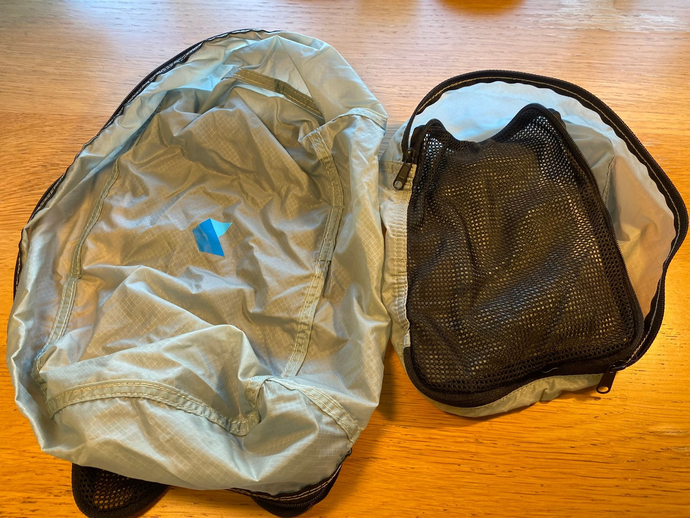

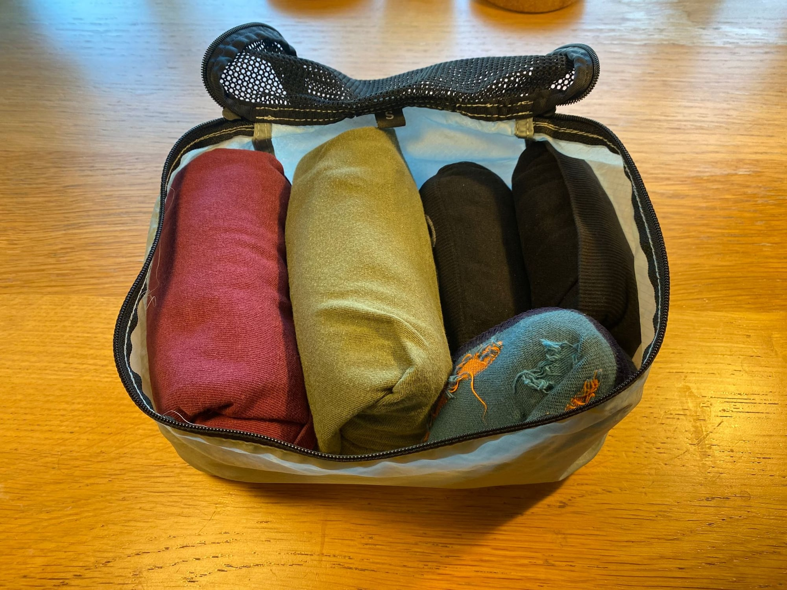
</Grid>

I have three of these, though normally only use the smaller one. They're ridiculously lightweight and make it super easy for me to keep my "overnight" clothes separate from everything else.

- [Packing Cubes 3.0](https://www.minaal.com/en-gb/products/packing-cubes-3-0)

#### OluKai 'Ohana Waterproof Flip-flops

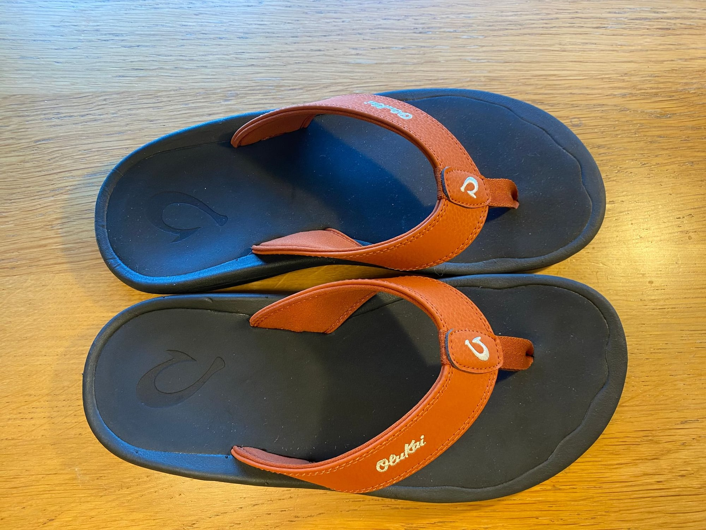

I **hate** cheap flip-flops, but since I only travel with one pair of shoes I kinda need some with me. My main requirement is that they're waterproof and comfortable. At home I wear Birkenstocks but they're far too bulky to pack and aren't waterproof. I got these OluKai flip-flops in the US in early 2025 and the jury's still out on them as of mid-2025.

- ['Ohana - Dark Java / Ray](https://olukai.co.uk/products/ohana-mens-beach-sandals-dark-java-ray?variant=45276199190818)

### Sleep Kit

#### WAOAW Sleep Mask

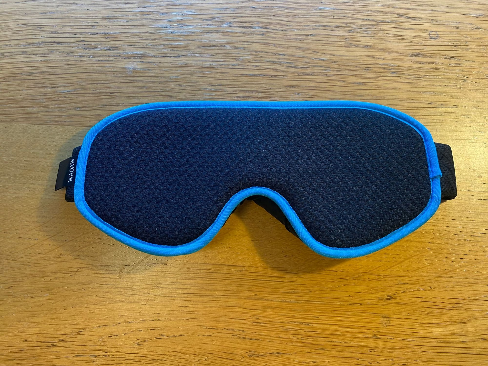

This is a great, and fairly inexpensive bit of kit which 100% blocks light out, and the foamy bit means you can open your eyes while wearing it.

#### Sea to Summit Aeros Inflatable Travel Pillow

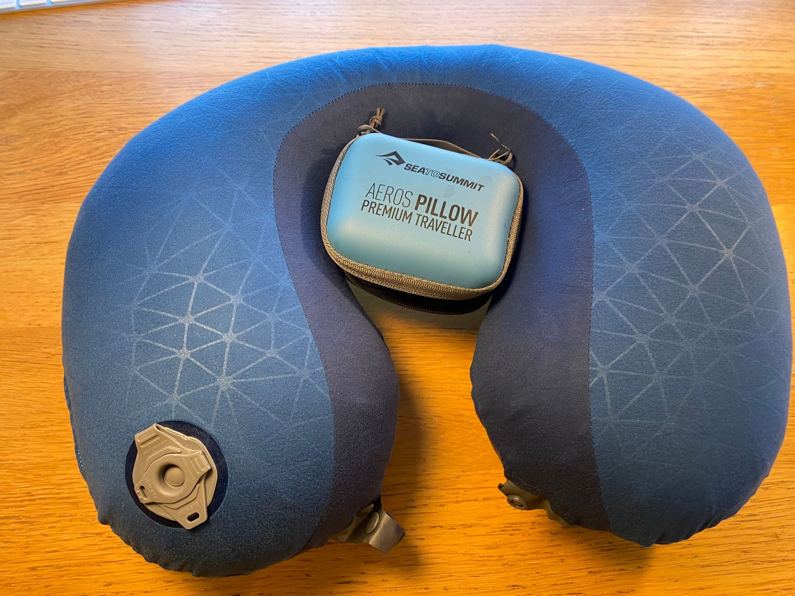

I bought this in Texas in April 2025 after looking for a **comfortable** but **compact** pillow to use when sleeping on planes, trains and the like. It's mega comfortable and packs down into a box the size of my hand.

#### ACS Custom SleepSound Earplugs

### Wash Kit

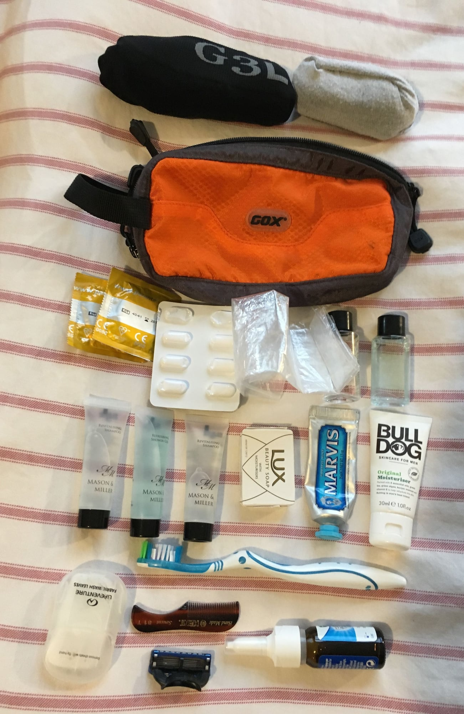

I try to keep my wash-kit as small as possible and for the most part I get soap, shampoo and the like wherever I'm staying. The GOX toiletry bag is exactly the right size and shape for me. Other than that the only unusual things are the **fabric wash leaves**, **moustache comb** and **Vicks First Defence**.

The wash leaves are amazing for washing underwear and T-shirts in a sink, and being non-liquid they're one less thing to worry about when flying. I bought the moustache comb when I had a moustache, but now use it for combing my hair and beard - it works fine and is smaller than a normal comb. The First Defence is amazing for preventing colds.

- GOX Toiletry Bag ([Amazon](https://www.amazon.co.uk/Toiletry-Ultra-Light-Cosmetic-Large-Capacity-Portable/dp/B01I30DJJ2?th=1))
- Clear plastic bag for liquids if travelling by air
- Paracetamol, cold relief, caffeine pills, condoms
- Small bottles (stolen from hotel) containing **aftershave** and **mouthwash**.
- Shampoo, shower gel and soap (all nicked from hotels)
- Marvis Aquatic Mint Travel Toothpaste 25ml ([Amazon](https://www.amazon.co.uk/dp/B00PWX4JDO/ref=cm_sw_r_tw_dp_U_x_E0wcDbF8F8XJY))
- Bull Dog Travel Moisturiser
- Toothbrush
- LifeVenture Fabric Wash Leaves ([Amazon](https://www.amazon.co.uk/dp/B002UGCU7S/ref=cm_sw_r_tw_dp_U_x_w2wcDb3MB6KSY))
- Vicks First Defence Micro-Gel Nasal Spray, 15ml ([Amazon](https://www.amazon.co.uk/dp/B000LNEBO2/ref=cm_sw_r_tw_dp_U_x_c3wcDb2V8CM1S))
- Razor blade (without handle)
- Kent Handmade Fine Toothed Moustache and Beard Comb for Men, 7.3 cm ([Amazon](https://www.amazon.co.uk/dp/B004K3J6H6/ref=cm_sw_r_tw_dp_U_x_p4wcDbA9BWMHP))

<Callout emoji="💡" type="blue" title="International Travel" largeHeading>
If I'm heading outside the UK I'll make a few changes to my every-day kit and add a couple of items to my bag…

- My **passport** goes in my pocket.
- I **leave** my nice lighter, pocket knife & car key at home, along with any cards in my wallet which aren't useful outside the UK.
- I'll maybe add an extra pair of **shorts** if I'm going somewhere warm, or some merino wool underwear if I'm going somewhere cold.
- I add a **Lifeventure Universal Travel Adaptor**. They don't make it anymore but it looks a bit like this…

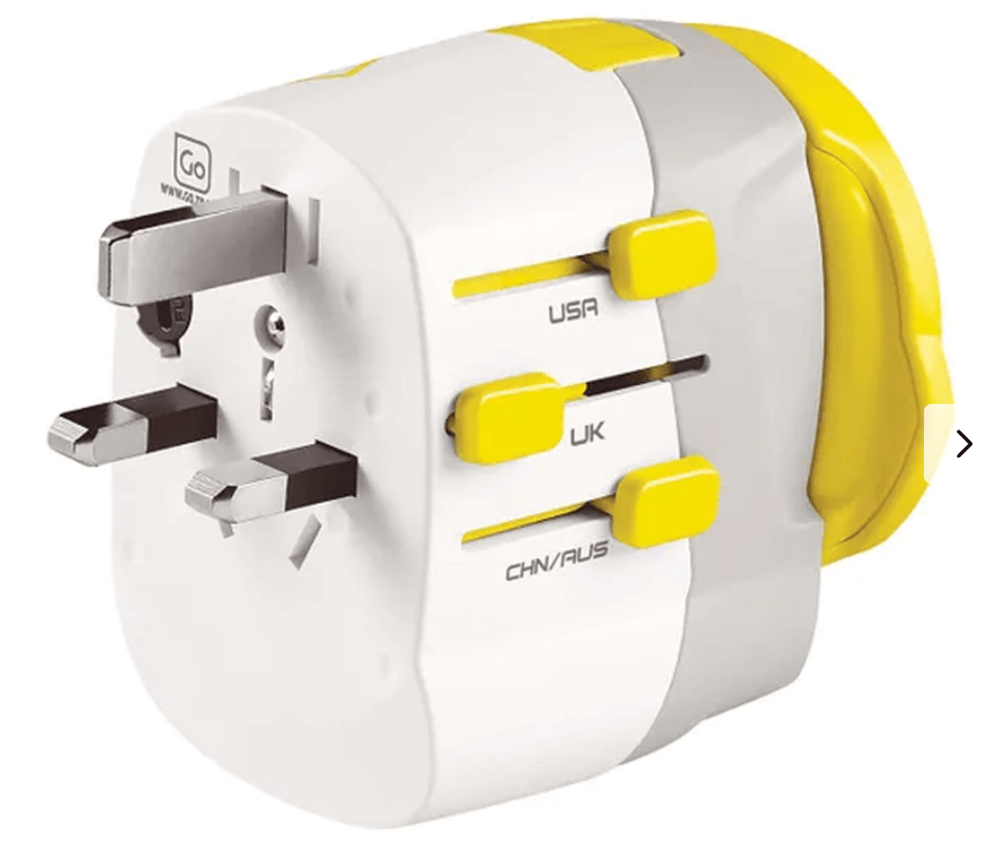
</Callout>

## Extended Travel

My main additional requirement when travelling for more extended periods of time is **more room to carry stuff**. The Minaal Carry-on can fit my (unpacked) daily bag inside it, along with everything else I'd normally carry and a bit of room for a few extra clothes or purchases made along the way.

#### Minaal Carry-On 1.0

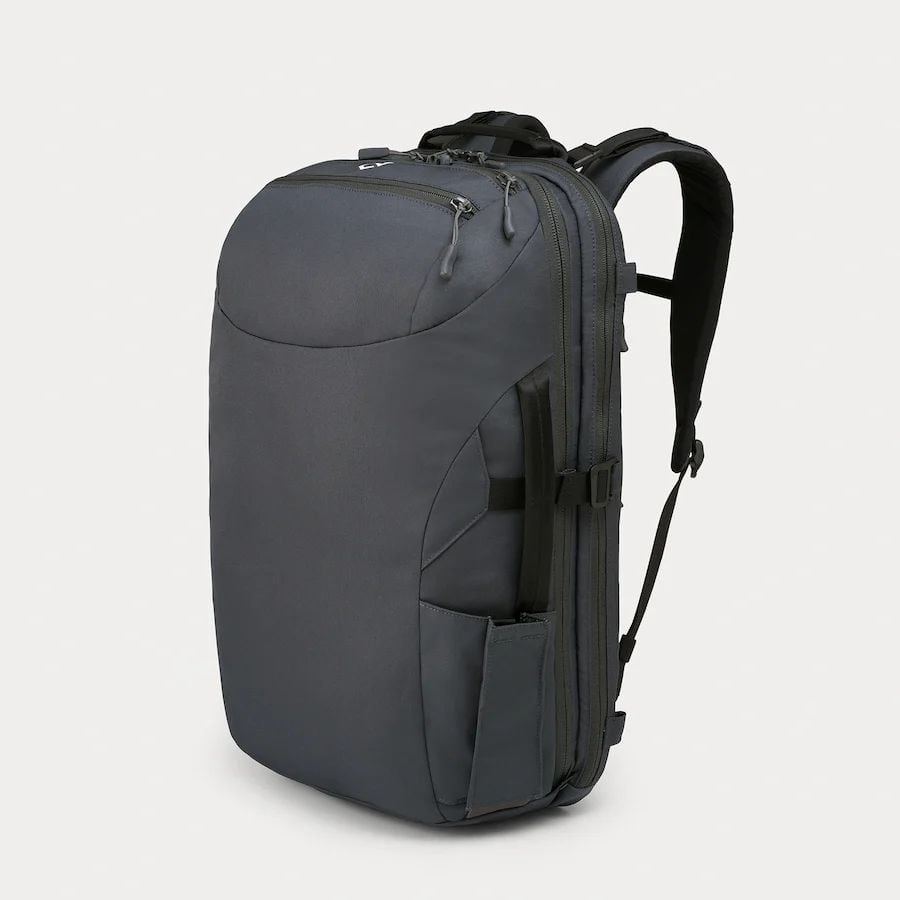
