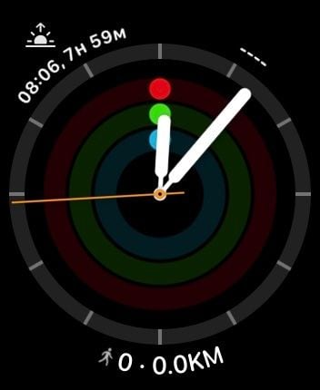
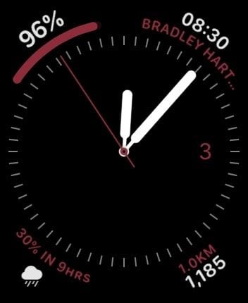
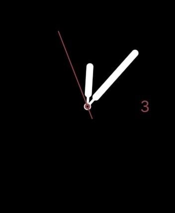
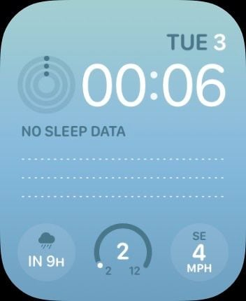

It would take forever to describe all the software I use regularly, but here's the stuff I consider to be most important...

## Principles 📖

I try to keep things as simple as possible when it comes to the software I use. This hasn't always been the case, but I'm now using these principles to guide my decisions:

1. **Prefer web-based tools to installable tools**. Tha ability to log in and work on any machine is huge, and reduces reliance on my laptop.

   <Callout emoji="⚠️">
   I'm reconsidering this principle at the moment for some things after working more with **local plain-text files**.
   </Callout>

2. Use the **right tool for the job**, but **balance** against the complexity cost of introducing a new tool.
3. Prefer **default configs** over complicated custom setups.

## Core Stuff 📕

These tools form the base on which most of my other stuff works. I use them every day.

- [**Google Suite**](https://gsuite.google.co.uk/intl/en_uk/) - I use GSuite email and calendaring. Most of my important stuff lives on Google Drive, synced to my laptop. I use Notion Mail & Notion Calendar as my main email and calendar apps.
- [**Notion**](https://notion.so) - My external brain. Everything that can lives in here.
- **Obsidian** - I'm slowly switching much of my system from Notion to Obsidian so I own my data and can use local AI tools with it.
- [**1Password**](https://1password.com/) - Security is [not a dirty word](https://www.youtube.com/watch?v=y9o_nu6WWEg). I rely on 1Password to manage my passwords and some other security stuff.
- [**Readwise Reader**](https://readwise.com) - I use Reader to save everything I want to read or listen to later, and also to keep highlights of stuff I read and synchronise them between other devices and apps.

## General 📔

These tools have a supporting role, and I couldn't do without them. I happily pay for many of these.

- **ChatGPT** & **Claude Desktop** - I use these much like everyone else.
- [**YNAB**](https://www.youneedabudget.com/) - Manages all my budgeting stuff. I use this in conjunction with my banking app, [Monzo](http://monzo.com/). It's awesome.
- **NordVPN** - My VPN on all my devices.
- [**Cal.com**](http://cal.com) - I use this for scheduling meetings and whatnot.
- [**Loom**](https://loom.com/) - Sharing short videos. I use this all the time.
- [**Figma**](https://figma.com/) - Replaced Sketch in 2019 and Miro in 2022. I use FigJam to run nearly all my workshops, and also as a visual place to think.
- [**DNSimple**](https://dnsimple.com/) - Manages my domains and DNS.
- **Snipd** - Podcasts. I use the AI snipping features to capture short snippits and sync them into Notion.
- [**Zapier**](https://zapier.com) - I have a few Zaps set up to automate stuff.

## Coding 🤓

I don't code a lot anymore, but when I do here are the tools I use…

<Accordion header="Text Editor - Cursor">
My font is Operator Mono Light with [coding ligatures added by this](https://github.com/kiliman/operator-mono-lig). I use the following extensions as of 2025-05-04

```plaintext
astro-build.astro-vscode
christian-kohler.path-intellisense
dbaeumer.vscode-eslint
dracula-theme.theme-dracula
eamodio.gitlens
esbenp.prettier-vscode
figma.figma-vscode-extension
formulahendry.auto-rename-tag
github.copilot
github.copilot-chat
github.vscode-pull-request-github
ibm.output-colorizer
mechatroner.rainbow-csv
mikestead.dotenv
ms-vscode.atom-keybindings
ms-vscode.vscode-speech
ms-vsliveshare.vsliveshare
prisma.prisma
steoates.autoimport
tomoki1207.pdf
tyriar.lorem-ipsum
unifiedjs.vscode-mdx
vunguyentuan.vscode-css-variables
wix.vscode-import-cost
```
</Accordion>

<Accordion header="Terminal - Ghostty">
- With [oh-my-zsh](https://ohmyz.sh/) and [these dotfiles](https://github.com/dannysmith/dotfiles).
- My dotfiles should give an idea of the command-line tools I use on the regular.
</Accordion>

## Mac Apps 🍏

Although I try to use mostly web-based apps, I inevitably have a bunch of mac apps for very specific things. It'd take forever to list them all and would be super boring. So here are the mac apps I use almost daily – mostly utilities...

- [**Raycast**](https://raycast.com/) - I probably use this more than any other tool for finding stuff and launching other apps. I have it mapped to **⌘ + Space**.
- [**Handy**](https://handy.computer) - Extremely accurate local voice transcription in any text field. This is how macOS dictation *should* work. I use this to interact with loads of apps via voice.
- [**iStat Menus**](https://bjango.com/mac/istatmenus/) - Super-customizable system monitoring etc.
- [**Bartender**](https://www.macbartender.com/) - Hides the myriad menubar icons I don't need to see. Pretty much everything is hidden by default.
- [**Tripmode**](https://tripmode.ch/) - allows me to selectively block internet traffic to certain apps. Useful when I'm travelling or on a slower internet connection.
- [**Endel**](https://endel.io/) - Great music to work, focus or sleep to.
- [**CleanMyMac**](https://macpaw.com/cleanmymac) - A very useful tool for keeping my laptop healthy. At 8 years old it needs it.
- [**iA Writer**](https://ia.net/writer) - I use this for nearly all my long-form writing, though I'll often port finished pieces over to Notion.

## Dark Mode 🌚

I use Night shift to flip the OS Dark mode setting and configure all my apps to respect that OS setting. This means that I have nice bright white apps during the day and dark apps at night.

I also have dynamic desktop backgrounds that flips between white and black depending on the time of day. I spent **far too long** making these backgrounds 🙃

')

')

## Web Browser 🕸️

I stopped using Chrome in 2021 because it was using so much CPU that my laptop's fan was probably damaging my hearing. After using Safari for 18 months I switched to [**Arc**](https://arc.net/), which has totally changed how I use a browser. I have the following extensions…

- 1Password
- Readwise Reader
- Notion Webclipper
- Reflect

## Phone & Watch 📱

The apps on my iPhone are mostly just mobile versions of the stuff above, plus a bunch of super common apps. I use Focus Modes to control my notifications and swap out the home and lock screens depending on what I'm doing. I only ever have one home screen per focus mode. Some of the focus modes also activate corresponding faces on my Apple Watch.

### Normal Mode

This is the default when no focus mode is set. I still have a lot of notifications and badges switched off, but the home screen shows the apps I use when I'm not working.




### Work Mode

I turn this on whenever I'm working. It hides notifications from everything except my work apps, and the home and lock screens show my calendar and task widgets.




### Reading Mode

Whenever I find myself noodling about on my phone or opening twitter, I try to turn this mode on and do some reading instead. It blocks all notifications and only shows my reading apps.


### Deep Focus Mode

I turn this on whenever I need to really focus on something. The blank home screen is a reminder to put my phone down if I pick it up. It obviously blocks all notifications and phone calls.


### Driving Mode

I don't have CarPlay, so my phone sits in a mount by the steering wheel. The home screen makes it easier to get at the apps I need when I'm in my car.


### Sleep Mode

The minimal home screen is a reminder to put my phone down if I pick it up in the night. I sometimes use Audible and Spotify when I'm going to sleep.




### Wake Up Mode

This mode is super bright and is turned on automatically by a shortcut when I witch my alarm off. It shows me how I slept and has a few apps which I use in every morning.




### Other Watch Faces

I also have a few watch faces which aren't tied to a focus mode…


